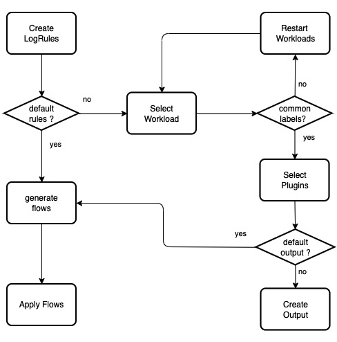
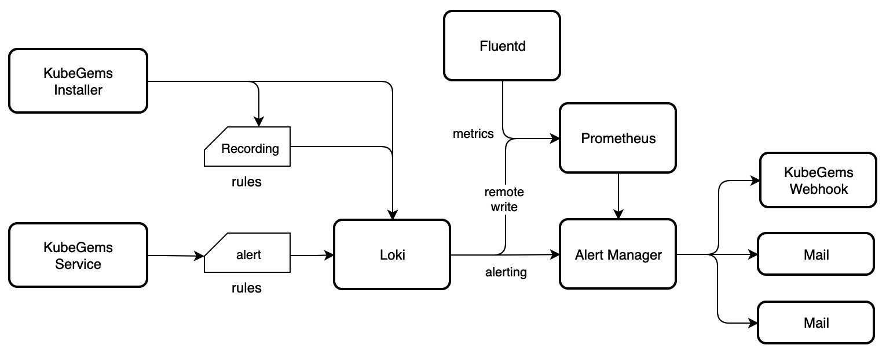

`KubeGems Logging` 服务主要面向平台内部以及平台内租户提供日志采集、解析、传输和存储等相关的能力。依靠 Logging Operator 对日志的配置和路由管理，实现平台的终端用户可以对应用运行期间的日志进行实时查询和分析。KubeGems 日志持久化采用 Grafana Loki 实现。

## 核心需求

### 多租户

KubeGems 是一个多租户平台，基于此场景。平台内部对于租户应用产生的日志应该具备**独立的解析配置以及路由规则**。

### 系统鲁棒性

- 高性能
  - 日志采集和转发性能至少需处理 10K line/sec
  - 支持采取日志限流策略
  - 日志延迟不得低于 5min

- 可扩展
  - 架构支持灵活的水平扩展以提升整体日志吞吐量
  - 组件因满足无状态属性

### 可运维性

- 可配置
  - 日志规则和路由的配置应 CRD 化，由 Operator 统一管理，并尽量做到配置简化。
  - 需支持常见的 `json 解析`、`字段增删改` 等插件配置。
  - 应用日志应满足发送多种常见的数据管道或收集系统，诸如 kafka、elasticSearch、MongoDB 等。

- 可视化
  - 日志规则应在 UI 中由用户组合装配置日志的解析与输出规则。

- 监控与告警
  - 日志采集的状态统计，包含组件运行状态以及日志采集统计。
  - 需支持用户根据自定义日志片段进行设置告警规则。

### 需求边界

- 对于应用日志没有输出到控制台（stdout）的场景，暂不纳入采集需求

>可采取其他方式重定向内部日志到控制台，诸如`s6-log`

## 日志设计

### Logging Operator

Logging Operator 是 BanzaiCloud 下开源的一个云原生场景下的日志采集方案。它在 2020 年 3 月的时候经过重构后的 v3 版本，底层凭借高效的 fluentbit 和插件丰富的 flunetd，Logging Operator几乎已经完美的适配了 kubernetes 模式下的日志采集场景。

在 KubeGems 1.20 的版本中，我们选择采用 Logging Operator 作为内部日志流传的核心框架。其主要原因如下：

- 原生 Flow 和 Output 类资源作用域为 kubernetes 命名空间，这与 KubeGems 租户环境的资源独立性相谋和

- 采用高性能的 fluentbit 作为日志采集客户端，fluentd 为日志聚合端。flunetd 在 logging 中通过 `replicas` 控制副本数，可根据吞吐量水平扩容

- flunetd 支持的插件较为丰富，满足当前基本需求

Logging Operator 不足：

- 核心资源 Flow 和 Output 交于用户配置较为困难，需要 KubeGems 将资源封装（也许兼容源对象）
- 可观测性功能较弱
- 日志 Match 部分功能较弱，无法通过直接匹配 workload 进行关联

### KubeGems 日志整体架构


由 Logging Operator 负责日志组件的运行管理和配置管理，租户侧资源以 CR 的方式在所属的环境空间中管理。Operator 将 CR 渲染为 Fluentd 的配置文件，用于处理日志的过滤和转发规则。可观测部分，由 KubeGems Plugins 服务初始化 ServiceMonitor，抓取组件运行期间的状态。

## KubeGems Logging

KubeGems 对 Logging Operator 的封装仅满足简单的两种模式的场景：

-  精简模式

    开箱即用的日志采集模式，对于用户环境空间内的所有容器开启采集，并输出到 KubeGems 平台内置的 Loki 组件用于日志分析和告警等场景

- 局部自定义模式

    面向希望通过配置局部容器采集，并需要对接外部日志分析系统的场景。则采用此方式，不过此时



除此之外，对于希望能够完全掌握平台内的日志路由的高端用户，KubeGems 只需兼容对 Logging Operator 的原始 CR 资源即可。

### 精简模式

对于通用场景下的容器控制台日志采集，KubeGems 采用``精简模式``配置规则，仅需在用户界面中支持 **一键配置开启日志采集** 功能。**一键启用功能**的实现主要分为两部分。


1. KubeGems Installer 服务在对 kubernetes 集群启用 logging 插件时，将对 `logging operator `以及关联的 `clusteroutputs/containers-console`资源进行初始化。

    > 默认的clusteroutput 资源定义了容器日志的输出路径是 Loki

2. 用户创建默认的容器采集规则时，`LabelSelector` 为空，即匹配当前命名空间下的所有 Pod。
3. Flow 中只启用 Prometheus 插件用于统计采集状态。
4. Flow 中关联系统默认的 `clusteroutputs/containers-console`

即在``精简模式``下，KubeGems 只在租户空间的接口中传入如下参数：

```apl
POST  observe/log/<tenant_name>/flowlite?enabled=true&namespace=tenant
```


|   参数    |            释意            | required |  Type   |
| :-------: | :------------------------: | :------: | :-----: |
|  enabled  | 启用环境空间的日志采集功能 |   True   | Boolean |
| namespace |   采集日志的目标命名空间   |   True   | String  |

KubeGems 将 Flows 渲染为如下内容：

```yaml
apiVersion: logging.banzaicloud.io/v1beta1
kind: Flow
metadata:
  name: default
  namespace: tenant
spec:
  match:
    - select: {}
  filters:
  - prometheus:
      labels:
        container: $.kubernetes.container_name
        namespace: $.kubernetes.namespace_name
        node: $.kubernetes.host
        pod: $.kubernetes.pod_name
      metrics:
      - desc: Total number of log entries generated by either application containers
          or system components
        name: logging_entry_count
        type: counter
  globalOutputRefs:
  - containers-console
```

### 局部自定义模式

用户如果需要按照应用日志需求，局部对环境空内应用进行日志的规则和路由时，KubeGems 需要对 Logging Operator 的 CR 资源进行优化，以方面在用户界面中实现跟友好的交互。其中首先需要处理平台 **应用元数据** 相关的事务。默认情况下 Flow 的规则采用 `labelSelector `对命名空间内资源做匹配，如下：

```yaml
apiVersion: logging.banzaicloud.io/v1beta1
kind: Flow
metadata:
  name: default 
  namespace: tenant
spec:
  localOutputRefs:
    - defalt
  match:
    - select:
        labels:
          app: nginx
```

虽然通过 `labelSelector`可以灵活控制日志采集规则，但经过实际验证，这个逻辑仍然存在 **反直觉的场景**，用户大多需要的是**在 Selector 阶段与应用资源直接关联** ，当然我们不能直接把`label 与 workload 做等同映射`。我们需要通过外部方式来对 Label 做通用性匹配。

#### KubeGems CommonLabels

**KubeGems 通用标签** 是根据用户上层操作而对 Kubernetes Workload 做自动注入的一组元数据。它是一组常量，被定义到`common.go`当中。 当用户在 Kubernetes 中做资源对象的操作时，它会以 `mutatingwebhook`的方式自动注入的被管理的资源对象当中。


CommonLabel 中的 `kubegems.io/applications` 或者 Kubernetes 中的 `app.kubernetes.io/name`或`app`共同声明了该应用的 workerload 标签。基于此，用户在创建日志规则是，可以通过 `LabelSelector` 定位到环境下的唯一资源。对于用户提交的 Flow ，同一种日志解析、路由规则类型的资源可以集中管理配置，如下：

```yaml
apiVersion: logging.banzaicloud.io/v1beta1
kind: Flow
metadata:
  name: default
  namespace: tenant
spec:
  localOutputRefs:
    - default
  match:
    - select:
        labels:
          kubegems.io/applications: nginx
    - select:
        labels:
          kubegems.io/applications: mysql
    - select:
        labels:
          app.kubernetes.io/name: tomcat
```

#### 局部模式下的用户流程


局部自定义模式下，开放普通用户配置有限功能的 Flow 以及 Outputs 资源。KubeGems 仍然需要对 CR 做简单接口封装。它的调用流程如下：

1. 创建日志规则时，请求KubeGems listWorkload 返回当前环境空间下具备采集条件（ CommonLabel）的资源列表，由用户在前端选择加入。
1. 用户界面内提供插件列表，有用户自定义插件是否启用
3. 通过请求 KubeGems listOutput 返回当前环境下可用的日志路由。普通用户同时也具备列出 `ClusterOutput` 资源(它由KubeGems 平台管理员创建)。
4. 日志规则关联 `localOutputRefs`或者 `globalOutputRefs`后提交给 KubeGems 后台渲染 Flow 文件。
5. Flow/Output 资源由 Logging Operator 处理，并返回资源validate结果和状态。


即在 `局部自定义模式` 下，KubeGems 在租户空间的接口中传入如下参数：


```apl
POST  observe/log/<tenant_name>/flow?name=tenant&namespace=tenant&monitor=true&throttle=4000&geoip_keys=remote_addr&outputs=my-elasticsearch,my-kafka&clusteroutputs=loki
```

|      参数      |                  释意                  |   required    |  Type   |
| :------------: | :------------------------------------: | :-----------: | :-----: |
|      name      |            日志采集规则名称            |     True      | String  |
|   namespace    |         采集日志的目标命名空间         |     True      | String  |
|    monitor     |  启用日志采集状态监控，default: true   |     False     | Boolean |
|    throttle    |  启用容器级日志条目限速，Lines / 10s   |     False     |  Int16  |
|   geoip_keys   |              启用 GEO IP               |     False     | String  |
|    outputs     | 普通日志输出通道，多个通道用 ,逗号分割 | At laeast one | String  |
| clusteroutputs |   日志输出通道，多个通道用 ,逗号分割   | At laeast one | String  |

> outputs 和 clusteroutputs 参数至少满足一个

KubeGems 将 Flow 渲染如下：

```yaml
apiVersion: logging.banzaicloud.io/v1beta1
kind: Flow
metadata:
  name: tenant
  namespace: tenant
spec:
  filters:
   - geoip:
       geoip_lookup_keys: remote_addr
       records:
         - city: ${city.names.en["remote_addr"]}
           location_array: '''[${location.longitude["remote"]},${location.latitude["remote"]}]'''
           country: ${country.iso_code["remote_addr"]}
           country_name: ${country.names.en["remote_addr"]}
           postal_code:  ${postal.code["remote_addr"]}
  - record_modifier:
      records:
      - throttle_group_key: ${record['kubernetes']['namespace_name']+record['kubernetes']['pod_name']}
  - prometheus:
      labels:
        container: $.kubernetes.container_name
        namespace: $.kubernetes.namespace_name
        node: $.kubernetes.host
        pod: $.kubernetes.pod_name
      metrics:
      - desc: Total number of log entries generated by either application containers
          or system components
        name: logging_entry_count
        type: counter
  - throttle:
      group_bucket_limit: 4000
      group_bucket_period_s: 10
      group_key: throttle_group_key
  localOutputRefs:
  - my-elasticsearch
  - my-kafka
  globalOutputRefs:
  - loki
```

### 原始模式

对于租户需要使用 Logging Operator 完整特性来做自定义日志解析场景，KubeGems 只需在页面中满足对 **Flow 原始格式 **的校验和提交即可。

```api
POST  observe/log/<tenant_name>/flow?raw=true
```

Body:

```yaml
apiVersion: logging.banzaicloud.io/v1beta1
kind: Flow
metadata:
  name: kafka
spec:
  filters:
   - tag_normaliser: {}
   - parser:
       remove_key_name_field: true
       reserve_data: true
       parse:
         type: multi_format
         patterns:
         - format: nginx
         - format: regexp
           expression: /foo/
         - format: none
  match:
    - select:
        labels:
          app.kubernetes.io/name: log-generator
  localOutputRefs:
    - kafka-output
```

## KubeGems Log Observability

KubeGems 的日志可观测性主要满足以下几点需求

- 用户环境空间内的日志采集速率分析
- 用户环境空间内的错误日志统计
- 用户自定义的日志告警规则

默认情况下 KubeGems Logging 插件集成了 Loki 实例用于持久化平台内容器日志。借有 Loki Ruler，可实现日志告警和错误日志分析相关功能。 

### 日志可观测性流程



1. KubeGems Installer 在 Kubernetes 集群初始化阶段负责将 Logging 插件下的 Loki 和 `Recording Rules` 配置。
2. 普通用户在用户界面中创建日志告警规则，由 KubeGems 将告警规则以 Loki API 方式提交。
3. 当产生Loki 产生日志告警时，经由 AlertManager 将告警事件推送给用户，并在 KubeGems Webhook 记录。

在上述流程中，KubeGems 日志告警中仅需提供 logrules 接口，用于管理用户告警内容。

### Log Alerting Template

Loki 的 Rules 的语法规则和 Prometheus 一样，区别只在`expr`中体现。当前 KubeGems 中的 Metrics 告警采用的是`预制模板` 的方式，以支持用户更快的创建规则。在日志告警规则也可参考此方式，预制常见的 LogQL 模板。

#### 普通模板

普通模板即用户只需要设置`日志关键字符`以管道的方式过滤字符。KubeGems 在后端组装语句 expr 并请求 Loki API 完成规则提交  。查询语句如下：

```yaml
sum by (pod,namespace,application) (count_over_time({pod="<pod>",namespace="<namespace>",applications="<applications>"}  |~ `<your_log_string>`  |~ `<your_log_string>`[1m]))
```


#### 格式化模板（json/logfmt)

采用 LogQL 的格式化解析器提取日志，通过查找 `key-values` 的方式过滤结果。

- json 解释器

```sql
sum by  (pod,namespace,application) (count_over_time({pod="<pod>",namespace="<namespace>",applications="<applications>"}  | json |  <your_key>=<your_string>  |   __error__=""[1m]))
```

- logfmt

```sql
 sum by  (pod,namespace,application) (count_over_time({pod="<pod>",namespace="<namespace>",applications="<applications>"}  | logfmt |  <your_key>=<your_string>  |   __error__=""[1m]))
```

#### 高级模式

采用 LogQL 原生语句直接提交 Rules。

上述 3 种 LogQL 预制模板，最终提交的格式化 alertrules 结构如下：

```yaml
  - name: should_fire
    rules:
      - alert: <your_log_string>-alert
        expr: sum by (pod,namespace,application) (count_over_time({pod="<pod>",namespace="<namespace>",applications="<applications>"}  |~ `<$your_log_string>`  |~ `<$your_log_string>`[1m]))  >= <$your_thresholds>  
        for: 1m
        labels:
            severity: <$your_severity>
            pod: {{$labels.pod}}
            namespace: {{$labels.namespace}}
            application: {{labels.applicastions}}
        annotations:
            summary:  message <your_log_string> alerting ,now has {{$labels.value}}.
```

### Log Recording Rules

`Recording Rules` 允许用户预先将需要进行大量计算的表达式的结果转化保存为一组新的时间序列，并将其通过 `remote_write`的方式写入 Prometheus。在 KubeGems 中，平台将接入 `Logging Observability` 的应用预制了通用性的 Error Log Rules。

与  Alerting Rules 一样，Recoring Rules 如要 Loki Ruler 的支持，这部分将在 KubeGems Installer 初始化中部署到您的集群。

> 关于 Loki Ruler 对 RemoteWrite 的配置，可查考[loki/remote-write](https://grafana.com/docs/loki/latest/rules/#remote-write)

### Log Metrics

Log Metrics 在 KubeGems 中，由用户提交的日志采集器中声明，这部分采用 `fluent-plugin-prometheus`，核心部分即为每个进入管道的日志流创建一个 `计数器(Counter)`并记录其条目和元数据。

```yaml
  - prrometheus:
      labels:
        container: $.kubernetes.container_name
        namespace: $.kubernetes.namespace_name
        node: $.kubernetes.host
        pod: $.kubernetes.pod_name
      metrics:
      - desc: Total number of log entries generated by either application containers
          or system components
        name: logging_entry_count
        type: counter
```

最终由 Prometheus 将指标`logging_entry_count`持久化到本地。


## 总结

KubeGems 中基于租户的日志采集方案整体设计采用 Logging Operator + Loki 架构，用户可根据企业自身组织结构对其进行管理和适配。对于在 Kubernetes 集群中操作原生的 CRD 资源复杂的场景下，KubeGems 尽量让用户在接入日志采集、监控和告警的三个方面做到开箱即用的功能，极大简化系统管理者或研发人员的是学习和接入成本。


