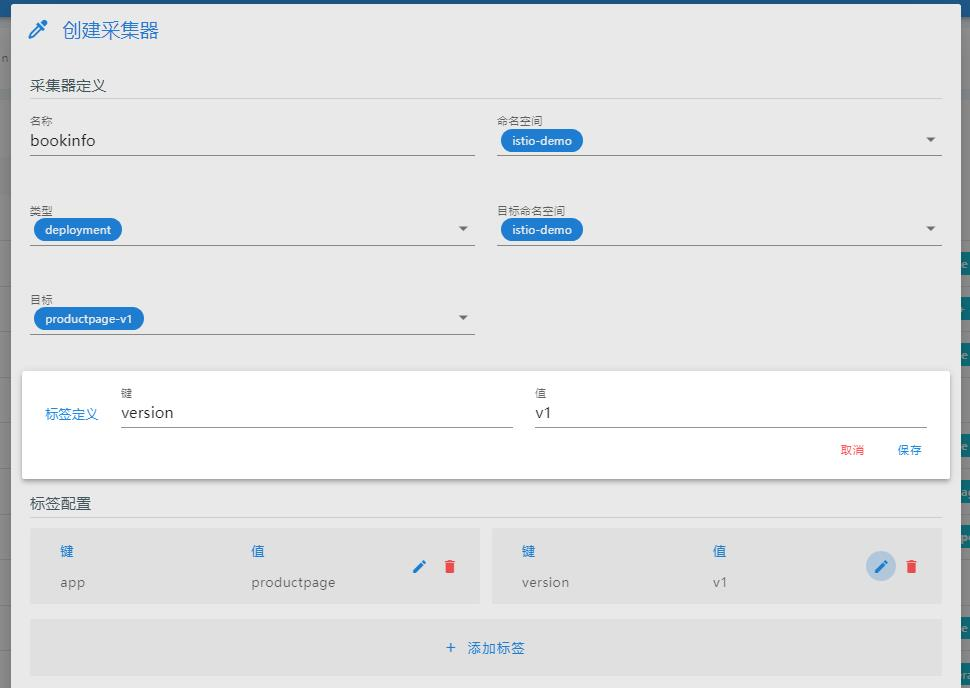

## 整体思路
整体交互类似 [监控采集器](../docs/tasks/observability/monitor/monitors#指标采集)

1. 不再由前端直接管理`flow`和`output`资源，由后端提供简化、统一的`日志采集器`接口
2. 每个集群共用同一个`kubegems-container-clusteroutput`的`ClusterOutput`资源，由`installer`管理:
```yaml
apiVersion: logging.banzaicloud.io/v1beta1
kind: ClusterOutput
metadata:
  name: kubegems-container-clusteroutput
  namespace: gemcloud-logging-system
spec:
  loki:
    buffer:
      flush_interval: 1s
      flush_mode: interval
      flush_thread_count: 4
      tags: time
      timekey: 1m
      timekey_wait: 5s
      total_limit_size: 20G
    configure_kubernetes_labels: false
    drop_single_key: true
    extra_labels:
      cluster: {{ cluster_name }}
    extract_kubernetes_labels: true
    labels:
      container: $.kubernetes.container_name
      image: $.kubernetes.container_image
      namespace: $.kubernetes.namespace_name
      node: $.kubernetes.host
      pod: $.kubernetes.pod_name
      stream: $.stream
    remove_keys:
    - logtag
    - kubernetes
    - docker
    - time
    - throttle_group_key
    url: http://loki-gateway.gemcloud-logging-system:3100
```
3. 前端指定如下字段创建日志采集器，采集器全是**应用级**的，而不是namespace级:

| 字段名            | 释义                                                                     |
| :---------------- | :----------------------------------------------------------------------- |
| name              | 采集器名                                                                 |
| namespace         | 采集器及要采集目标的namesapce                                            |
| target_type       | 要采集的workload类型(deployment/statefulset/daemonset)                   |
| target_name       | 要采集的workload名，根据这些信息，前端也要将对应的`labels`传入接口       |
| target_labels     | 前端根据 target_type和target_name获取其`pod template`的`labels`,自动填入 |
| target_containers | 要采集的容器名，多选                                                     |
| max_per_minute    | 每分钟最多采集的日志条数                                                 |

界面和字段都类似监控采集器:


1. 后端拼凑出对应的的`flow`:

```yaml
apiVersion: logging.banzaicloud.io/v1beta1
kind: Flow
metadata:
  name: myapp
  namespace: mynamespace
  annotations:
    # 用于标记采集的workload
    gems.kubegems.io/loggingTargetName: deployment/myapp
spec:
  filters:
  - record_modifier:
      records:
      - throttle_group_key: ${record['kubernetes']['namespace_name']+record['kubernetes']['pod_name']}
  - prometheus:
      labels:
        container: $.kubernetes.container_name
        namespace: $.kubernetes.namespace_name
        node: $.kubernetes.host
        pod: $.kubernetes.pod_name
      metrics:
      - desc: Total number of log entries generated by either application containers
          or system components
        name: logging_entry_count
        type: counter
  - throttle:
      group_bucket_limit: 20000
      group_bucket_period_s: 60
      group_key: throttle_group_key              
  localOutputRefs:
  - kubegems-container-clusteroutput
  match:
  - select:
      labels:
        app.kubernetes.io/name: myapp
```

:::tip 提示
`clusteroutput`及`flow`的字段参数可能有变，在后续的调试中优化，**但不影响前端接口及交互**
:::
   
## 备选思路

由于`logging operator`文档及其欠缺，且它对接的工具太多，担心引入后会增加kubegems维护的风险。我们实际使用的只有loki、fluentd、fluentbit，可以考虑直接操作他们的原生配置。