## 主要数据模型

数据模型的主要层级关系为 租户 -> 项目 -> 环境 -> 应用;

对应到集群中的以下资源

| 资源|简写| group/version| 是否是namespaced资源| Crd|
| --- |--- |---|---|---|
|environments                      |tenv               |gems.kubegems.io/v1beta1            |false        |Environment|
|tenantgateways                    |tgw                |gems.kubegems.io/v1beta1            |false        |TenantGateway |
|tenantnetworkpolicies             |tnetpol            |gems.kubegems.io/v1beta1            |false        |TenantNetworkPolicy |
|tenantresourcequotas              |tquota             |gems.kubegems.io/v1beta1            |false        |TenantResourceQuota |
|tenants                           |ten                |gems.kubegems.io/v1beta1            |false        |Tenant |

- 系统内顶级资源为租户和集群,  租户和集群都由系统管理员添加；租户与集群通过`TenantResourceQuota`关联，一个租户在一个集群下只能存在一个TenantResourceQuota;
租户映射到集群中的CRD为`Tenant`, 租户CRD下存在`网络隔离策略(TenantNetworkPolicy)`和`资源限制(TenantResourceQuota)`以及`租户网关(TenantGateway)`, 这些子资源都将在租户crd创建的时候默认创建；
- 用户(Users)与租户，项目，环境都存在着关联关系，这些关联关系将为以后的用户权限提供数据支持；
- 项目仅仅是平台侧的概念，它表示一组应用的集合
- 环境与集群的namespace关联，实现环境隔离，资源限制，网络隔离等，环境则更多的是运维相关属性;
- 应用表示真实的应用

## 用户权限

系统的用户权限主要通过**角色**实现, 角色又分为*系统级角色*,*租户级角色*,*项目级角色*和*环境级角色*;

### 系统级角色

- **系统管理员**的职责是管理系统资源，集群，集群插件，租户等; 系统管理员拥有一切资源的操作权限和读权限
	 
- **普通用户**代表 KubeGems 中的普通成员，用普通用户角色的账号仅能登陆系统，其他租户，项目等权限将根据租户和项目下的角色判断

### 租户级角色

- **租户管理员**的主要职责是负责租户的成员管理和项目管理,负责项目添加和删除，租户成员的添加和修改; 租户管理员拥有租户下的一切资源操作权限和读权限

- **租户成员**默认仅可以读租户下的项目信息; 在添加`项目成员`，`环境成员`的时候，用户必须是租户成员才能作为项目成员和环境成员的备选项;
	
### 项目级角色
	
- **项目管理员**的职责是负责项目的成员管理，项目的环境管理和项目下的应用管理; 项目管理员拥有项目下的一切资源的操作权限和读权限;

- 项目成员拥有三个角色，分别是`开发` `测试` `运维`

    - **项目开发成员**可以读所有环境，只能操作开发类型的环境
    - **项目测试成员**可以读所有环境，只能操作测试类型的环境
    - **项目运维成员**可以读所有环境，可以操作开发 测试 生产类型的环境
		
### 环境级角色

- **环境reader**在默认情况下，项目成员是所有环境的reader,即只要是项目成员，就能读取所有的环境数据

- **环境operator**通常不需要配置这个角色，但是有特殊的情况，例如开发需要操作生产环境的资源，默认情况下开发人员只能操作开发环境，这时候授权开发人员在生产环境是operator的角色，就可以操作生产环境了;

## 登陆模块

### 需求

支持多源登陆(ldap, oauth2)

- 本地认证，支持账号+密码登陆

- 外部认证，支持ldap和oauth2的认证

### 登陆设计

插件式设计，允许不同类型的登陆源实现登陆插件即可,插件目前分为两类,分别是`OAUTH`和`LDAP`

插件需要实现接口`aaa.AuthenticateIface`接口

    type AuthenticateIface interface {
        // 返回登陆插件的名字
        GetName() string
        // 返回登陆地址
        LoginAddr() string
        // , 获取用户信息
        // 验证凭据,获取根据用户提供的凭据获取用户信息
        GetUserInfo(ctx context.Context, cred *Credential) (*UserInfo, error)
    }

登陆流程:

1. LDAP类型和默认账号密码登陆,直接提供登陆的用户和密码以及登陆源即可,登陆后将获得token

2. OAUTH类型，先获取登陆地址，重定向到登陆地址，通常这个登陆地址为第三方平台的认证授权界面，授权后第三方将会重定向到平台配置的一个地址，并且携带着第三方平台的一个授权code,平台通过这个code获取access_token，再带着这个access_token访问用户信息，通过第三方平台中的`用户名`作为kubegems中的用户，登陆成功后获得token

### 认证设计

插件式设计，目前仅实现了基于JWT的认证方式; 需要实现接口`aaa.UserGetterIface`

    type UserGetterIface interface {
        GetUser(req *http.Request) (u user.CommonUserIface, exist bool)
    }

### 认证流程

不同的认证插件, 从请求头中获取需要的信息，例如通过Authorization头获取Bearer token,通过获取到的信息载入用户，如果没有找到用户，则表示未登陆
