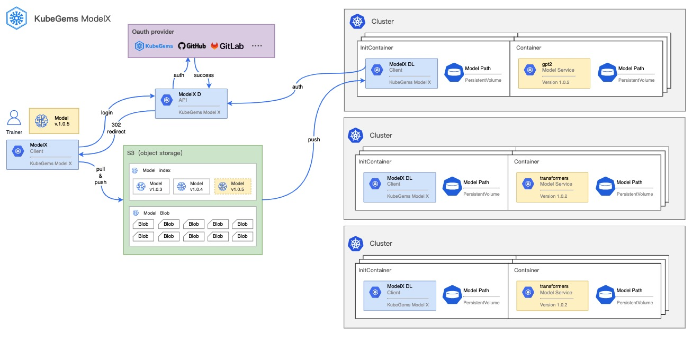

## 快速了解 ModelX

---
 
Model X 是一个简单、高性能、 跨平台和可扩展的用于存储机器学习场景下的模型仓储服务。它参考了 OCI、Git Lfs 和 对象存储的设计思想和在 Kubernetes 中运行算法服务的场景，为用户提供了一个便捷的、可版本化的模型管理解决方案

Model X 将 **算法镜像** 与 **模型文件** 这两类资源进行解耦。可让企业内部算法和工程团队之间的产品交付流程。让算法同学更专注于训练，而无需担心模型的管理。

目前 Model X包含了三个主要组件：

- modelx (ModelX Cli)

    Modelx 用户侧客户端，可用它来在本地初始化、推送、拉取和版本管理模型文件

- modexd (ModelX Server)

    Modelx 服务端, 它是一个服务 OCI 协议标准的API Server，它主要响应来至CLI的认证和模型管理的请求

- modelxdl (ModelX Download Tools)

    Modelx下载工具，它主要用于在 Kubernetes 中将模型从商店中下载到指定的挂载路径