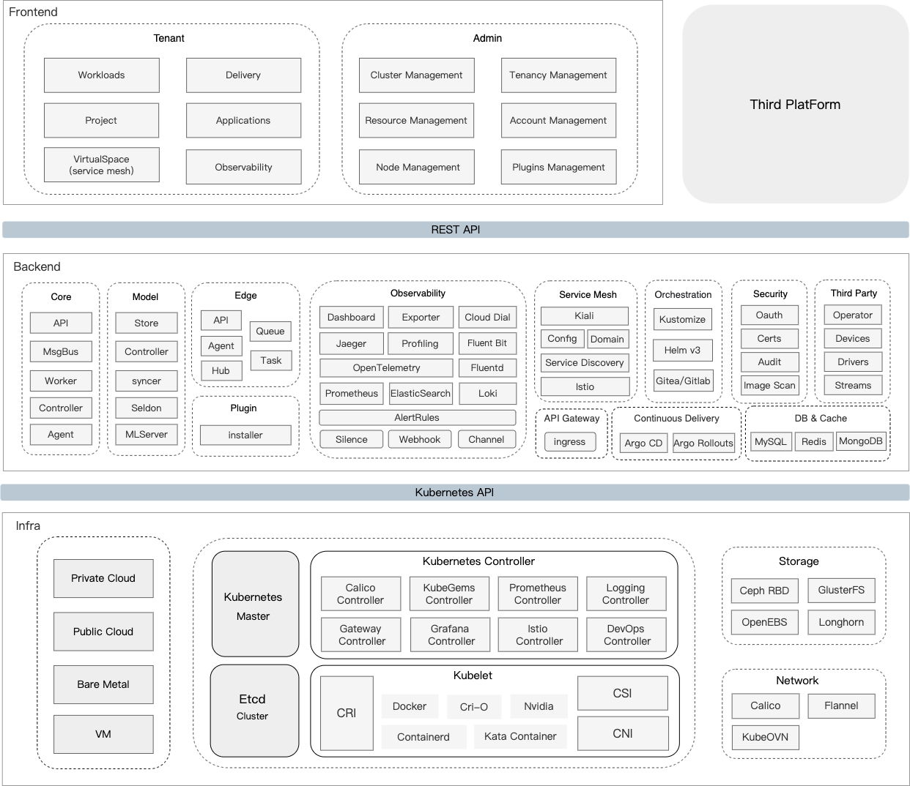

## 产品架构

---

KubeGems 采用前后端分离的架构设计，后端通过 kubegems-api 服务对外部提供 [**Rest API**](https://www.apifox.cn/apidoc/project-729575/api-13879389) 接口，同时内部实现对个模块的集成与封装。通过 kubegems-controller 服务对 kubernetes 的资源进行管理，已实现实现操作不同基础设施的集群。依托Kubernetes架构，KubeGems 无底层基础设施依赖，它可以在任何遵循带有Kubernetes一致性认证的平台上运行，其中包括但不限于，原生Kubernetes、私有云平台、公有云、裸金属或虚拟机。

:::tip 推荐 Kubernetes 版本
为保持最佳的使用体验，KubeGems 推荐运行在 **Kubernetes v1.20 - 1.25** 之间的版本当中。
:::

### 组件列表

| 组件名称                | 组件说明                                                     |
| :----------------------- | :------------------------------------------------------------ |
| kubegems-dashbaord          | KubeGems 用户管理界面，用户在上面可以完成平台支持的所有功能操作 |
| kubegems-api                | KubeGems 核心服务，负责管理API 接口和集群内部各个模块之间通信的枢纽，以及集群安全、审计控制 |
| kubegems-msgbus             | KubeGems 实时消息服务，负责处理前端对Kubernetes实时性较强的业务逻辑       |
| kubegems-worker             | KubeGems 异步任务服务，负责执行系统的后台异步任务                         |
| kubegems-local-agent              | KubeGems 集群Agent，负责处理平台业务逻辑，直接与 Kubernetes API通信 |
| kubegems-controller-manager | KubeGems Operator，负责完成 Kubernetes 的 CRD 与 Webhook 的处理     |
| kubegems-installer          | KubeGems  Operator，负责完成 KubeGems 产品的部署与 Kubernetes 初始化 |
| nginx-ingress-operator  | Nginx Ingress Operator，负责提供KubeGems产品多租户独立网关的能力   |
| cert-manager            | Kubernetes 证书管理套件，负责处理平台内TLS证书的自动管理      |
| prometheus-operator     | kubernetes 监控控制器，为KubeGems提供主机、容器、微服务等监控告警等功能 |
| logging-operator        | kubernetes 监控控制器，为KubeGems提供容器日志采集等功能 |
| grafana                 | 开源的监控指标展示平台，，为KubeGems提供指标展示的扩展   |
| fluentd                 | 日志采集客户端，具备丰富灵活的插件配置，为KubeGems提供主机、容器的日志采集 |
| loki                    | 云原生日志分析服务，为KubeGems提供日志存储、查询和分析服务   |
| helm                    | 一种应用容器打包和部署标准，为KubeGems提供应用商店接入的能力 |
| kustomize               | 一种应用容器编排的方法，为KubeGems提供用户应用编排的能力     |
| argocd                  | 一套开源实现ci/cd流程的系统，为KubeGems提供用户CD的部署能力  |
| istio                   | 服务网格，为KubeGems提供微服务治理和流量管控的能力           |
| jaeger                  | 应用分布式链路跟踪服务，为Sidecar和应用提供数据接受的服务    |
| calico                  | Kubernetes容器组网服务，负责容器间通信和网络隔离策略管理     |
