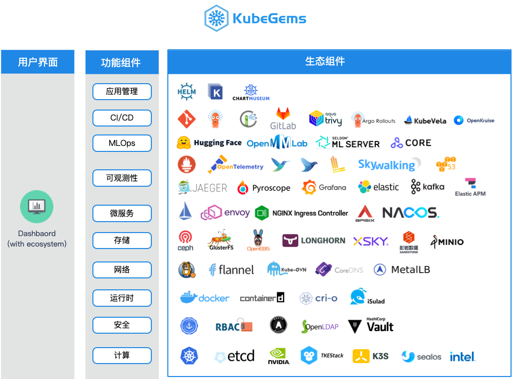

## KubeGems生态

---

KubeGems广泛的使用来自包括 [云原生基金会（CNCF)](https://www.cncf.io/) 和 [Istio社区](https://istio.io/latest/) 开源的产品，并在此基础上做了二次开发和适配。针对产品内部比较通用的需求，KubeGems也会及时将代码以PR的方式回馈社区，以保证产品能够与社区进行同步更新。

为更好的降低用户对云原生生态内的熟悉门槛，KubeGems提供了专门的安装控制器对集成的三方插件进行集中管理，并以此保证我们的产品能始终如一的部署在不同方式构建的Kubernetes集群之上，使用户能更完整能够体验到KubeGems的功能。

:::info 
在 v1.22 版本中，KubeGems 内部集成了近 30 来个服务，您可以自由选择是否启用它们。
:::
