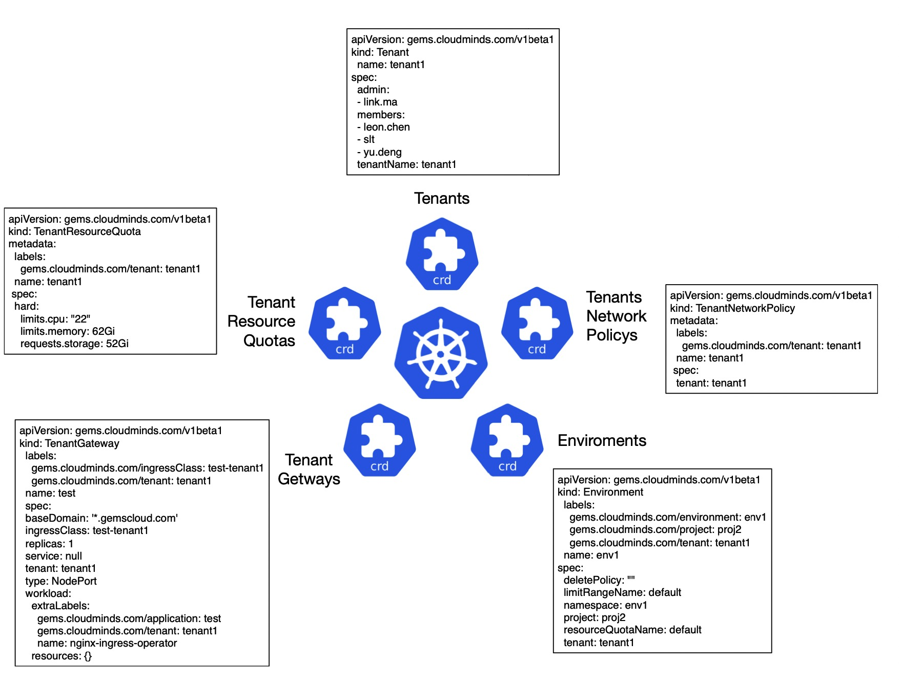
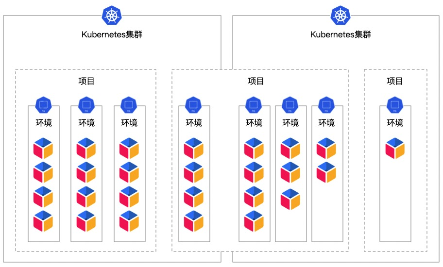

## 多租户管理

--- 

在 KubeGems 中，资源（例如集群）可以在租户之间共享。管理员或运维人员掌握了平台内不同的用户角色的权限设置。普通用户在环境空间对各种计算资源进行操作。基础设施层上的计算资源由 **KubeGems管理员** 集中管理和分配，由于 KubeGems 在租户层面实现了资源的隔离，因此用户不必担心计算资源分配额度以及资源竞争问题。其主要功能如下：

- **角色身份：** 内置多身份类型，平台内用户可按照角色进行授权；

- **多认证方式：** 平台内置用户账号认证，同时也支持`OpenLdap`、`GitLab`、`GitHub`和遵循 `Oauth2.0` 协议的第三方用户系统；

- **成员管理：** 普通用户与`租户(空间)，项目(空间)，环境(空间)` 进行关联，可为空间做精细化的成员管理

- **网络隔离：** 支持基于 **Calico** 模式下的网络策略管理，在平台内部为租户在基于 `租户、项目、环境` 三个维度下实现网络隔离的策略分发

### CostomResourceDefinition

KubeGems通过自定义 `CRD(Custom Resource Definitions)` 将租户资源抽象为5个类型进行统一管理，分别是：

- Tenant （租户）

- Enviroments （环境）

- TenantResourceQuotas （资源）

- TenantGateways （网关）

- TenantNetworkPolicys （网络策略）

KubeGems的租户控制主要在`Tenant`和`Enviroments`两个CRD中实现管理，里面分别定义了租户以及环境（包含项目）等信息。

### 平台术语

|术语|解释|
| :--- | :--- |
| 用户（User）  | KubeGems 上一个可登录的用户，用户的权限可以是平台管理员租户或者普通用户，用户的角色可以由各级管理员进行控制。| 
| 应用（Application）| 部署在 KubeGmes 的一个应用，它可以是一个进程或进程组，通常它等同于Pods。应用是 KubeGems 上最小的部署单元 | 
| 环境（Enviroments）| KubeGems 应用部署的在 Kubernets 上一个命名空间，它等同于 Namespaces |
| 项目（Project）| KubeGems 内多个环境组成的一个抽象集合，项目下的环境可以分布在多个Kubernets集群，也可以分布在一个Kubernetes集群内 | 
| 集群（Cluster）| 一个Kubernetes集群 | 
| 租户（Tenant）| KubeGems 上服务用户的主体单位，用户的计算资源运行在租户空间内，它与平台内的其他租户共享 Kubernetes 资源 | 

下图表述了KubeGems平台中的空间与Kubernetes集群之间的逻辑关系：

### 网络隔离

KubeGems定义了租户级别的CRD对象`TenantNetworkPolicys`，此对象**定义的网络隔离范围和网络隔离的策略**，KubeGems可以控制集群内`NetworkPolicy`以实现内部租户、项目和环境级别的网络隔离。

:::caution 注意
KubeGems v1.20.0 版本暂不支持Pod级别的细粒度网络隔离策略。
:::

## 附录 

---

### 用户角色说明

|角色|类别|说明|
| --- | --- | --- |
| 系统管理员|	系统|	可以操作系统所有的资源，用户，租户|
| 系统成员	|系统	|没有任何系统级别的权限|
| 租户管理员|	租户	|可以操作租户下所有资源|
| 租户成员|	租户	|只能看到自己参与的项目|
| 项目管理员|	项目|	可以操作项目下的所有资源|
| 项目测试	|项目	|仅可以操作测试属性的环境|
| 项目研发	|项目	|仅可以操作研发属性的环境|
| 项目运维	|项目	|可以操作所有环境|
| 环境成员	|环境	|只可以查看环境下的资源|
| 环境管理员|	环境|	可以操作环境下的资源|
