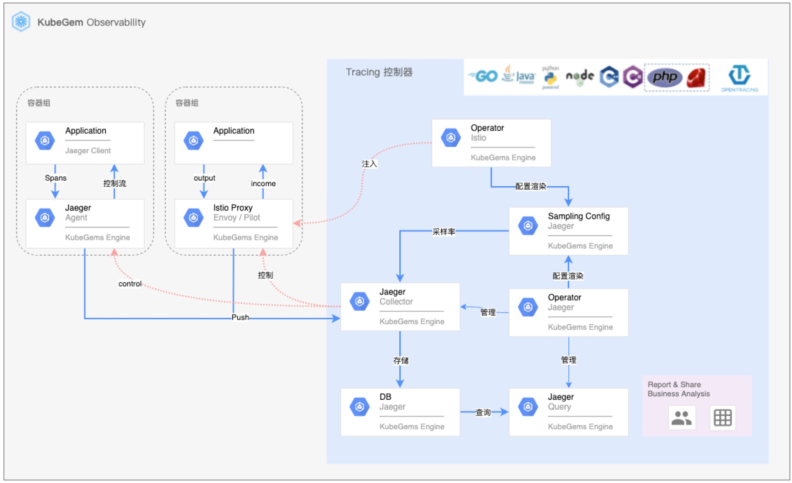

## 可观察性

--- 
### 监控与告警

- **多维度监控：** KubeGems 内置了对`主机`、`Kubernetes集群`、`容器`和`中间件`等服务的监控模板，通过内置的查询器为用户提供精细化的监控；

- **自定义告警策略和规则：** 支持多租户模式下的监控指标采集，用户可自定义被监控应用的指标采集策略，如监控端口，请求路径、频率等信息；

- **兼容 Prometheus：** KubeGems 采用 Prometheus Operator，可与用户现有环境无缝集成;

- **平台组件状态：** KubeGems 集成了内部组件和 Kubernetes 三方组件状态的监控，避免因平台组件故障造成的不必要停机;

- **自定义告警策略和规则：** 支持租户模式下的监控指标采集策略，用户可根据监控模板自助设定告警策略;

- **丰富的阈值规则：** 支持用户在告警规则中设置告警事件的重复时间、持续时间、告警级别、黑名单等功能;

- **分级告警：** 支持用户自定义的告警级别，并进行分级告警，避免无效告警；

- **历史跟踪：** KubeGems 为每一条告警记录都设置了详情页，里面完整记录了该规则自创建以来发生的每一次事件，为用户提供告警事件的回溯；

- **告警渠道：** 支持 `邮件(SMTP协议)` 和 `Webhook` 两种渠道告警；

- **告警实时通知：** KubeGems 内置的实时消息组件，在发生告警时可将内容实时推送到用户界面；
### 日志与分析

- **日志采集管理：** 支持多租户模式下的日志采集管理，利用 `CRD` 可在租户空间内进行自定义控制容器日志采集和解析规则；

- **标签化查询语句：** 注入多维度的日志标签（项目、环境、容器组、应用、集群等关键字），用户可以灵活查询或者实时分析日志；

- **日志告警：** 支持`关键字`过滤，可以在用户应用发生告警时通知到运维、研发等同事

- **多种日志收集平台：** 支持多种日志收集平台，例如 `Elasticsearch`、`Loki`、`Kafka`、`S3` 等 

- **高性能和水平扩展：** 采用 `FluenBit/d` 分级架构，满足日志高吞吐情况下，汇聚层 **水平扩展** 以提高采集吞吐量；

### 平台事件和审计

- **Kubernets 事件持久化：** 支持租户级 Kubernetes 事件记录，用户可以搜索与所在租户相关的产生的所有事件；

- **用户行为审计：** 内置函数式审计，记录了平台内的每一个操作，甚至是用户的**Pod Shell命令**

### 分布式链路跟踪

- 兼容 Jaeger

- 支持 OpenTelemetry 应用接入
