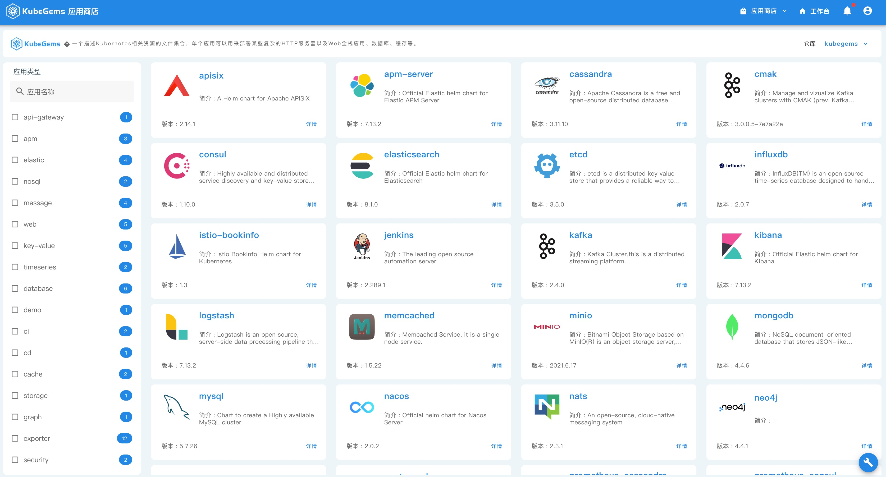
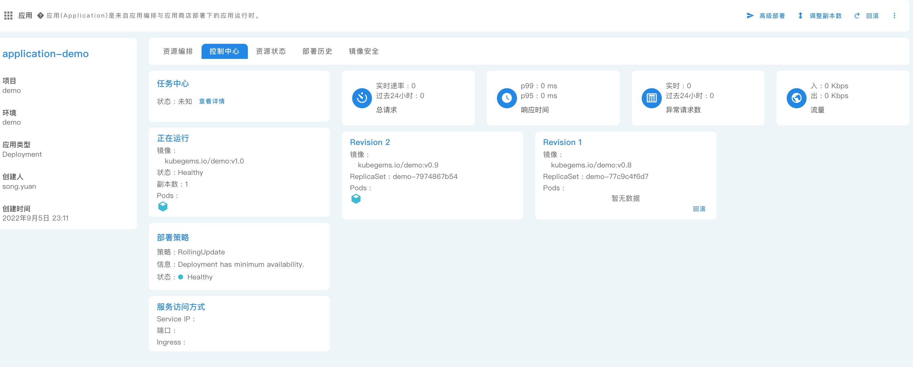
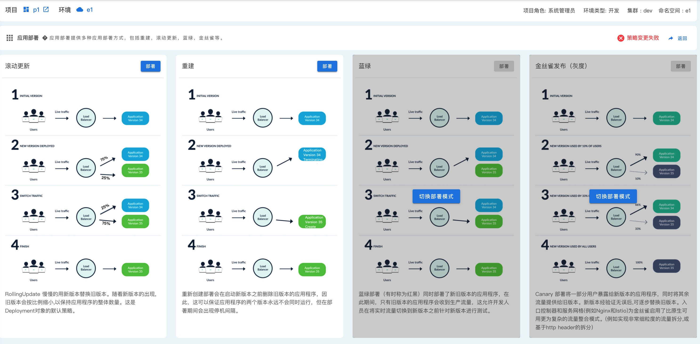

## 应用管理

--- 

在KubeGems中，应用是**一等公民**，其内部的功能大都以围绕应用管理展开。KubeGems内定义了两种应用管理渠道，分别是应用商店和用户编排

### 应用商店

KubeGems 内部提供了一个基于[Helm v3](https://helm.sh/)的应用仓库，里面集成了众多的定制中间件应用。除此之外，应用商店还提供了额外的功能，诸如：

- **多仓库支持：** 无缝对接外部 Helm 仓库，并自动离线同步到本地

- **人性化定制：** 用户可以通过填写 应用表单 或者编写 Values文件 方式灵活定制自己的应用

- **资源可视化：** 用户可以在应用详情中对应用拓扑结构和生命周期进行完整管理

### 应用管理和编排

应用中心为用户/企业提供了私有化应用的编排和管理，在 KubeGems 内部，我们提供了以 [Kustomize](https://kustomize.io/) 风格的应用编排方式，用户只需在平台的界面上，就可以自主进行 Kubernetes 的资源编排。

- **可视化编排：** Kustomize 风格的应用编排方式；

- **版本化管理：** KubeGems内置 GitOps 引擎，为应用编排提供版本变更的追踪、回滚和历史等高级功能；

- **镜像安全：** 支持对用户镜像进行 CVE 漏洞分析和风险等级报告（ 需对接 Harbor）；

- **应用管理：** 提供用户应用完整的生命周期管理；

- **灵活发布：** 应用编排可灵活推送到用户环境，并提供一键批量部署；

### 策略部署

#### 金丝雀发布

- **自定义流量比例：** 可根据用户定义的流量比例进行发布；

- **自定义灰度策略：** 根据用户请求头(header) 、路径（url）和进行流量比例分配；

- **应用监控分析：** 灰度过程中全程监控应用请求的状态，用户可根据灰度监控数据进行流程控制；

####  蓝绿发布

- **双重资源保障：** 控制蓝绿两个版本的应用容量，避免出现雪球效应；

- **操作简洁：** 一键完成应用蓝绿部署；

- **应用监控：** 蓝绿过程中全程监控应用请求的状态，可根据应用监控数据进行流程控制；

