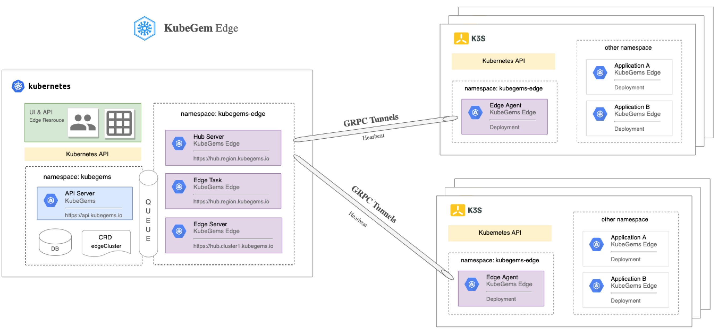
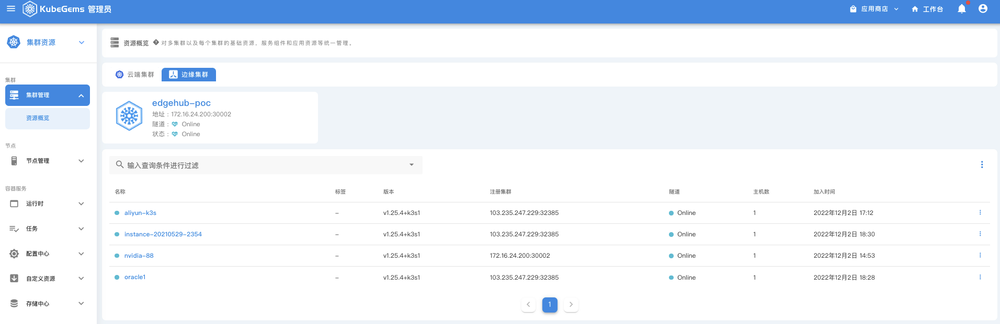
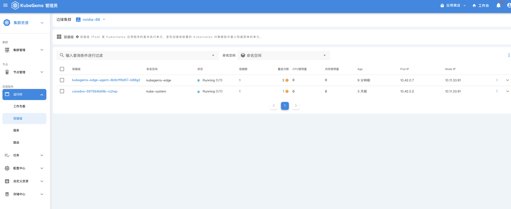

## 边缘集群治理

--- 

KubeGems 自 v1.23 版本开始，产品联合了 [Rancher k3s](https://www.rancher.cn/k3s/) 开启对边缘集群的管理。通过 Grpc Tunnel 技术实现了边缘 k3s 集群自主连接和上报心跳到云端。

:::tip 什么是 rancher k3s
Rancher k3s是经 CNCF 一致性认证的 Kubernetes 发行版，专为物联网及边缘计算设计。https://www.rancher.cn/k3s/
:::

### KubeGems 边缘架构

- ** Edge Agent **

由 Golang 开发，支持在 x86 和 arm 架构下运行。主要代理K3S API 服务以及与云端 Hub 服务建立 GRPC 隧道，并定时上报隧道和设备心跳数据

- **Edge Hub** 

管理边缘设备上连云端的隧道管理，并提供设备认证支持（计划中）

- **Edge Server **

KubeGems Edge 资源管理（CRD） 与 Edge API 服务

- **Edge Task (计划中)**

KubeGems Task 边缘设备任务调度服务，包含应用发布，（发送设备指令）等功能

### 设备管理

KubeGems 通过 Edge Agent 模块来对边缘集群进行操作，并额外支持了如下功能：

- **多种注册方式：** 支持主动注册和匿名注册两种方式

- **支持断线自动重连：**  Edge Agent 在弱网恢复的情况下支持断线重连

### 可扩展

- **支持横向扩展： ** Edge Hub 服务无状态，大规模设备接入场景下支持横向扩展能力

- **完整 Kubernetes 能力: ** 支持完整的 kubernetes api 能力，并被集成在 KubeGems 产品当中

### 身份认证(计划中)

- **设备身份认证: ** 支持多种身份认证 Provider，为设备安全提供保障

- **双向认证: ** 支持由云端自动签发与更新边缘设备 TLS 证书，并进行双向认证