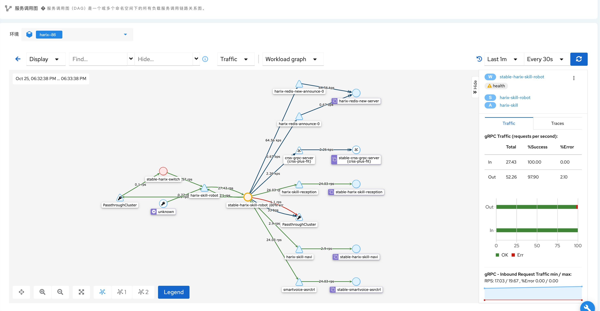
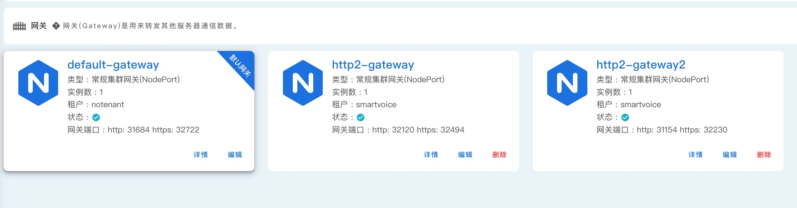

## 基于Istio的微服务网格

--- 

### 服务治理

#### 流量管理

KubeGems 中虚拟空间启用了应用的 Istio 功能支持，通过其控制平面的功能来配置和管理应用行为，这包括：

- **负载均衡:** 为 HTTP、gRPC、WebSocket 和 TCP 流量自动负载均衡；

- **访问控制:** 支持丰富的路由规则、重试、故障转移和故障注入对流量行为进行细粒度控制；

- **流量控制:** 可插拔的策略层和配置 API，支持访问控制、速率限制和配额；

#### 安全

- **丰富的认证策略:** 使用 peer 和 request 认证策略为在 Istio 网格中接收请求的工作负载指定认证;

- **自定义应用授权:** 支持基于 RBAC 的应用权限控制；

- **公钥基础设施 (PKI):** 使用 X.509 证书为每个工作负载都提供 tls 双向认证;

#### 可观察性

KubeGems 的虚拟空间内生成了内部服务通信的详细遥测数据。使用户能够排查故障、维护和优化应用程序。

- **应用指标:** 基于 4 个监控的黄金标识（延迟、流量、错误、饱和）生成了一系列服务指标

- **分布式追踪:** 为每个服务生成分布式追踪 span，对网格内的服务调用进行追踪；

- **访问日志:** 记录应用流量生成请求的完整记录，包括源和目标的元数据；

### 微服务网关

KubeGems 内置微服务网关控制器，以支持应用南北向流量的代理,网关类型分为**基础版(Basic Nginx)**和**微服务版(Mesh Istio)**。

#### 基础版网关

采用 **Nginx Ingress Operator** 为 KubeGems 提供基础网关能力支持，其中包括：

- 租户独占网关： 每个租户可创建独占的 ingress 网关，通过 class 方式关联 ingress 资源；

- 应用路由管理： 支持 TCP/UDP, HTTP/HTTPS, GRPC/HTTP2.0 等协议的支持和路由转发；

- 流量负载均衡： 支持对 ingress 关联的上游 pod 进行流量负载均衡；

- 访问监控：支持以 Prometheus 的方式暴露内部监控指标；

#### 微服务网关（开发中...）

- 基础网关所有功能

- 支持应用流量细粒度控制

- 支持应用蓝绿发布、灰度发布等高级策略

- 访问权限认证
