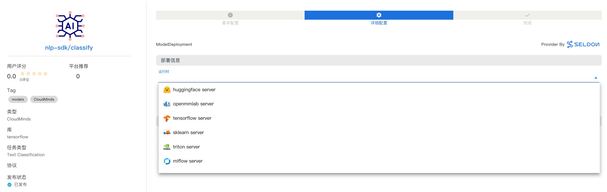
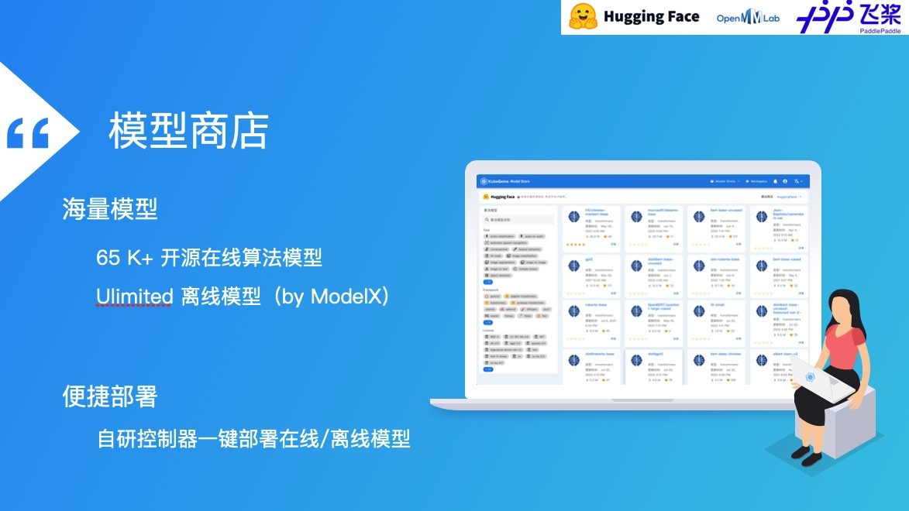

## AI算法推理服务

--- 

### 模型交付

KubeGems 在 v1.22 版本开始引入 [Seldon Core](https://docs.seldon.io/)，它是一个用于在 Kubernetes 上大规模部署您的机器学习模型。通过 KubeGems 的模型管理控制器，我们旨在标准化用户在平台内提供通用场景下的 MLOps 模型交付流程。

高级功能：

- 预打包推理服务镜像，支持多种推理框架 [MLServer](https://github.com/SeldonIO/MLServer) 或自定义开发语言容器的集成

- 开箱即用，可以通过Swagger UI、Seldon Python Client 或 Curl/GRPCurl进行测试

- 与云无关，并在AWS EKS、Azure AKS、Google GKE、阿里云、Digital Ocean 和 Openshift 上进行了测试

- 元数据出处，以确保每个模型都可以追溯到其各自的训练系统、数据和指标

- 与Prometheus 和 Grafana集成的高级和可定制的指标

- 通过与 Elasticsearch 集成的模型输入输出请求日志记录实现完全可审计性

- 通过与 Jaeger 的集成实现微服务分布式跟踪，以深入了解跨微服务跃点的延迟

- 通过一致的安全和更新策略维护安全、可靠和强大的系统

### 推理框架

MLServer 旨在提供一种简单的方法，通过 REST 和 gRPC 接口开始为您的机器学习模型提供服务，完全符合KFServing 的 V2 Dataplane 规范。

- 多模态应用，让用户在同一进程中运行多个模型

- 支持并行运行推理服务，并以跨多个模型进行垂直扩展

- 自适应批处理，将推理请求组合在一起

- Kubernetes 原生可扩展性，包括 Seldon Core和 KServe（以前称为 KFServing)

- 支持 gRPC 和 REST 风格的标准 V2 推理协议 (该协议已被各种模型服务框架标准化和采用)

### 算法商店

- 支持 HuggingFace、OpenMMLab 等第三方算法商店接入

- 支持使用 Model X 自建算法仓库

- 支持算法商店模型社区运营,包括排名、打分、留言、编辑推荐等管理

