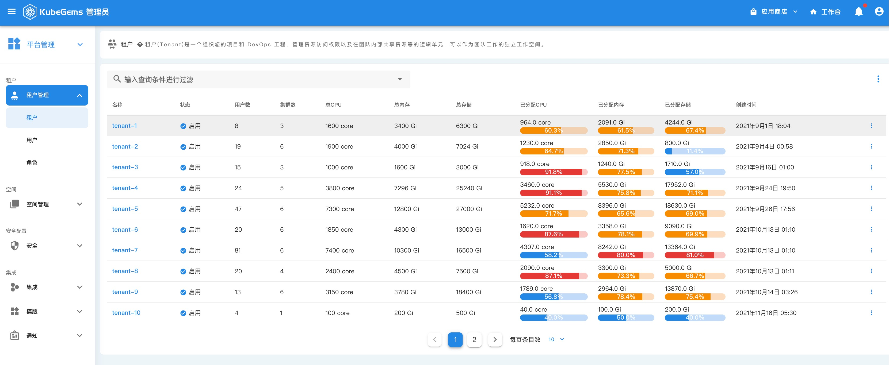
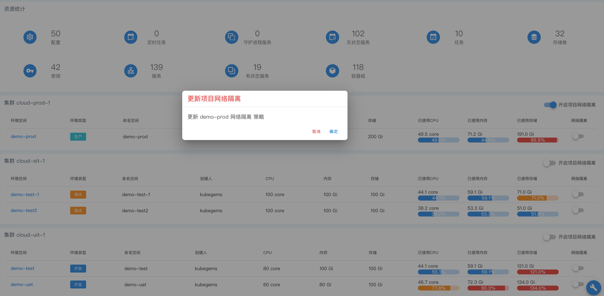
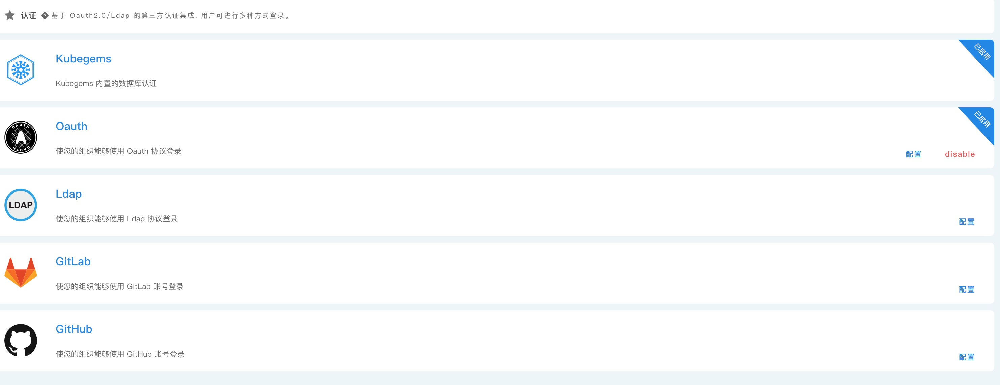

## 多租户管理

--- 

在 KubeGems 中，资源（例如集群）可以在租户之间共享。管理员或运维人员掌握了平台内不同的用户角色的权限设置。普通用户在环境空间对各种计算资源进行操作。基础设施层上的计算资源由 **KubeGems管理员** 集中管理和分配，由于 KubeGems 在租户层面实现了资源的隔离，因此用户不必担心计算资源分配额度以及资源竞争问题。其主要功能如下：

- **角色身份：** 内置多身份类型，平台内用户可按照角色进行授权；

- **成员管理：** 普通用户与租户(空间)，项目(空间)，环境(空间) 进行关联，可为空间做精细化的成员管理

- **网络隔离：** 支持基于 **Calico** 模式下的网络策略管理，在平台内部为租户在基于 **租户、项目和环境** 三个维度下实现网络隔离的策略分发

下图表述了KubeGems平台中的空间与Kubernetes集群之间的逻辑关系：

### 网络隔离

KubeGems定义了租户级别的CRD对象 TenantNetworkPolicys ，此对象**定义的网络隔离范围和网络隔离的策略**，KubeGems可以控制集群内 NetworkPolicy 以实现内部租户、项目和环境级别的网络隔离。

:::caution 注意
KubeGems v1.22.0 版本暂不支持Pod级别的细粒度网络隔离策略。
:::

### 身份认证

平台内置用户账号认证，同时也支持 OpenLdap、GitLab、GitHub和遵循 Oauth2.0 协议的第三方用户系统；

