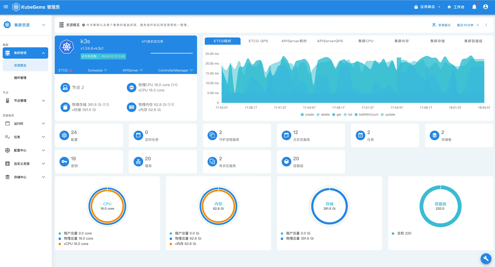
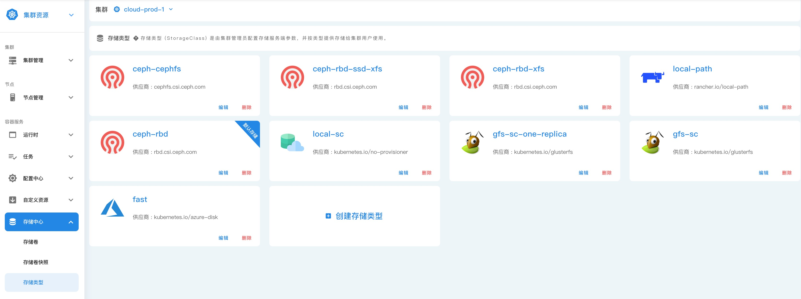
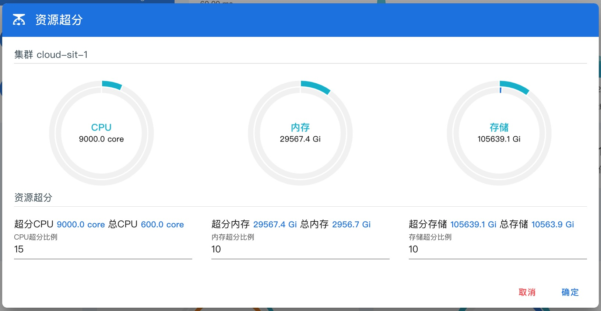
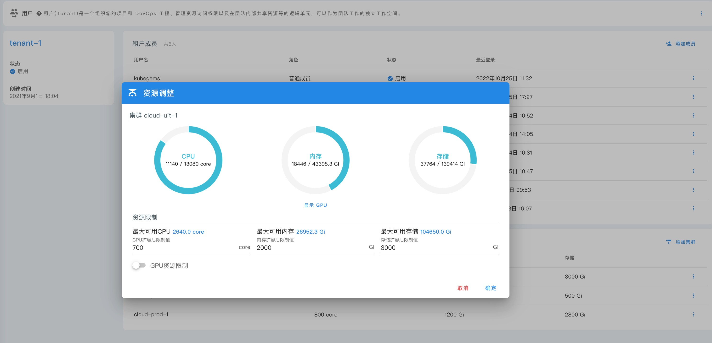
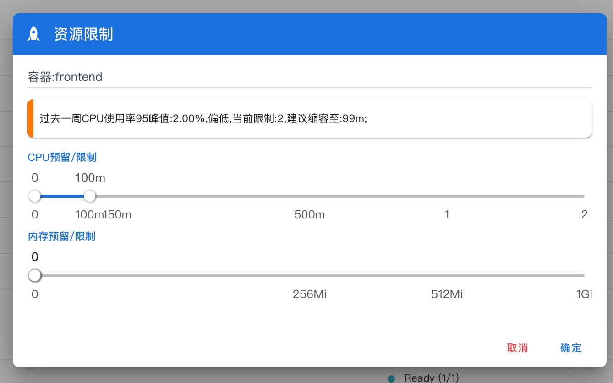

## Kubernetes集群部署与资源管理

--- 

### Kubernetes集群安装

**KubeGems** 支持对接多套 Kubernetes 集群，并可以通过自身 Operator 完成集群的安装任务，无论您是采用裸金属部署的Kubernetes，还是由公有云厂家托管的Kubernetes，它们都能运行 Agent 服务并接入到中心集群进行管理。

:::tip 提示
KubeGems 建议您的生产环境Kubernetes集群至少满足三个主Master的模式。
:::

### 多种网络方案接入

- 支持Calico、Flannel 和 KubeOvn 等开源的网络解决方案

### 多种存储方案接入

- 支持开源存储解决方案，例如GlusterFS、CephRBD、OpenEBS 和 Longhorn 等存储系统;

- 支持其他商业存储以 CSI 插件方式连接到 KubeGems 平台中的各种块存储服务;

### 计算资源管理

KubeGems-API 服务于维护了 Kubernetes 集群资源的使用统计和注册。当 Kubernetes 集群在 KubeGems 平台上成功导入，Agent 会被自动推送到 kubernetes集群内运行，并将集群资源上报给  API 服务，交由用户在 KubeGems 后端进行资源的分配

KubeGems提供了多维度的集群资源管理配置功能：

- **资源超分：** 支持 Kubernetes 集群资源超分规划，更好的提高集群资源使用率，降低IT成本；

- **资源管理：** 支持对租户空间内的资源进行扩容、监控等管理；

- **细粒度资源控制：** 基于 ResouceQuota 和 LimitRange 对用户环境空间内各应用进行细粒度资源的控制；

- **灵活分配：** 租户可以在 KubeGems 内提交资源工单，并在平台内部扭转给后台管理员进行审批和分配；

### 资源动态管理

KubeGems 根据用户过去的时间周期，在后台离线为用户资源进行资源使用率分析，并推荐用户进行资源调整。

