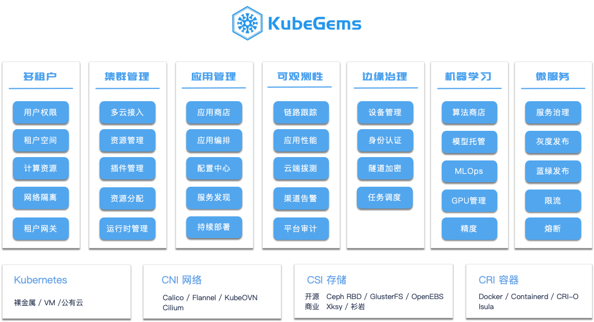

## 什么是 KubeGems

---

### 概述

**KubeGems**是一款以围绕 Kubernetes 通过自研和集成云原生项目而构建的通用性开源 PaaS 云管理平台。经过我们内部近一年的持续迭代，当前 KubeGems 的核心功能已经初步具备多云多租户场景下的统一管理。并通过插件化的方式，在用户界面中灵活控制包括 **监控系统**、**日志系统**、**微服务治理** 等众多插件的启用和关闭。

作为一个面向云原生的通用型云平台，**KubeGems** 从立项开始就把支持多集群、多租户场景下的资源隔离作为其主要实现设计目标。用户可以对接入平台的 Kubernetes 集群做 *租户级* 的自定义资源规划。除此之外，我们提供了比原生 Dashboard 功能更加丰富且人性化操作的 UI 界面，让用户/企业根据自身场景规划平台元数据，而不用担心自己的业务和数据出现错乱。同时 KubeGems 也提供过了众多丰富的功能模块来为个人或企业用户带来更好的使用体验，例如 *访问控制、资源规划、网络隔离、租户网关、存储卷、可观察性、用户审计、证书管理、金丝雀发布、istio治理* 等功能。

### 功能概览

### 关于KubeGems

坦率的讲 KubeGems 项目的发起时间比较晚，也已经过了各大企业建设私有云的红利期。也许看到这里，您会觉得 *"KubeGems又是一个同质化的产品"* 。不错！ 我们从来不否认您在使用 KubeGems 时可能会有些似曾相识的感觉，但深入体验之后又会感觉到区别。我们一直坚持将云原生产品以`简单`、`直观`和`高效`为宗旨并将其纳入项目当中，真正做到简化日常运维和开发的操作。

虽然时值 2022 年，我们在市场上看到仍旧有很多中小型企业在面临容器化时带来的一些运维、管理上的高复杂度和人员储备困难到而驻足于当前。在人才方面，中小型公司在对云原生方面的投入往往也跟随着人员的流式而能力丧失，甚至退回到之前。这类现象不仅发生在个别企业，你我身边比比皆是。而这往往也是企业不愿再过多投入基础平台建设的底层逻辑。看到这里，相信您也知道 KubeGems 选择以开源模式运营项目的初衷。 我们主要将服务于上述用户，让中小型企业从复杂繁琐的云原生项目下解放，而更专注发展自身业务！我们的核心研发团队位于成都，虽然在版本 v1.20.0 发布之后，仍然有很多新的 Feature 需要更新，但我们仍然希望您能参与进项目，使用 KubeGems 来构建你的专属的私有云平台，同时您也将获得我们整个研发团队的支持，并与它见证彼此的成长！

 --- KubeGems 项目组

2022 年 3 月 22 日
