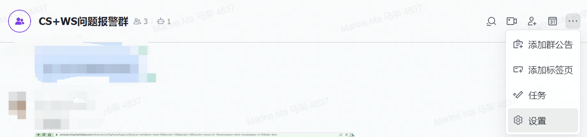

## 将日志告警发送到飞书群

---

:::tip 说明
该最佳实践案例来至 KubeGems 某用户提供
:::

日志报警可以根据自己想要监控的日志，当命中规则以后，可以发飞书/邮件通知到人，可以及时发现应用问题。

这是官方文档，更准确 https://www.kubegems.io/docs/tasks/observability/logging/alert

### 1. 建告警群，添加飞书机器人
点击群设置

点击添加机器人，选择自定义机器人，点击 "添加"

### 2. 创建告警接收器
点击右上角三个点创建

  
  

### 3. 创建报警规则

  

选择你要监控的环境，点击右上角可以创建报警规则
  

规则填写，输入以后，点添加告警级别
  

添加完告警级别后，点击保存，点击右下角下一步
  

点击添加接收器，就可以看到刚才你在第二步创建好的告警接收器，点击确定就可以了
  

### 4. 报警效果

  

