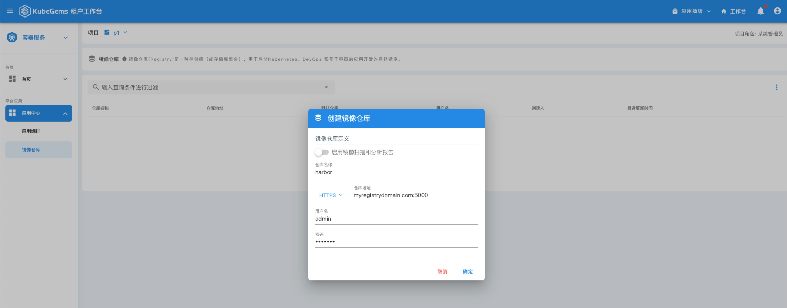
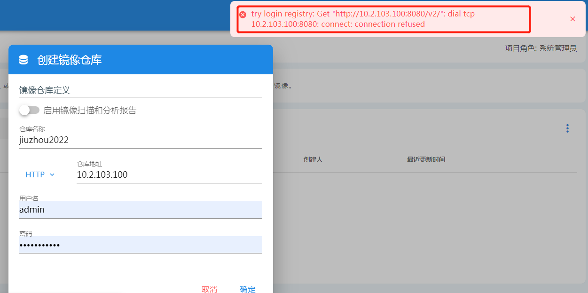
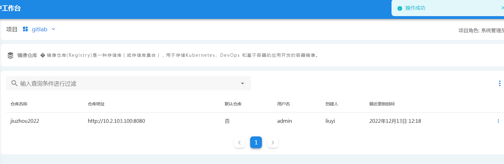

import Tabs from '@theme/Tabs';
import TabItem from '@theme/TabItem';

## 对接 Harbor 镜像仓库

---

### Harbor Registry


Harbor是一个用于存储和分发Docker镜像的企业级Registry服务器。

作为一个企业级私有 Registry 服务器，Harbor 提供了更好的性能和安全。提升用户使用 Registry 构建和运行环境传输镜像的效率。Harbor 支持安装在多个 Registry 节点的镜像资源复制，镜像全部保存在私有 Registry 中， 确保数据和知识产权在公司内部网络中管控。另外，Harbor 也提供了高级的安全特性，诸如用户管理，访问控制和活动审计等。

- 基于角色的访问控制 - 用户与 Docker 镜像仓库通过“项目”进行组织管理，一个用户可以对多个镜像仓库在同一命名空间（project）里有不同的权限。
- 镜像复制 - 镜像可以在多个 Registry 实例中复制（同步）。尤其适合于负载均衡，高可用，混合云和多云的场景。
- 图形化用户界面 - 用户可以通过浏览器来浏览，检索当前 Docker 镜像仓库，管理项目和命名空间。
- AD/LDAP 支持 - Harbor 可以集成企业内部已有的 AD/LDAP，用于鉴权认证管理。
- 审计管理 - 所有针对镜像仓库的操作都可以被记录追溯，用于审计管理。
- 国际化 - 已拥有英文、中文、德文、日文和俄文的本地化版本。更多的语言将会添加进来。
- RESTful API - RESTful API 提供给管理员对于 Harbor 更多的操控, 使得与其它管理软件集成变得更容易。
- 部署简单 - 提供在线和离线两种安装工具 

### Harbor 安装

跳过，[参考 harbor 官方文档](https://goharbor.io/docs/2.6.0/install-config/)

### 修改 CRI 配置 (Insecure Registry)

在没有配置 https 证书的情况下，访问镜像仓库需要先配置docker 或 containerd 允许访问 Insecure Registry


<Tabs groupId="cri">
  <TabItem value="docker" label="docker" default>

修改 `/etc/docker/daemon.json` 文件，将harbor 地址写入如下配置：

```json
{
  "insecure-registries" : ["myregistrydomain.com:5000"]
}
```

:::info 注意地址需添加端口
:::

  </TabItem>
  <TabItem value="containerd" label="containerd">

修改 `/etc/containerd/config.toml`, 将harbor 地址写入如下配置：

```xml
[plugins."io.containerd.grpc.v1.cri".registry]
  [plugins."io.containerd.grpc.v1.cri".registry.configs]
    [plugins."io.containerd.grpc.v1.cri".registry.configs."myregistrydomain.com:5000".tls]
      insecure_skip_verify = true
  [plugins."io.containerd.grpc.v1.cri".registry.mirrors]
    [plugins."io.containerd.grpc.v1.cri".registry.mirrors."myregistrydomain.com:5000"]
      endpoint = ["http://myregistrydomain.com:5000"]
```

:::info 注意地址需添加端口
:::

  </TabItem>
</Tabs>

### 添加镜像仓库

在租户工作台中，选择“进入项目”，在侧边栏中，点击【镜像仓库】进入仓库列表，点击右上角按钮“创建镜像仓库”



:::info 如果镜像仓库为 insecure 模式，请选择 http
:::

填入镜像仓库名称，仓库地址和访问凭证即可添加成功

:::caution 
如果您的 harbor 采用 docker-compose 部署，并映射的端口为 `80 -> 8080`，在添加镜像仓库遇见如下报错时

请将端口映射改为 `8080 -> 8080` 后重新提交
