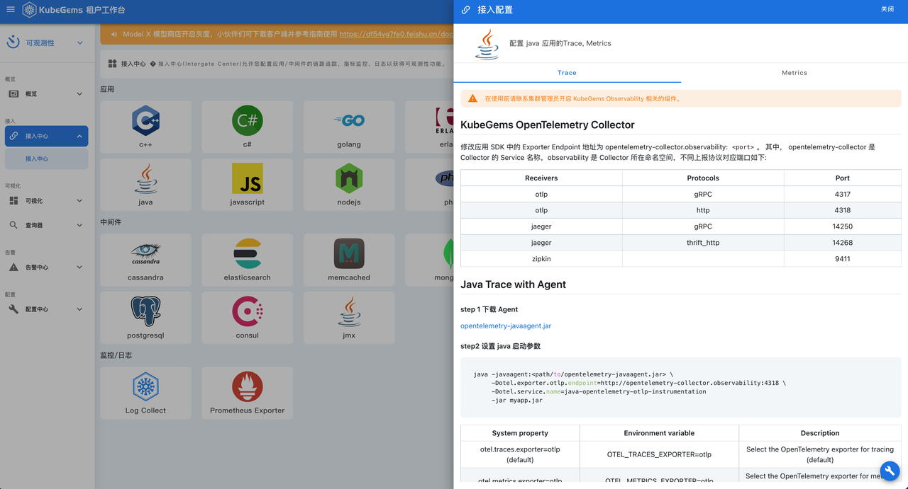
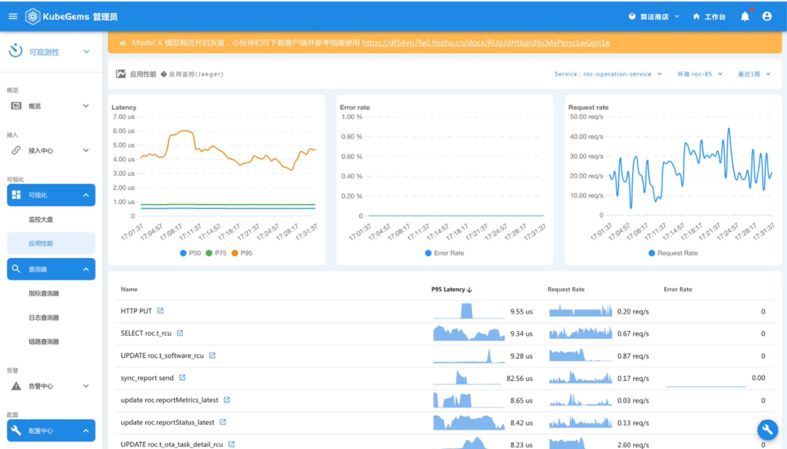
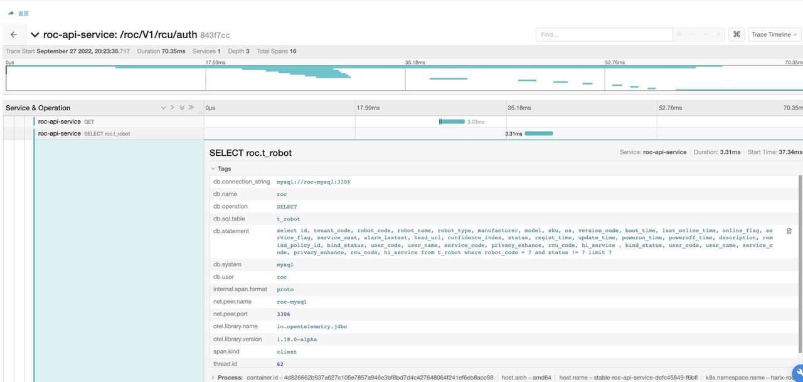

## Java应用接入KubeGems OpenTelemetry

---

## 1. 引入 Java Agent

步骤一、 进入 KubeGems 可观测性功能下的接入中心，选择 Java 应用，查看接入说明



步骤二、 封装 java 类型基础镜像

1.Dockerfile

将 java agent 拷贝到路径 /opt/otel/lib/opentelemetry-javaagent.jar 下

```bash
RUN mkdir -p /opt/otel/lib && \
    curl -o /opt/otel/lib/  https://github.com/open-telemetry/opentelemetry-java-instrumentation/releases/latest/download/opentelemetry-javaagent.jar
```

2. entrypoint.sh (业务启动脚本)

:::info提供伪代码来说明脚本启动逻辑
:::

```bash
if exist and true << (ENV OTEL_ENABLED)
    java -javaagent:/opt/otel/lib/opentelemetry-javaagent.jar -jar myapp.jar
else
    java -jar myapp.jar
fi
```

步骤三、 在 KubeGems 中需要接入的应用，在编排中添加环境变量，并同步成功

```yaml
spec:
  template:
    spec:
      containers:
        - env:
            - name: OTEL_ENABLED
              value: "true"
            - name: OTEL_EXPORTER_OTLP_ENDPOINT
              value: http://opentelemetry-collector.observability:4317
            - name: OTEL_SERVICE_NAME
              value: <你的应用名称>
            - name: OTEL_K8S_NODE_NAME
              valueFrom:
                fieldRef:
                  apiVersion: v1
                  fieldPath: spec.nodeName
            - name: OTEL_K8S_POD_NAME
              valueFrom:
                fieldRef:
                  apiVersion: v1
                  fieldPath: metadata.name
            - name: OTEL_K8S_NAMESPACE
              valueFrom:
                fieldRef:
                  apiVersion: v1
                  fieldPath: metadata.namespace
            - name: OTEL_RESOURCE_ATTRIBUTES
              value: >-
                service.name=$(OTEL_SERVICE_NAME),namespace=$(OTEL_K8S_NAMESPACE),node=$(OTEL_K8S_NODE_NAME),pod=$(OTEL_K8S_POD_NAME)
```

步骤四、在 KubeGems 应用性能中查看接口和内部方法的监控视图




在 KuebGems 链路查询器中查看链路视图



## 2. 打印 Trace Context 日志

映射的诊断上下文（MDC）是

> 是一种工具，用于区分来自不同来源的交错日志输出。
> &mdash; <cite> [log4j MDC documentation](http://logging.apache.org/log4j/1.2/apidocs/org/apache/log4j/MDC.html) </cite>

它包含线程本地的上下文信息，这些信息后来被复制到由日志库捕获的每个日志事件中。

OpenTelementry Java Agent将关于当前跨度的几个信息注入到每个日志事件的MDC副本中。

- trace_id - 当前的跟踪 ID（与 Span.current().getSpanContext().getTraceId()相同）。
- span_id - 当前的span id（与Span.current().getSpanContext().getSpanId()相同）。
- trace_flags - 当前的跟踪标志，格式为W3C traceflags格式（与Span.current().getSpanContext().getTraceFlags().asHex()相同）。

这三条信息可以通过在模式/格式中指定它们来包含在由日志库产生的日志语句中。

:::info对于使用logback的Spring Boot配置，只需覆盖logging.pattern.level，就可以在日志行中添加MDC。
:::

```bash
logging.pattern.level = trace_id=%mdc{trace_id} span_id=%mdc{span_id} trace_flags=%mdc{trace_flags} %5p
```

这样，任何解析应用程序日志的服务或工具都可以将跟踪/跨度与日志语句相关联。

#### 支持的日志库

| Library | Version |
|---------|---------|
| Log4j 1 | 1.2+    |
| Log4j 2 | 2.7+    |
| Logback | 1.0+    |

### 2.1 Log4j instrumentation 注入 TraceID

:::tip
本文参考腾讯云文档 [OpenTelementry 增强探针（Java）](https://cloud.tencent.com/document/product/1463/79421)
:::

1. 添加 Log4j2 与 OpenTelemetry-api 库到依赖库 dependencies 中：

- Maven project:

```xml
<dependencies>
  <dependency>
    <groupId>io.opentelemetry.instrumentation</groupId>
    <artifactId>opentelemetry-log4j-2.13.2</artifactId>
    <version>1.9.2-alpha</version>
    <scope>runtime</scope>
  </dependency>
  <dependency>
    <groupId>io.opentelemetry</groupId>
    <artifactId>opentelemetry-api</artifactId>
    <version>1.11.0</version>
  </dependency>

<dependency>
    <groupId>org.slf4j</groupId>
    <artifactId>slf4j-api</artifactId>
  </dependency>
</dependencies>
```

- Gradle projects：

```bash
dependencies {
  runtimeOnly("io.opentelemetry.instrumentation:opentelemetry-log4j-2.13.2:1.9.2-alpha")
  implementation("io.opentelemetry:opentelemetry-api:1.11.0"

  implementation("org.slf4j:slf4j-api")
}
```

2. 更新 log4j2.properties 配置文件，示例配置如下：

```bash
status=info
name=properties_configuration
property.basePath=/Users/tcenent/java/opentelemetry-logger-tracer/logs/

appender.rolling.type=RollingFile
[appender.rolling.name](http://appender.rolling.name/)=fileLogger
appender.rolling.fileName=${basePath}/opentelemetry-tracer.log
appender.rolling.filePattern=${basePath}app_%d{yyyyMMdd}.log.gz
appender.rolling.layout.type=PatternLayout
appender.rolling.layout.pattern=%d{HH:mm:ss.SSS} [%t] %-5level %logger{36} traceId: %X{trace_id} spanId: %X{span_id} - %msg%n
appender.rolling.policies.type=Policies

appender.rolling.policies.time.type=TimeBasedTriggeringPolicy
appender.rolling.policies.time.interval=1
appender.rolling.policies.time.modulate=true
appender.rolling.strategy.type=DefaultRolloverStrategy
appender.rolling.strategy.delete.type=Delete
appender.rolling.strategy.delete.basePath=${basePath}
appender.rolling.strategy.delete.maxDepth=1
appender.rolling.strategy.delete.ifLastModified.type=IfLastModified
appender.rolling.strategy.delete.ifLastModified.age=30d

rootLogger.level=info
rootLogger.additivity=false
rootLogger.appenderRef.rolling.ref=fileLogger
```

:::tip 建议将 log4j 的日志输出到 STDOUT，便于在日志查询器中进行过滤查询
:::

3. 配置完后，可在 logger 日志文件中查看到 TraceID 与 SpanID，如下图所示


### 2.2 Logback instrumentation 注入 TraceID

1. 添加 logback 工程依赖库到 dependencies 中：

- maven project

```xml
<dependencies>
  <dependency>
    <groupId>io.opentelemetry.instrumentation</groupId>
    <artifactId>opentelemetry-logback-1.0</artifactId>
    <version>1.9.2-alpha</version>
    <scope>runtime</scope>
  </dependency>

    <dependency>
       <groupId>ch.qos.logback</groupId>
      <artifactId>logback-core</artifactId>
      <scope>provided</scope>
   </dependency>
   <dependency>
       <groupId>ch.qos.logback</groupId>
      <artifactId>logback-classic</artifactId>
   </dependency>
  <dependency>
      <groupId>ch.qos.logback</groupId>
     <artifactId>logback-access</artifactId>
     <scope>provided</scope>
  </dependency>
</dependencies>
```

- Gradle projects：

```bash
dependencies {
  runtimeOnly("io.opentelemetry.instrumentation:opentelemetry-logback-1.0:1.9.2-alpha")

  implementation("ch.qos.logback:logback-core:1.11.0"

  implementation("ch.qos.logback:logback-classic"

  implementation("ch.qos.logback:logback-access"
  }
```

- 更新 logback.xml 配置文件，下面是一个示例配置：

```xml
<?xml version="1.0" encoding="UTF-8" ?>
<configuration scan="true" scanPeriod="3 seconds">
    <appender name="FILE" class="ch.qos.logback.core.FileAppender">
        <encoder>
            <pattern><![CDATA[%date{HH:mm:ss.SSS} [%thread] %-5level %logger{15}#%line %X{req.requestURI} traceId: %X{trace_id} spanId: %X{span_id} %msg\n]]></pattern>
        </encoder>
        <File>/Users/tencent/java/opentelemetry-logger-tracer/logs/logFile.log</File>
        <append>true</append>
    </appender>
    <appender name="OTEL" class="io.opentelemetry.instrumentation.logback.v1_0.OpenTelemetryAppender">
        <appender-ref ref="FILE" />
    </appender>
    <root>
        <level value="INFO" />
        <appender-ref ref="FILE" />
    </root>
</configuration>
```

:::tip 建议将 logback 的日志输出到 STDOUT，便于在日志查询器中进行过滤查询
:::

3. 配置完后，可在 logger 日志文件中查看到 TraceID 与 SpanID，如下图所示：


### 2.3 注意事项

因为 spring-boot 会自带 logger 的配置，所以要我们配置的文件生效，需要在引入 spring-boot 依赖示去掉默认的 loger 库：

```xml
<dependency>
    <groupId>org.springframework.boot</groupId>
    <artifactId>spring-boot-starter-web</artifactId>
    <exclusions>
        <exclusion>
            <artifactId>org.springframework.boot</artifactId>
            <groupId>spring-boot-starter-logging</groupId>
        </exclusion>
        <exclusion>
            <groupId>org.slf4j</groupId>
            <artifactId>slf4j-log4j12</artifactId>
        </exclusion>
    </exclusions>
</dependency>

<dependency>
    <groupId>org.springframework.boot</groupId>
    <artifactId>spring-boot-starter-test</artifactId>
    <scope>test</scope>
</dependency>

<dependency>
    <groupId>org.springframework.boot</groupId>
    <artifactId>spring-boot-starter</artifactId>
    <exclusions>
        <exclusion>
            <groupId>org.springframework.boot</groupId>
            <artifactId>spring-boot-starter-logging</artifactId>
        </exclusion>
    </exclusions>
</dependency>
```