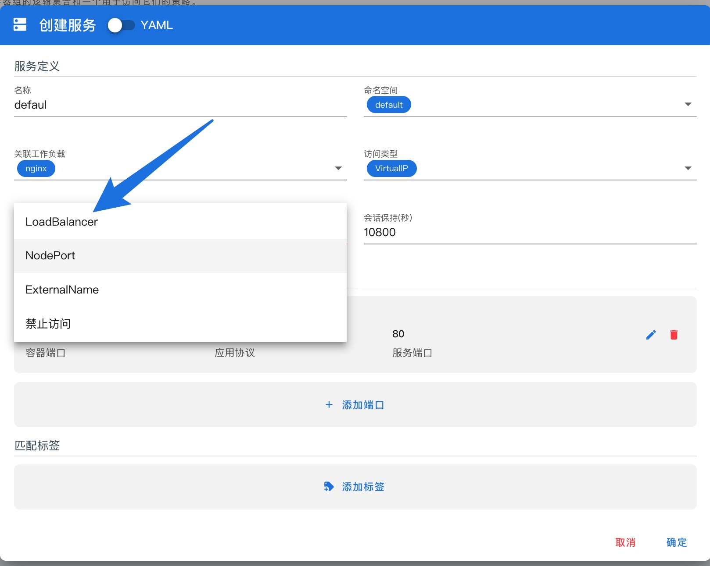
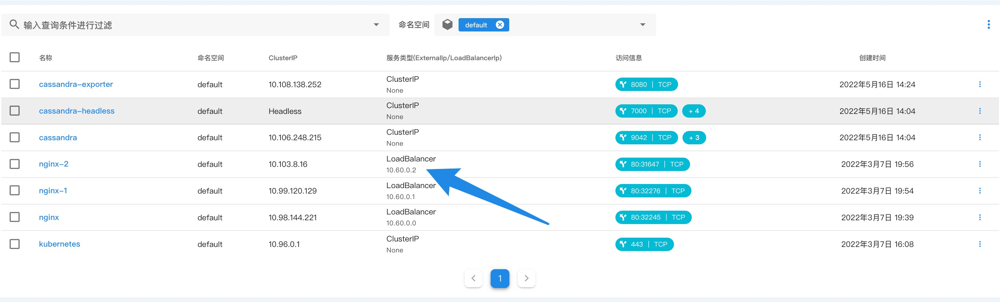

## 使用 BGP 协议为 KubeGems 提供负载均衡器

---

本篇主要介绍用户在自建数据中心内如何使用 Calico 和 MetalLB 的 BGP 协议来进行组网以及为 KubeGems 提供 LoadBalancer IP。

## 关于 CNI 选型 

当下云原生的 CNI 组件非常多，诸如老牌的 Flannel、Calico、WeaveNet、Kube-Router 以及近两年兴起的 Antrea、 Kube-OVN 和 Cilium。它们都在各自的场景下各有所长，在选择前我们可以先对其做一个简单的功能性的比较:

|                            |  Flannel  |     Calico      |   Cilium   | WeaveNet |  Antrea   |    Kube-OVN     |
| :------------------------: | :-------: | :-------------: | :--------: | :-------: | :-------: | :-------------: |
|          部署模式          | DaemonSet |    DaemonSet    | DaemonSet  | DaemonSet | DaemonSet |    DaemonSet    |
|        包封装与路由        |   VxLAN   | IPinIP,BGP,eBPF | VxLAN,eBPF |   VxLAN   |   Vxlan   | Vlan/Geneve/BGP |
|          网络策略          |    No     |       Yes       |    Yes     |    Yes    |    Yes    |       Yes       |
|          存储引擎          |   Etcd    |      Etcd       |    Etcd    |    No     |   Etcd    |      Etcd       |
|          传输加密          |    Yes    |       Yes       |    Yes     |    Yes    |    Yes    |       No        |
|          运营模式          |   社区    |     Tigera      |    社区    | WeaveWorks |  VMware   |     灵雀云      |

:::tip
传输加密主要以支持 WireGuard 或 IPSec 来评估
:::

此外关于CNI 性能部分，我们也可以透过一份 2020 年的 CNI 性能测试报告[《Benchmark results of Kubernetes network plugins (CNI) over 10Gbit/s network》](https://itnext.io/benchmark-results-of-kubernetes-network-plugins-cni-over-10gbit-s-network-updated-august-2020-6e1b757b9e49) 来选择。


:::info
上述性能测试原始数据：https://docs.google.com/spreadsheets/d/12dQqSGI0ZcmuEy48nA0P_bPl7Yp17fNg7De47CYWzaM/edit?ouid=118246426051561359914&usp=sheets_home&ths=true
:::

### 为什么选择 Calico

在对数据中心内的网络选型上，我们推荐 Calico 作为云端网络解决方案，在这里我们简单阐述下为什么推荐 Calico 的几点原因：

- 支持 BGP 广播，Calico 通过 BGP 协议广播路由信息，且架构非常简单。在 kubernetes 可以很容易的实现 mesh to mesh 或者 RR 模式，在后期如果要实现容器跨集群网络通信时，实现也很容易。

- Calico配置简单，且配置都是通过 Kubernetes 中的 CRD 来进行集中式的管理，通过操作 CR 资源，我们可以直接对集群内的容器进行组网和配置的实时变更

- 丰富的功能及其兼容性，考虑到集群内需要与三方应用兼容，例如配置多租户网络、固定容器 IP 、网络策略等功能又或者与 Istio、MetalLB、Cilium 等组件的兼容，Calico 的的表现都非常不错

- 高性能， Calico 的数据面采用 HostGW 的方式，由于是一个纯三方的数据通信，所以在实际使用下性能和主机资源占用方面不会太差，至少也能排在第一梯队

:::info
采用 BGP 协议组网需在数据中心内交换机开启 bgp 的支持
:::

## 关于 MetalLB

在讲 MetalLB 之前，先回顾下应用部署在 Kubernetes 中，它的下游服务是如何访问的吧。通常有如下几种情况

- **集群内请求:**  

直接通过 Kubernetes 的 Service 访问应用。

- **集群外请求：**

1. 通过 NodePort 在主机上以 nat 方式将流量转发给容器，优点配置简单且能提供简单的负载均衡功能， 缺点也很明显下游应用只能通过主机地址+端口来做寻址
2. 通过 Ingress-nginx 做应用层的 7 层转发，优点是路由规则灵活，且流量只经过一层代理便直达容器，效率较高。缺点是 ingress-nginx 本身的服务还是需要通过 NodePort 或者 HostNetwork 来支持

可以看到在没有外部负载均衡器的引入之前，应用部署在 kubernetes 集群内，它对南北向流量的地址寻址仍然不太友好。也许有的同学就说了，我在公有云上使用 Kubernetes 时，将 Service 类型设置成 LoadBalancer，集群就能自动为我的应用创建一条带负载均衡器地址的 IP供外部服务调用，那我们自己部署的 Kubernetes 集群有没有类似的东西来实现呢？

当然有！`MetalLB` 就是在裸金属服务器下为 Kubernetes 集群诞生的一个负载均衡器项目。

:::info
事实上当然不止 MetalLB，开源界里面还有其他诸如 PureLB、OpenELB等负载均衡产品。不过本文旨在采用 BGP 协议来实现负载均衡，所以重点会偏向 MetelLB
:::

简单来说，MetalLB包含了两个组件，`Controler`用于操作 æ Service 资源的变更以及IPAM。`Speaker`用于外广播地址以及 BGP 的连接。它支持两种流模式模式即：`layer2` 和 `BGP`。

- Layer2 模式

又叫ARP/NDP模式，在此模式下，Kubenretes集群中运行 Speaker 的一台机器通过 leader 选举，获取 Service 的 LoadBalancer IP 的所有权，并使用 ARP 协议将其 IP 和 MAC 广播出去，以使这些 IP 能够在本地网络上可访问。由此可见，使用 Layer2 的模式对现有网络并没有太多的要求，甚至不需要路由器的支持。不过缺点也显而易见，LoadBalancer IP 所在的 Node 节点承载了所有的流量，会产生一定的网络瓶颈。

:::info
我们可以简单的将 Layer2 模式理解为与 Keepalived  原理相似，区别仅为 Layer2 的lead 选举并不是使用 VRRP 组播来通信的
:::

- BGP 模式

MabelLB 在 BGP 模式下，集群中的所有运行 Speaker 的主机都将与上层交换机建立一条BGP 连接，并广播其 LoadBalancer 的IP 地址。优点是真正的实现了网络负载均衡，缺点就是配置相对而言要复杂许多，且需上层路由器支持BGP。

### MetalLB with Calico

通过上述的介绍，你可能发现了一个问题：在 BGP 模式的场景下，Calico 和 MetalLB 都需要运行一个 DaemonSet 的bgp 客户端在主机上与上层路由器建立 bgp peer，在 Calico 中是 Bird ，MetalLB 中是 Speaker。这就会引出来它们使用上的一些问题。

:::info 
BGP 只允许每个节点建立一个会话，如果使用 Calico 并建立了 BGP 路由器会话，MetalLB 无法建立自己的会话.因为这条 BGP会话会被路由器认为是相冲突而拒绝连接
:::


事实上我们传统的 Fabric 网络在运用上述方案也遇到此问题，MetalLB 社区也给了 3 个方案来解决：

- BGP 与 Tor 交换机连接

    此方案即 MetalLB 放弃在 Node 节点上部署 Speaker 服务，关于主机上 BGP 路由的广播统一交给 Calico Bird 处理。这也是 Calico 社区建议采取的方案。


- BGP 与 Spine 交换机连接

    此方案让 MetalLB Speaker 的 BGP Peer 绕过 Tor 路由，直达上层核心路由器。虽然解决了 BGP 连接问题，但是额外带来了配置的复杂性，以及损失了BGP 连接的扩展性，这大型的数据中心是不被认可的！


- 开启 VRF-虚拟路由转发

    如果你的网络硬件支持 VRF（虚拟路由转发），那就可以将通过虚拟化的方式分别为 Calico Bird 和 MetalLB Speaker 创建独立的路由表，并建立 BGP 连接。然后再在两个 VRF 内部之间进行路由

 

    
此方案理论上可行，但笔者的数据中心并没有支持 VRF 功能的路由器，且受限于不同网络设备厂家的实现方式不同而带来的操作差异也不可控。所以具体的实现还需每个用户自行决定。
    


## 具体实践

本节我们就简单的部署与配置来完成 Calico BGP 与 MetalLB 的配置

网络上面的一些基本信息:

|   规划CIDR   |                             用途                             |      关联服务      |
| :----------: | :----------------------------------------------------------: | :----------------: |
| 10.52.1.0/24 |    Kubernetes 主机物理网络，同时也是 IBGP 连接的承载网络     | Kubernetes，Calico |
| 10.59.0.0/16 |             Kubernetes 容器默认使用的 IP 地址池              |       Calico       |
| 10.96.0.0/12 |       Kubenretes Service 内部地址池，即 ClusterIP 区域       |     Kubernetes     |
| 10.60.0.0/21 | Kubenretes Service 负载均衡器地址池，即 LoadBalancer IP 区域 |  Calico, MetalLB   |

IDC 中心的 BGP 信息

|   BGP    |           信息           |
| :------: | :----------------------: |
|  AS 域   |          65001           |
| BGP peer | 10.52.1.253，10.52.1.254 |

### Calico 部分

- 下载并部署 Calico  Manifest 文件，并将文件内容中关于 `POD CIDR`修改为自己环境下的配置

```yaml
curl https://projectcalico.docs.tigera.io/manifests/calico.yaml -O

----
containers:
- image: kubegems/calico-node:v3.22.1
  name: calico-node
  env:
  - name: CALICO_IPV4POOL_CIDR
    value: 10.59.0.0/16
```

- 配置 BGP Peering，可根据机房规模选择 `Global BGP Peer`和`Per-Node Peer`。它们之间区别为**Global BGP Peer**的连接拓扑呈星状，所有的节点都在一个 AS 域内。**Per-Node Peer**则可以利用主机标签进行灵活的接入。

​	这里由于我们服务器规模不大（<50）可直接采用全局 BGP 连接模式。

```yaml
apiVersion: projectcalico.org/v3
kind: BGPPeer
metadata:
  name:  tor-router-253
spec:
  peerIP: 10.52.1.253
  asNumber: 65001
---
apiVersion: projectcalico.org/v3
kind: BGPPeer
metadata:
  name:  tor-router-254
spec:
  peerIP: 10.52.1.254
  asNumber: 65001
```

:::info
考虑到 BGP 连接的冗余，实际在使用上，我们可以创建两个 BGPPeer，防止路由器单点故障。

如果你需要按照机架来划分 AS 域的话，可以采用 Per-Node Peer 模式，通过 nodeSelector 来实现个性化的连接配置。

```yaml
apiVersion: projectcalico.org/v3
kind: BGPPeer
metadata:
  name: rack1-tor
spec:
  peerIP: 192.20.30.40
  asNumber: 64567
  nodeSelector: rack == 'rack-1'
```
:::

- 禁用 Calico NodeToNodeMesh

```bash
calicoctl patch bgpconfiguration default -p '{"spec": {"nodeToNodeMeshEnabled": false}}'
```

- 禁用 ipipMode 和vxlan Mode

```yaml
apiVersion: projectcalico.org/v3
kind: IPPool
metadata:
  name: default-ipv4-ippool
spec:
  allowedUses:
  - Workload
  blockSize: 26
  cidr: 10.59.0.0/16
  ipipMode: Never
  natOutgoing: true
  nodeSelector: all()
  vxlanMode: Never
```

此时，我们使用calicoctl 来查看 BGP 状态，如果 STATE 为 up，就代表集群内主机的 BGP 连接正常。


###  MetalLB 部分

- Kube-Proxy 采用 IPVS 的话，需开启严格的 ARP 学习设置。

```yaml
kubectl edit configmap -n kube-system kube-proxy

----
apiVersion: kubeproxy.config.k8s.io/v1alpha1
kind: KubeProxyConfiguration
mode: "ipvs"
ipvs:
  strictARP: true
```

:::info
如果多台用户主机同时向设备发送大量ARP报文，或者攻击者向设备发送伪造的ARP报文，会出现以下问题：

- 处理 ARP 报文会消耗大量 CPU 资源。设备学习到很多无效的ARP表项，耗尽了ARP表项资源，导致设备无法学习到来自授权用户的ARP报文的ARP表项，造成用户的通信被中断。
- 设备收到伪造的ARP报文后，错误地修改了ARP表项。造成用户无法相互通信。

为避免上述问题，开启 strictARP 后，设备对发送的ARP请求报文只学习ARP回复报文的ARP表项。这样，设备就可以防御大部分的ARP攻击。
:::

- 下载并安装 MetalLB

```
kubectl apply -f https://raw.githubusercontent.com/metallb/metallb/v0.12.1/manifests/namespace.yaml
kubectl apply -f https://raw.githubusercontent.com/metallb/metallb/v0.12.1/manifests/metallb.yaml
```

注意，由于我们不需要 MetalLB 的 Speaker 服务，所以当 MetalLB Controller 运行成功后，可以将 speaker 服务删除。

```bash
kubectl delete daemonset speaker -n metallb-system
```

- 配置 MetalLB 中需要广播的 BGP 地址范围，也就是后面 Kubernetes Service 中 LoadBalancer 的地址。

```yaml
apiVersion: v1
kind: ConfigMap
metadata:
  namespace: metallb-system
  name: config
data:
  config: |
    address-pools:
    - name: default
      protocol: bgp
      addresses:
      - 10.60.0.0/21
```

### Calico 广播 Kubernetes 服务地址（包含 MetalLB 地址）

得益于 BGP 的使用，Calico 可以很容易的将 Kubernetes 集中的 Service IP 地址像 Pod IP一样发布到内网。通过使用ECMP（等价多路径路由）来实现真正的负载均衡。

通常Kubenretes中 Service 中的地址涉及到 3 种类型，即 `ClusterIP`、`ExternalIP `和 `LoadBalancerIP`。

考虑到我们仅需要将有限的服务通过`LoadBalancerIP`方式暴露出来。（虽然直接发布 ClusterIP 很酷，但它在某些网络限制严格的场景下是不被接受的）。所以对 Calico 的 BGP 仅需如下配置。

```yaml
apiVersion: projectcalico.org/v3
kind: BGPConfiguration
metadata:
  name: default
spec:
  logSeverityScreen: Info
  nodeToNodeMeshEnabled: false
  asNumber: 65001
  serviceLoadBalancerIPs:
  - cidr: 10.60.8.0/21
```

如果我们需要将 Kubernetes 的控制节点从广播中排除开来，那么仅需要为控制平面的主机添加如下标签即可：

```bash
kubectl label node control-plane-01 node.kubernetes.io/exclude-from-external-load-balancers=true
```

### 路由器配置

原则上说，在路由器上开启 BGP 协议是上述所有操作中最先应该开始的工作。但由于每位读者所在环境中支持BGP 的交换机厂家不尽相同，所以我将此部分挪到最后来说明。我并不是网络上的专家，这里我只对我们 Calico BGP 网络的架构做一个简单说明，读者在规划自己的 BGP 网络时，可与网络工程师一起合作完成。


最终当交换机上的路由反射器和 BGP 邻居创建完成后，Calico 的 Bird 服务便能与反射器建立对等连接，此时连接的状态如下


路由表信息如下


可以看到此时，容器的子网路由都明确了下一跳的主机地址，以及公布的`LoadBalancer CIRD`下一跳地址。

#### 关于 EMCP

等价多路径路由ECMP（Equal-Cost Multi-Path routing）实现了等价多路径负载均衡和链路备份的目的。多用于 Layer 3 的负载均衡，用于解决“负载均衡服务器”的单点和扩缩容的问题。既然我们在内部采用了 BGP 网络，当然也可以在路由器上启用此功能。


当启用此功能后，我们在路由表中便可以看到对访问目标地址是`LoadBalancer CIRD`网段的路由，下一跳地址可以是多个 Calico 的 Node 主机。

不过在决定启用 ECMP 之前，你需了解它的背后仍然面临一些应用上的限制。

当我们使用 BGP 做Layer 3层的负载均衡时，当某一台主机出现故障后，交换机上通过连接三元组/五元组作为 `hash key` 进行负载均衡的数据包会被重新发到新的主机上去，由于目的地址变化，当数据包到达新主机时会被直接丢弃，导致连接断开。这是反应在应用层上的现象就是`“Connection reset by peer”`

当然我们可以使用一些其他方法来规避和缩小上述现象的影响范围，例如：

1. 路由器上调整更稳定的等价多路径路由 ECMP（Equal-Cost Multi-Path routing）算法。当后端集群发生变化时而受到影响较少的连接数。

:::info
- 逐流负载分担能保证包的顺序，保证了同一数据流的帧在同一条下一跳路由转发，而不同数据流在不同的下一跳路由上转发。


- 逐包负载分担可以提高ECMP的带宽利用率，使等价多路径路由分担更均匀，但存在数据包乱序的问题，需要确保流量接收的设备或终端支持报文乱序组包的功能，实际使用场景很少。


:::

2. 服务部署调度时，尽量选择固定到更小的范围、或者更稳定的主机组。

3. 上层应用需支持网络连接断开重试逻辑

4. 在 MeltalLB和应用之间再加一层流量控制器（如 ingress-nginx），以此来维护连接状态的一致性。这样只有当 ingress-nginx 的规模产生变换时，才会出现上述问题。

## 创建 LoadBalancer

进入到 KubeGems 服务窗口，创建服务时“外部访问” 选择“负载均衡器”



创建成功后，MetalLB 会为改服务创建一个 Loadbalancer 类型的地址，并通过 BGP 协议广播到数据中心内部网络



