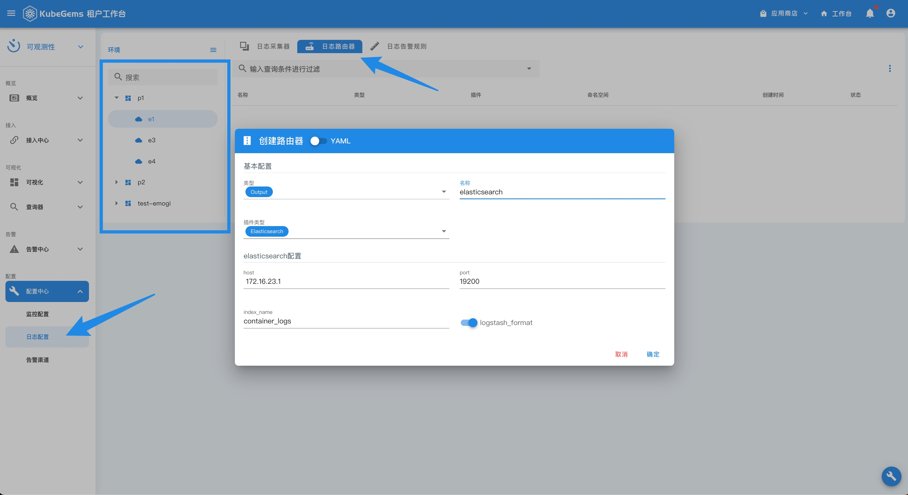
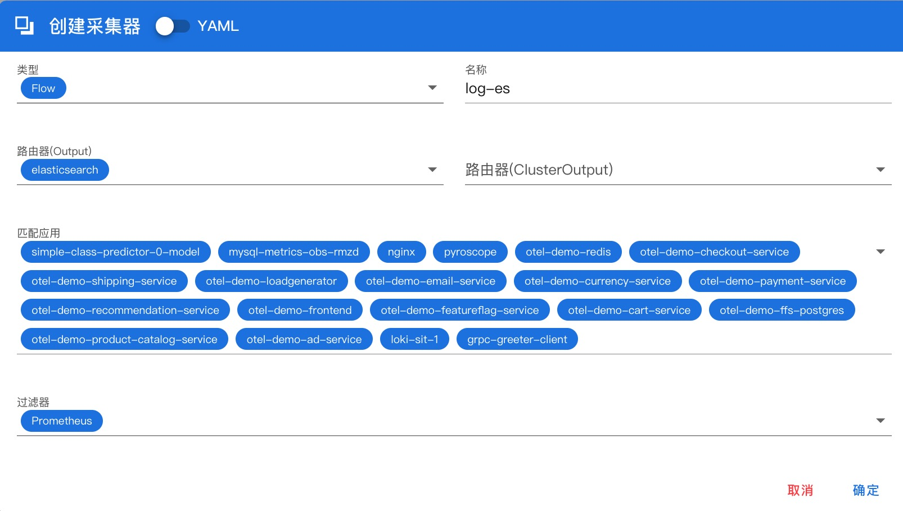
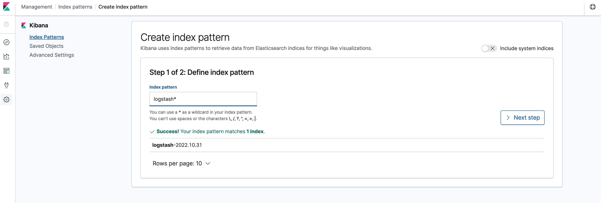
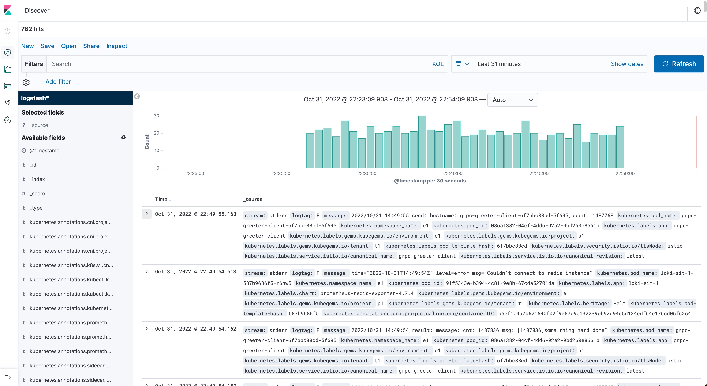

## 将容器日志发送到 ElasticSearch

--- 

### 前置条件

- KubeGems 开启了 logging 插件

- 具备一套 ElasticSearch 和 Kinbana 环境

### 1. 创建ElasticSearch 日志路由器

进入 KubeGems 可观测性页面，选择【配置中心】-【日志配置】，选择要将日志输出到 ES 的目标环境，点击【日志路由器】创建一个路由器

日志路由器插件选择 “ElasticSeach”，写入 ES 的地址相关信息

### 2. 创建日志采集器，并关联路由器

创建成功后，进入【日志采集器】标签页中，创建一个新的日志采集器，并在“路由器”选型中关联刚刚创建的"路由器" 即可

### 3.设置 Kibana Index Patterns

 登录 Kibana 创建 Index Patterns

### 4. Kibana 查询日志

进入Kinban Discover 查询日志

