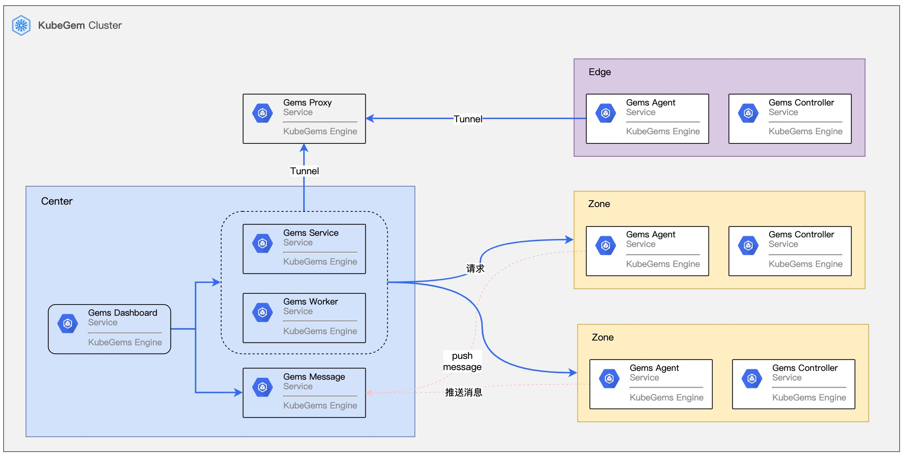
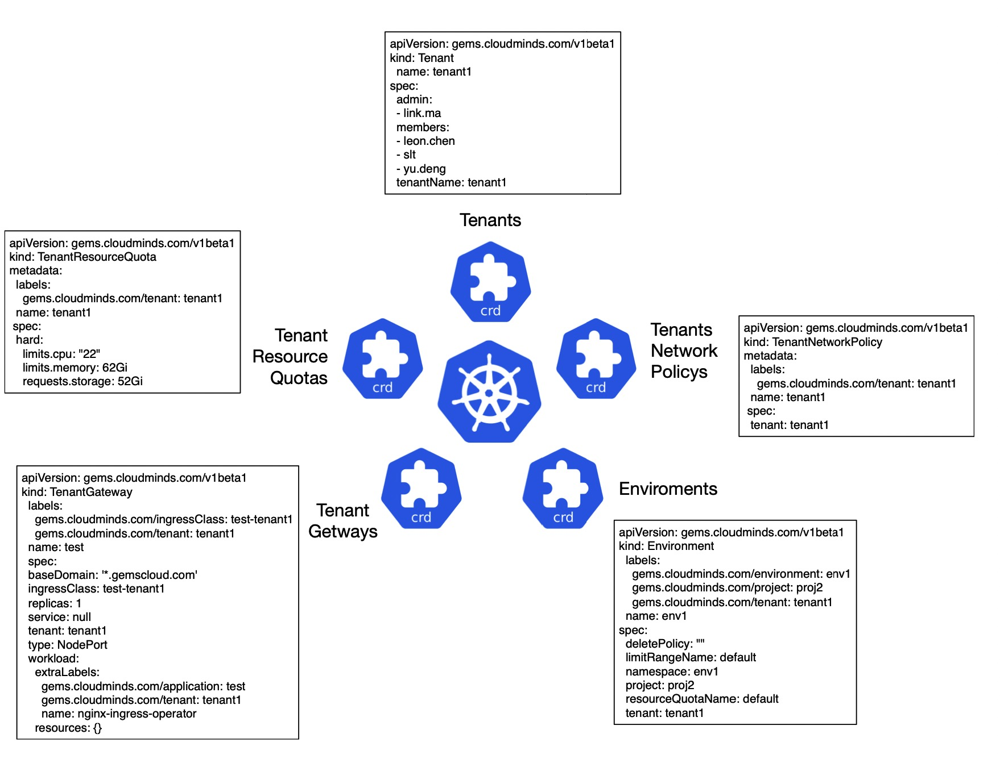
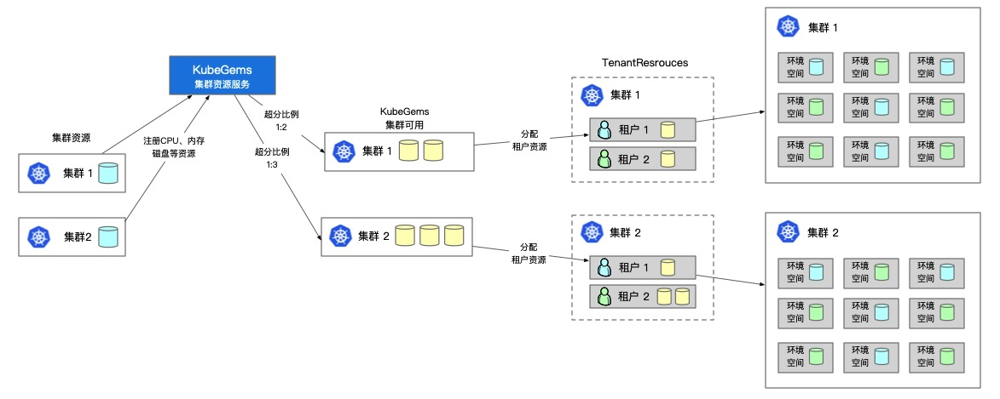
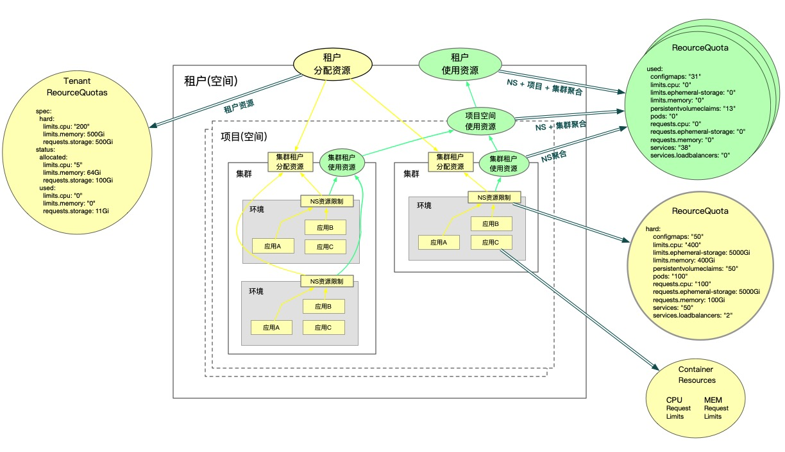

## 多集群管理

KubeGems 支持对接多套 Kubernetes 集群，并可以通过自身 Operator 完成集群的安装任务，无论您是采用裸金属部署的Kubernetes，还是由公有云厂家托管的Kubernetes，它们都能运行 Agent 服务并接入到中心集群进行管理。

## 多租户管理

--- 

### CostomResourceDefinition

KubeGems通过自定义 **CRD(Custom Resource Definitions)** 将户资源抽象为5个类型进行统一管理，分别是：

- Tenant （租户）

- Enviroments （环境）

- TenantResourceQuotas （资源）

- TenantGateways （网关）

- TenantNetworkPolicys （网络策略）

KubeGems的租户控制主要在 Tenant 和 Enviroments 两个CRD中实现管理，里面分别定义了租户以及环境（包含项目）等信息。

下图描述了 KubeGems 平台中的空间与Kubernetes集群之间的逻辑关系：

### 计算资源管理

KubeGems API 服务于维护了 Kubernetes 集群资源的使用统计和注册。当 Kubernetes 集群在 KubeGems 平台上成功导入，Agent 便会被推送到kubernetes集群内运行，并将集群资源上报给 service，交由用户在 KubeGems 后端进行资源的分配

### 计算资源设计

租户资源管理由 KubeGems 的 TenantResourceQuotas 管理，它在 Kubernetes 的原生资源对象 ResouceQuota 和 LimitRange 之上抽象的资源用于对集群内的租户资源进行控制。

当用户在 Kubernetes 集群内的命名空间内的资源总和大于租户分配到该集群的资源总数时，用户无法再通过调整配额的方式分配资源。此时需要该租户下的管理员提交资源申请工单给平台管理员进行申请。当管理员批准资源申请后，新的集群租户资源(TenantResourceQuotas)的操作会由 KubeGems API 服务 下发到 Kubernetes 集群，并由 KubeGems Controller 服务进行资源校验和控制。

### 网络隔离

KubeGems定义了租户级别的CRD对象 TenantNetworkPolicys ，此对象**定义的网络隔离范围和网络隔离的策略**，KubeGems可以控制集群内 NetworkPolicy 以实现内部租户、项目和环境级别的网络隔离。

:::caution 注意
KubeGems v1.20.0 版本暂不支持Pod级别的细粒度网络隔离策略。
:::

