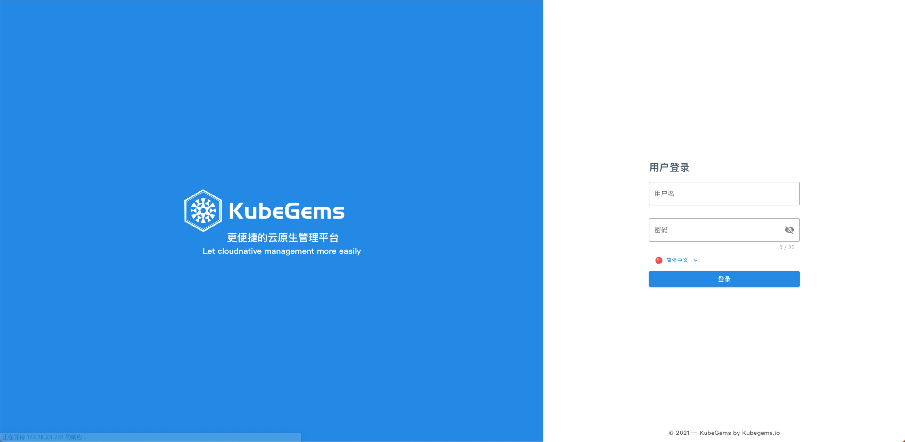

import Tabs from "@theme/Tabs";
import TabItem from "@theme/TabItem";

## 基于自建 k8s 安装

---

### 前置条件

- 安装 kubegems 需要具备**集群管理员**权限，所以在部署前需要联系您的集群管理员，以保证有足够的授权执行以下操作。

- kubernetes 1.21 及以上版本( 1.23+最佳 )

- 所有节点的时间同步

**KubeGems**通过与 [bundle-controller](https://github.com/kubegems/bundle-controller) 相同的方式进行安装，通过下发 plugin 类型的 CR 来安装对应的 helm/kustomize 包。

:::tip
如果您想尝试我们正在开发的版本，可以参考[这里](https://github.com/kubegems/kubegems/blob/main/deploy/README-zh.md)进行部署。
:::

## 主要部分

kubegems 包含以下主要部分：

| 名称                 | 描述                                                        |
| -------------------- | ----------------------------------------------------------- |
| kubegems-installer | kubegems 安装程序，安装 kubegems 组件及依赖组件             |
| kubegems           | kubegems 核心组件，包含 UI 界面及相关 API 服务              |
| kubegems-local     | kubegems 边缘组件，安装在托管集群上，获取集群信息和执行操作 |

## 部署 KubeGems

确定部署版本,您可以前往 [Kubegems Release](https://github.com/kubegems/kubegems/tags) 查询到最新的版本号.

```bash
$ export KUBEGEMS_VERSION=<kubegems version> #  安装 kubegems 的版本
```

### 部署 installer

installer 是用于安装 kubegems 主要组件和插件的控制器。
其通过监听类型为 `plugins.plugins.kubegems.io` 的 CR，并根据其定义来下载和安装相应的 helm chart 或者 kustomize 文件。

详情参考:[bundle-controller](https://github.com/kubegems/bundle-controller)。

```bash
$ kubectl create namespace kubegems-installer
$ kubectl apply -f https://github.com/kubegems/kubegems/raw/${KUBEGEMS_VERSION}/deploy/installer.yaml
```

等待安装程序准备就绪。

```sh
$ kubectl -n kubegems-installer get po
NAME                                  READY   STATUS    RESTARTS   AGE
kubegems-installer-6fb7495c4d-8rqwn   0/1     Running   0          12s
```

### (可选)安装依赖

- kubegems 需要持久化一些重要数据，需要集群有可用的 CSI 插件

  如果没有 CSI 插件，可以安装 local-path-provisioner

  ```bash
  $ kubectl create namespace local-path-storage
  $ kubectl apply -f https://github.com/kubegems/kubegems/raw/${KUBEGEMS_VERSION}/deploy/addon-local-path-provisioner.yaml
  ```

### 部署 kubegems 核心组件

:::caution
kubegems 默认使用名称为 local-path 的 storageClass，如果您使用不同的 storageClass，您需要在 apply 前下载并编辑 `kubegems.yaml` 文件。
:::

<Tabs>
  <TabItem value="dockerhub" label="DockerHub 源" default>

```bash
$ kubectl create namespace kubegems

$ export STORAGE_CLASS=local-path  # 改为您使用的 storageClass
$ curl -sL https://github.com/kubegems/kubegems/raw/${KUBEGEMS_VERSION}/deploy/kubegems.yaml \
| sed -e "s/local-path/${STORAGE_CLASS}/g" \
> kubegems.yaml

$ kubectl apply -f kubegems.yaml
```

  </TabItem>
  <TabItem value="aliyun" label="阿里云镜像源（中国大陆地区推荐）" default>

```bash
$ kubectl create namespace kubegems

$ export STORAGE_CLASS=local-path  # 改为您使用的 storageClass
$ export IMAGE_REGISTY=registry.cn-beijing.aliyuncs.com
curl -sL https://github.com/kubegems/kubegems/raw/${KUBEGEMS_VERSION}/deploy/kubegems.yaml \
| sed -e "s/local-path/${STORAGE_CLASS}/g" -e "s/docker.io/${IMAGE_REGISTY}/g" \
> kubegems.yaml

$ kubectl apply -f kubegems.yaml
```

  </TabItem>
</Tabs>

** kubegems CR 下发后，大约需要 5 分钟才会一切正常，这取决于您的具体配置。**

:::info
在启动完成之前会有许多 Pod 的状态为 `CrashLoopBackOff`，这是由于其依赖的服务（mysql、redis、gitea、argocd 等）还在启动中，这是正常的，请耐心等待。
:::

kubegems 所有服务部署并启动完成后会有如下 pod：

```bash
$ kubectl -n kubegems get pod

NAME                                               READY   STATUS      RESTARTS      AGE
kubegems-api-6d45f656f8-lfk7j                      1/1     Running     0             21h
kubegems-argo-cd-app-controller-5b849bfb49-ltvdz   1/1     Running     0             21h
kubegems-argo-cd-repo-server-7dddd8f57d-ldj5k      1/1     Running     0             21h
kubegems-argo-cd-server-76745cc657-v8dx9           1/1     Running     0             21h
kubegems-chartmuseum-6c546b4d-qxfjj                1/1     Running     0             21h
kubegems-charts-init-main-lmtwt                    0/1     Completed   0             21h
kubegems-dashboard-6bcd7f65f-89gsk                 1/1     Running     0             21h
kubegems-gitea-0                                   1/1     Running     0             21h
kubegems-init-main-vjxnq                           0/1     Completed   3             21h
kubegems-msgbus-7c58548497-pqwht                   1/1     Running     5 (21h ago)   21h
kubegems-mysql-0                                   1/1     Running     0             21h
kubegems-redis-master-0                            1/1     Running     0             21h
kubegems-worker-7d67974f4c-cj65l                   1/1     Running     5 (21h ago)   21h
```

### 访问 kubegems 仪表板

1. 通过端口转发：

```sh
$ kubectl -n kubegems port-forward svc/kubegems-dashboard 8080:80
```

2. 通过 NodePort:

你需要编辑 kubegems 插件，为 dashbnoard 组件开启 nodeport

```sh
$ kubectl -n kubegems edit plugins.plugins.kubegems.io kubegems
```

示例:

```yaml
apiVersion: plugins.kubegems.io/v1beta1
kind: Plugin
metadata:
spec:
  kind: helm
  url: https://charts.kubegems.io/kubegems
  values:
    dashboard:
      service:
        type: NodePort
    global:
      kubegemsVersion: v1.21.4
      storageClass: local-path
    ingress:
      hostname: dashboard.kubegems.io
```

3. 如果作为正式使用您可能需要使用 ingress 或其他方式访问。

kubegems 默认创建了 hostname 为 `dashboard.kubegems.io` 的 ingress, 同时默认绑定了 `default-gateway`的`ingressClass`。
如果您想更改为其他域名，或者绑定到其他网关可以编辑 kubegems 插件。

:::tip
`default-gateway`是平台默认网关，要使用它，你需要启用`网关-gateway`插件
:::

```sh
kubectl -n kubegems edit plugins.plugins.kubegems.io kubegems
```

示例:

```yaml
apiVersion: plugins.kubegems.io/v1beta1
kind: Plugin
metadata:
spec:
  kind: helm
  url: https://charts.kubegems.io/kubegems
  values:
    global:
      kubegemsVersion: v1.21.4
      storageClass: local-path
    ingress:
      hostname: dashboard.kubegems.io
      ingressClassName: default-gateway
```

:::info
更多相关配置文档: https://github.com/kubegems/kubegems/blob/main/deploy/plugins/kubegems/README.md#dashboard-exposure-parameters
:::

您需要将该域名解析到 Kubernetes 集群内任意节点或者 Ingress LoadBanlancer IP 后，才可通过该域名访问页面。

获取 ingress 访问地址：

```bash
$ PORT=$(kubectl -n kubegems-gateway get svc default-gateway -ojsonpath='{.spec.ports[0].nodePort}')
$ ADDRESS=$(kubectl -n kubegems get ingress kubegems -ojsonpath='{.spec.rules[*].host}')
$ echo http://$ADDRESS:$PORT
```



您可以通过如下用户名与密码登录控制台：

```
user: admin
password: demo!@#admin
```

### 下一步

请移步 [快速入门](../../category/快速入门) 进行平台设置