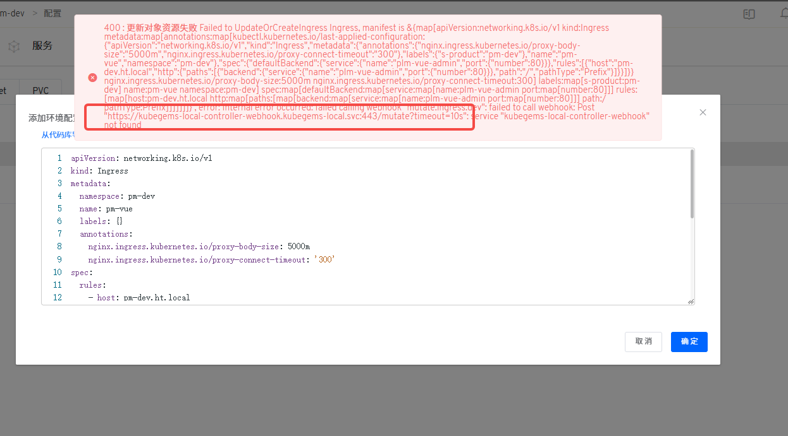

## 卸载 kubeGems

### 前置条件

1. 具备 kubegems 管理员账号

2. 具备 kubernetes 集群管理员权限


### 卸载插件

在 KubeGems 的后台集群管理的插件页面中，点击卸载即可删除所有 KubeGems 生态相关插件

:::caution 风险提示
 KubeGems 部分插件采用了 Operator 部署，在卸载插件前，请确定您是否通过 Operator 提交过其他资源。避免删除 Operator 后导致您的资源丢失或无法管理
:::

### 卸载 KubeGems

```
$ kubectl delete plugin kubegems -n kubegems
```

:::tip 提示
默认情况下，我们保留了 MySQL 等数据库的持久化数据卷，如果您要彻底删除数据，可执行以下命令
```bash
$ kubectl  delete pvc --all -n kubegems
```
:::

### 卸载 KubeGems installer

```
$ kubectl delete -f https://github.com/kubegems/kubegems/raw/${KUBEGEMS_VERSION}/deploy/installer.yaml
$ kubectl delete ns kubegems-installer
```

:::tip提示
${KUBEGEMS_VERSION} 填写您安装的 KubeGems版本
:::

### 卸载 WebHook 

如果您的集群在卸载 KubeGems 后遇到更新资源报错，例如



造成此报错的原因可能是 Kubernetes 中的 MutateWebhook 没有清除，请手动删除即可

```bash
kubectl delete mutatingwebhookconfigurations kubegems-local-controller-webhook
kubectl delete validatingwebhookconfigurations kubegems-local-controller-webhook
```

:::tip 什么是 Kubernetes Admission Webhook
[**Admission Webhook**](https://kubernetes.io/zh-cn/docs/reference/access-authn-authz/extensible-admission-controllers/) 是一种用于接收准入请求并对其进行处理的 HTTP 回调机制。 可以定义两种类型的准入 webhook，即验证性质的准入 Webhook 和 修改性质的准入 Webhook。 
- 修改性质的准入 Webhook (MutatingWebhook) 会先被调用。它们可以更改发送到 API 服务器的对象以执行自定义的设置默认值操作。在完成了所有对象修改并且 API 服务器也验证了所传入的对象之后， 
- 验证性质的 Webhook (ValidatingWebhook) 会被调用，并通过拒绝请求的方式来强制实施自定义的策略。
:::