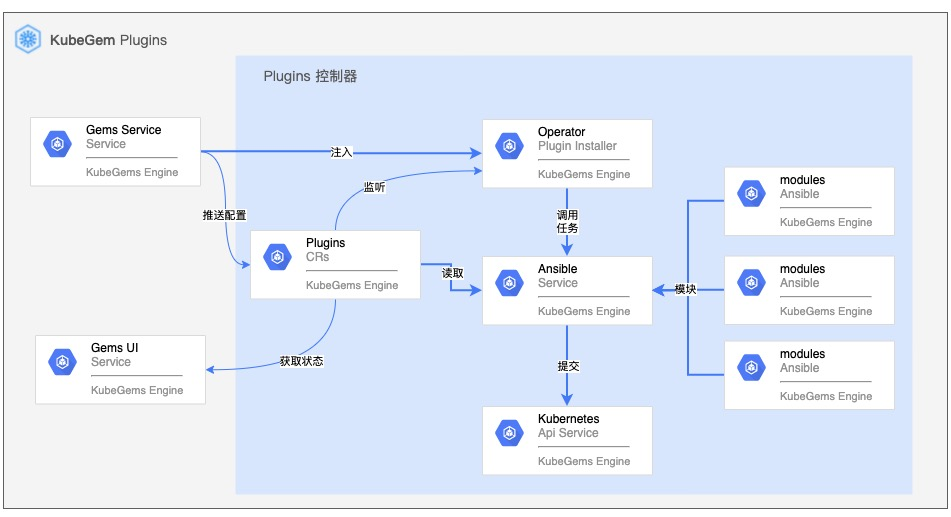
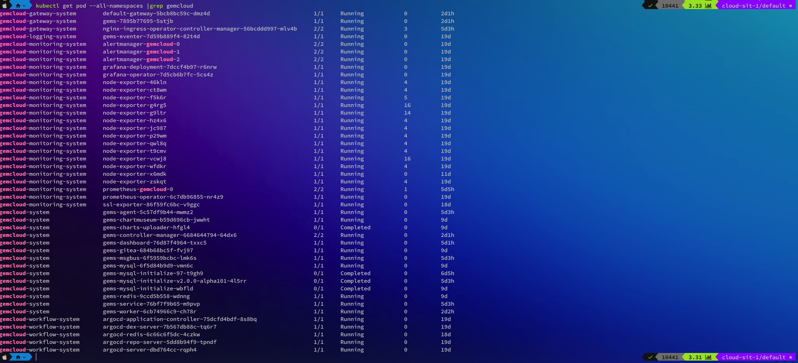

## 快速安装

---

**KubeGems Installer Operator**是一个通过 [Operator SDK](https://sdk.operatorframework.io/) 构建的Ansible Kubernetes控制器。通过CRD中的定义的字段对Ansible进行变量传递。Installer Operator的运行需要具备集群管理员的RBAC权限，所以在部署前需要联系您的集群管理员，以保证有足够的授权执行以下操作。



### Installation

1.执行以下命令安装KubeGems Installer控制器

```bash
kubectl apply -n kubegems-installer -f https://github.com/kubegems/installer-operator/releases/download/v1.20.0-beta.0/centrol.yaml
```

2.执行以下命令验证部署结果

```bash
kubectl get pod -n kubegems-installer

NAME                                           READY   STATUS    RESTARTS   AGE     IP                NODE              NOMINATED NODE   READINESS GATES
kubegems-installer-manager-8649bd7fcb-j286g    2/2     Running   0          15m     192.169.15.92     k8s-master3-123   <none>           <none>
```

### Installer

1.执行以下命令提交 installer 资源

```bash
kubectl apply -f https://github.com/kubegems/installer-operator/releases/download/v1.20.0-beta.0/centrol.installer.yaml
```


2.观察Installer部署状态

在提交CR后，可是使用以下命令观察installer的日志输出

```bash
kubectl logs -n kubegems-installer  <installer-operator容器> -c manager -f
```

指导出现类似下面日志，则表示初始化完成。


3.运行以下命令进行部署验证

```
kubectl get pod --all-namespaces |grep gems
```
KubeGems部署完成后，会运行如下截图信息的容器


### 访问界面

当部署成功后，您可以在`gemcloud-gateway-system`命名空间下找到一个名叫 `deftault-gateway` 的网关，它由 KubeGems 自动创建。

```bash
kubectl get pod -n gemcloud-gateway-system
NAME                                                         READY   STATUS    RESTARTS   AGE
default-gateway-5bcb8bc59c-2fcq4                             1/1     Running   0          7d7h
nginx-ingress-operator-controller-manager-56bcddd997-kbjqw   2/2     Running   0          7d7h

kubectl get pod -n gemcloud-gateway-system
NAME                                                        TYPE        CLUSTER-IP      EXTERNAL-IP   PORT(S)                      AGE
default-gateway                                             NodePort    10.102.206.7    <none>        80:32717/TCP,443:30557/TCP   7d7h
nginx-ingress-operator-controller-manager-metrics-service   ClusterIP   10.96.47.121    <none>        8443/TCP                     7d8h
nginx-ingress-operator-metrics                              ClusterIP   10.111.159.25   <none>        9113/TCP                     7d8h
```
您可以在创建一条ingress 规则将 kubegems dashboard 服务暴露出来，参考如下

```yaml
apiVersion: extensions/v1beta1
kind: Ingress
metadata:
  annotations:
    nginx.org/proxy-buffering: "false"
    nginx.org/websocket-services: gems-dashboard
  name: gems-dashboard
  namespace: gemcloud-system
spec:
  rules:
  - host: console.kubegems.io
    http:
      paths:
      - backend:
          serviceName: gems-dashboard
          servicePort: 8000
        path: /
        pathType: ImplementationSpecific
```

此时，您需要将域名`console.kubegems.io`解析到 Kubernetes 集群内任意节点后，即可通过 `http://console.kubegems.io:<NodePort>` 访问页面。

### 附录 

#### 系统命名空间

| 命名空间 | 用途 |
| --- | --- |
| cert-manager | 证书管理所在空间 |
| kubegems-installer | KubeGems installer 所在空间 |
| gemcloud-system| KubeGems系统服务所在空间|
| gemcloud-monitoring-system| 监控告警服务所在空间|
| gemcloud-logging-system| 日志服务所在空间 |
| gemcloud-gateway-system| 租户网关所在空间 |
| gemcloud-workflow-system | ci/cd引擎所在空间 |
| observability | 可观察组件所在空间 |
| istio-system | istio 组件所在空间 |
| local-path-storage | host pv服务所在空间 |
