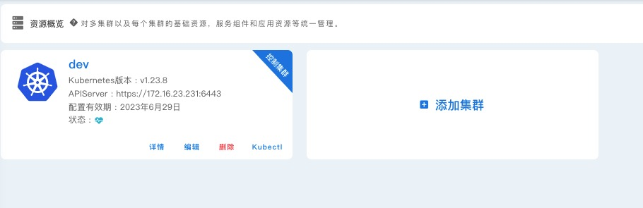
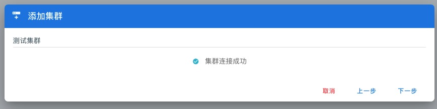
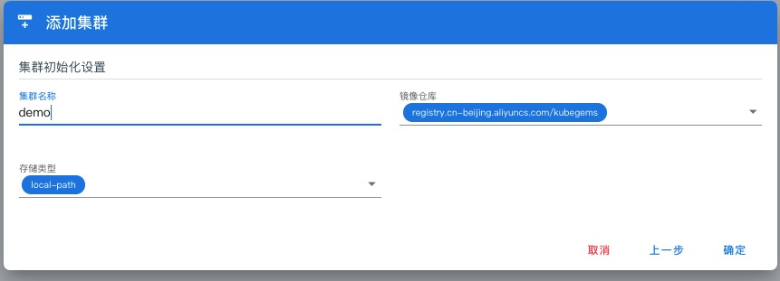
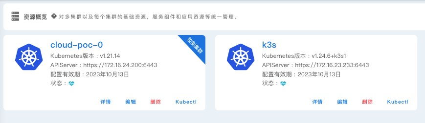
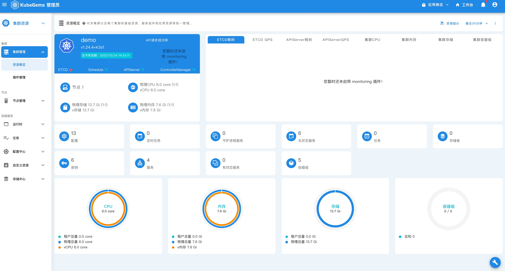
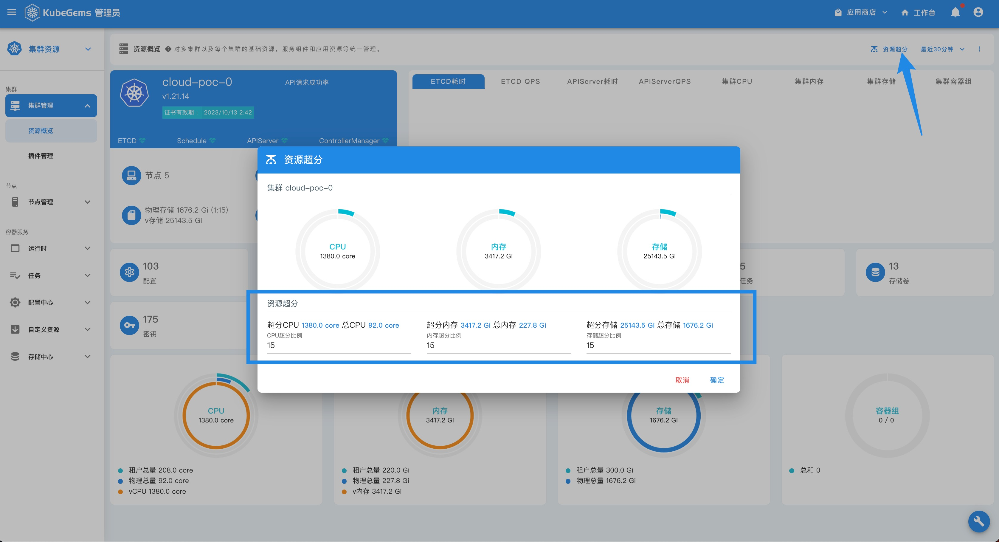

## Kubernetes 集群管理

---

### 前置条件

1. KubeGems 成功安装

### 导入 Kubernetes 集群

- 使用 admin 账号登录 KubeGems 管理后台，点击右下角 【工具箱】 图标，进入 【系统管理】

  

- 点击 【添加集群】，将集群的 kubeconfig 文件粘贴至文本框。

:::info 什么是 Kubeconfig 文件
Kubernetes 使用名为 kubeconfig 的 YAML 文件存储 kubectl 的集群身份验证信息。kubeconfig 包含 kubectl 在运行命令时引用的上下文列表。默认情况下，该文件保存在 $HOME/.kube/config。
:::

  

输入集群名称 等其他选项。

  

- 检测集群连接状态，等待状态正常后，点击 【下一步】进入集群配置界面

  

- 集群配置中，包含了集群的名称、关联镜像仓库 和 KubeGems 插件部署所需要的存储类型

  

KubeGems 会将 kubegems-installer 相关的 CRD 一同推送到目标kuebrnetes，最终当运行成功后。管理员可使用 kubectl 在目标 kubernetes 执行下述命令进行查看

```bash
$ kubectl get pod -n kubegems-installer

$ kubectl get pod -n kubegems-local

$ kubectl get plugin -n kubegems-local

argo-rollouts              template   Disabled                                                                               27d
cert-manager               template   Disabled   cert-manager          1.0.0            1.8.0            9d                 27d
dcgm-exporter              template   Disabled                                                                               27d
eventer                    template   Disabled   kubegems-eventer      1.0.0            1.4.12           9d                 27d
gateway                    template   Disabled   kubegems-gateway      1.0.0            0.3.2            9d                 27d
grafana                    template   Disabled                                                                               27d
istio                      template   Disabled   istio-system          1.0.0            1.11.7           9d                 27d
kubegems-local             helm       Installed  kubegems-local        0.0.0            0.0.0            9d                 27d
kubegems-models            helm       Disabled   kubegems              v1.22.0-beta.2   v1.22.0-beta.2   9d                 27d
kubevela                   template   Disabled                                                                               27d
local-path                 template   Disabled                                                                               27d
logging                    template   Disabled   kubegems-logging      1.0.0            3.17.6           9d                 27d
metallb                    template   Disabled                                                                               27d
metrics-server             template   Disabled                                                                               27d
monitoring                 template   Disabled   kubegems-monitoring   1.0.0            35.2.0           9d                 27d
nacos                      template   Disabled   nacos                 1.0.0            2.1.1            9d                 27d
node-local-dns             template   Disabled                                                                               27d
node-problem-detector      template   Disabled                                                                               27d
nvidia-device-plugin       template   Disabled                                                                               27d
openkruise                 template   Disabled                                                                               27d
opentelemetry              template   Disabled   observability         1.0.0            0.28.0           9d                 27d
prometheus-node-exporter   template   Disabled   kubegems-monitoring   1.0.0            3.3.0            9d                 27d
tke-gpu-manager            template   Disabled                                                                               27d
tracing                    template   Disabled   observability         1.0.0            1.36.0           9d                 27d
volume-snapshoter          template   Installed  kube-system           1.0.0            5.0.1            9d                 27d
```

同时在界面上添加集群时写入的集群信息也将配置到 configmap 当中

```yaml
apiVersion: v1
data:
  global.clusterName: demo
  global.imageRegistry: registry.cn-beijing.aliyuncs.com
  global.imageRepository: kubegems
  global.kubegemsVersion: v1.22.0-beta.2
  global.runtime: containerd
  global.storageClass: local-path
kind: ConfigMap
metadata:
  creationTimestamp: "2022-09-29T06:31:40Z"
  name: kubegems-global-values
  namespace: kubegems-local
```

- 当集群添加成功后，KubeGems 会自动为目标集群添加安装器，等待服务安装成功后，即可在集群列表中查看

  

集群详情页包含了集群的 基本状态、证书信息、监控指标、物理资源、资源类型以及使用统计等信息。

  

:::info
KubeGems 默认采用了精简安装，仅包含了最基本的功能。如需开启其他功能，可在插件中心启用
:::

### 设置集群资源超分

默认情况下 Kubernetes 集群资源是由 Kubelet 上报给 Api Server，在实际应用中，用户的计算资源往往会根据应用运行资源进行分配 CPU 、内存等。此时如果将集群真实资源进行分配，会导致可用资源的严重不足。所以 KubeGems 在集群管理中添加了 **“超分”** 的概念，平台管理员可根据资源规划来计算出合理的超分比例。



设置成功后，在集群详情卡片上即可展现出来
  
