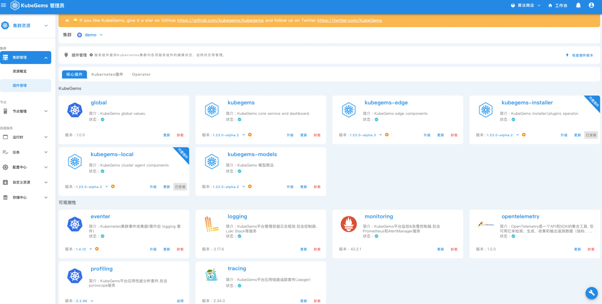
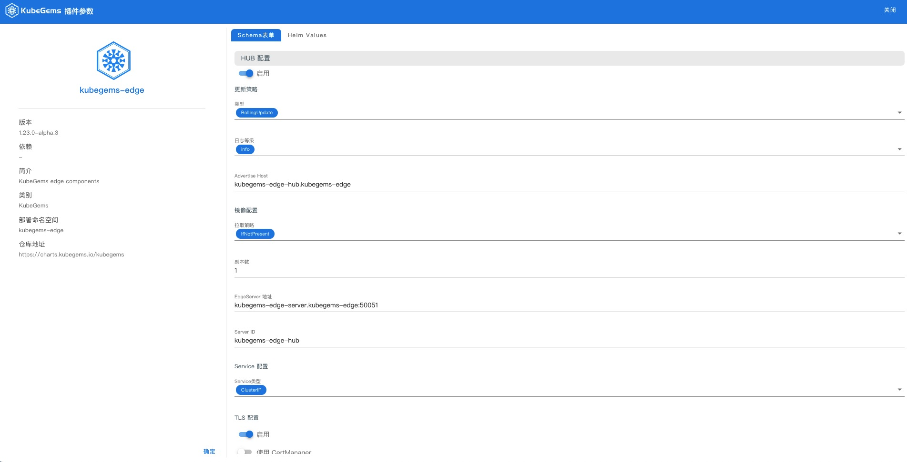
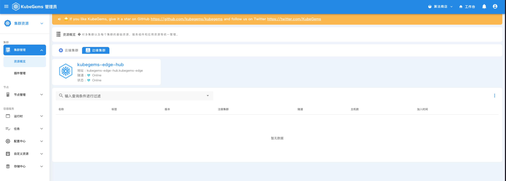

## 边缘设备管理
---

### 前置条件

1. KubeGems 安装成功且至少已添加一个集群

2. 具备 KubeGems 管理员权限

### 边缘架构


### 启用边缘插件

1. 进入到 "控制集群" 的【插件管理】功能页面，找到 "kubegems-edge" 插件，点击【启用】进入插件参数配置页面


2. kubegems-edge 插件包含两个核心服务`edge-hub`、`edge-server`，当启用插件时，位于 KubeGems 控制集群，则需要同时启用这两个核心服务，如需在其他集群启用插件是，仅打开`edge-hub`服务即可


**edge-hub 参数说明：**

- Advertize Host: Hub 服务对外暴露的域名地址，可以是外部域名+端口，也可以是一个 IP 地址+ 端口
:::tip 说明
`Advertize Host` 地址为边缘集群上连的地址,需要将此地址直接暴露到公网，或者通过 DNAT 方式映射到对应的 NodePort 上。<br/>以 DNAT 方式举例，如果您有一个公网地址 1.1.1.1 和一个 30000端口，则需要将`1.1.1.1:30000` 映射到服务 `kubegems-edge/kubegems-edge-hub:50051`对应的nodeport 上。
:::

- EdgeServer 地址：`edge-Server` 地址，如果运行在一个集群内，使用默认值即可。如果是在非控制节点集群部署 `edge-hub` 服务，则需要填写一个能够访问 `edge-server` 服务的地址

- Server ID：edge-hub服务唯一 ID，默认`kubegems-edge-hub`，可修改任意名称

- 启用 TLS：启用 TLS 证书，已有 secret/tls 直接填写名称，没有则由 KubeGems 自动签发证书
:::info 集群启用了 cert-manager 插件，则可直接使用 cert-manager 管理证书
:::

**edge-server 参数说明：**

- advertize Host：edge-server 服务对外暴露的域名地址，可以是外部域名+端口，也可以是一个 IP 地址+ 端口

- server ID：edge-server 服务唯一 ID，默认`kubegems-edge-server`，可修改任意名称
:::info 一般情况下只需在控制集群启用一套 edge-server，ServiceID 建议保持默认即可
:::


3. 当插件状态 Ready 后，您可以在 Kubernetes 集群的 kubegems-edge 命名空间下看到如下容器状态.

```bash
$ kubectl get pod -n kubegems-edge

NAME                                    READY   STATUS    RESTARTS   AGE
kubegems-edge-hub-7d55cb68fd-jf5nd      1/1     Running   0          30m
kubegems-edge-server-77d5789bd5-jhbrm   1/1     Running   0          30m
```

1. 此时进入到 KubeGems 管理后台的集群列表的【边缘集群】就出现了注册上来的 `edge-hub` 服务,状态如下



您也可以在控制集群中通过 `kubectl` 输入以下命令查看 edge-hub 服务状态

```bash
$ kubectl get edgehubs -n kubegems-edge

NAME                STATUS   ADDRESS                           LASTONLINE
kubegems-edge-hub   Online   kubegems-edge-hub.kubegems-edge   2023-01-18T05:56:56Z
```