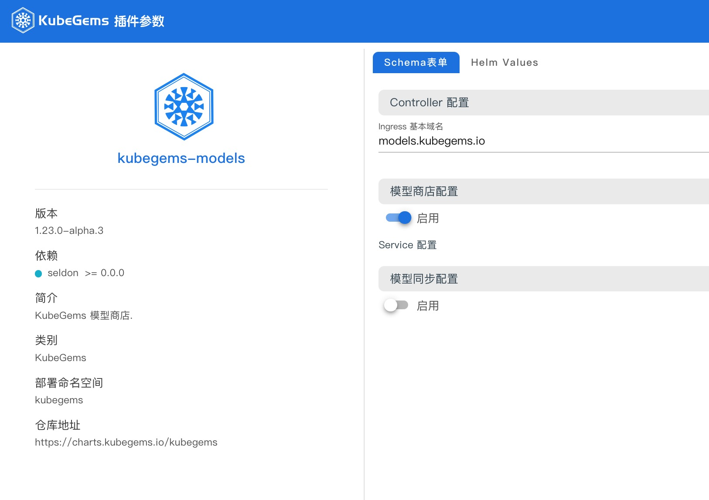
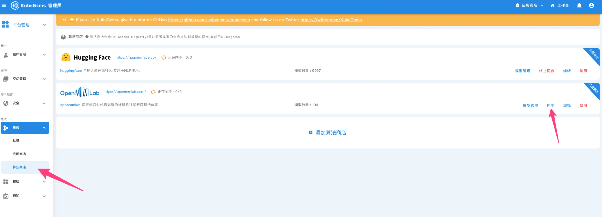
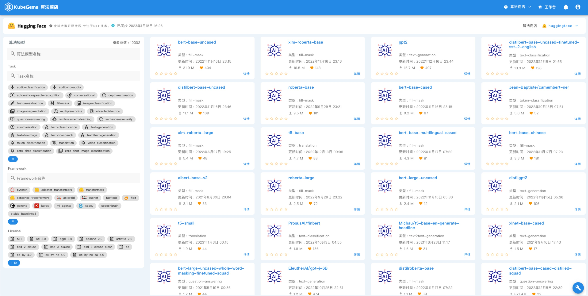

## AI 模型商店
---

### 前置条件

1. KubeGems 安装成功且至少已添加一个集群

2. 集群已设置超分（可选）

3. 具备 KubeGems 管理员权限

### 启用模型插件

进入到 "控制集群" 的【插件管理】功能页面，找到 "kubegems-models" 插件，点击【启用】进入插件参数配置页面



:::info 依赖
KubeGinfo的模型部署流程有 `Seldon Core` 实现，在启用 `kubegems-models` 插件之前，务必保证依赖的插件已部署且运行正常
:::

参数说明：

- ingress 域名： 算法服务部署运行后注册到 API 网关时的默认域名， 默认为 `models.kubegems.io`，用户可根据自身场景设置域名

:::tip 建议
在部署模型时，可指定算法服务注册到指定到不同的 API 网关，但为了管理方便，我们通常将建议您在企业内部将域名解析到 `default-gateway` 所在实例
:::

- 模型商店配置： 启用模型商店后台服务

- 模型同步配置： 启用模型同步服务（目前支持同步 HuggingFace 和 MMLab 两个 model zoo）

:::info 注意
`模型商店配置` 和  `模型同步配置` 仅在当前集群为 KubeGems 控制集群上有效，其它集群请 **关闭这两个选项**。这样在 worker 集群上仅需运行 kuebgems-models-controller 服务用于管理模型应用。
:::

当插件状态 Ready 后，您可以在 Kubernetes 集群的 kubegems 命名空间下看到如下容器状态.

```bash
kubectl get pod -n kubegems

...
kubegems-models-controller-5847ffb6bd-8l7z8        1/1     Running            0          10m
kubegems-models-mongodb-6d9d6589b8-hh7fx           1/1     Running            0          10m
kubegems-models-store-58997f98d-hnq6j              1/1     Running            0          10m
kubegems-models-sync-cd664bdbd-wwc7m               3/3     Running            0          10m
...
```

### 同步在线模型仓库

进入到 【平台管理】下的 【集成】边栏，选择 "算法商店"，进入算法商店管理页面



在这里，管理员可以对 KubeGems 内置的 Model Zoo 进行基本管理。

- 模型管理： 算法运营后台管理，可对模型商店内的应用进行`推荐值`、`推荐语`、`上/下架`管理，并影模型商店内的算法排序
- 同步/终止同步： 启动 KubeGems 内置模型同步服务（仅包含元数据，不含模型文件）
- 禁用/激活： 打开或隐藏模型商店内的 model zoo 入口

当模型同步任务完成后，在顶部横栏选择【算法商店】进入模型列表页，用户可在当前页面根据`名称`、`算法类型`、`framework` 进行过滤查找符合自己需求的算法模型。


:::info 同步模型商店任务不是自动任务，需管理员人工点击触发同步任务
:::
