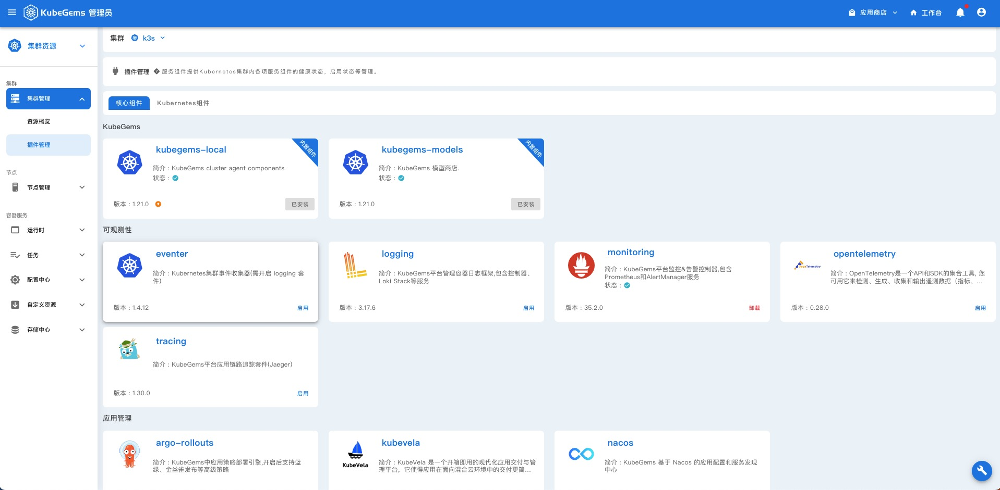

## 平台插件设置

---

KubeGems 内置了 `核心组件` 和 `Kubernetes 组件` 两种类型的插件,它们是 KubeGems 结合云原生生态的重要组成部分

- **核心组件** 内的插件与 KubeGems 核心服务进行了深度绑定，并影响页面功能加载

:::info
部分核心组件的启（禁）用会影响 kubegems-api 服务的重启。当插件启（禁）用时，插件相关的访问地址会作为全局变量，触发kubegems-api 重新更新，例如 monitoring 插件
:::
- **Kubernetes 组件** 是 KubeGems 与第三方或云原生社区集成的插件，他们并不直接与 KubeGems 核心服务交互。



:::tip KubeGems 即将上线新的插件类型 `Operator控制器`，用于统一管理 kubernetes 集群的控制
:::
### 前置条件

1. KubeGems 成功安装且运行正常

2. KubeGems 至少有一个 Kubernetes 集群

3. 需要具备 admin 权限的账号操作

### 启用插件


进入到 【集群管理】的插件列表页面，在界面中，KubeGems 提供了插件的各项配置，您可以根据实际情况进行配置。完成后点击 “确定” 即可完成插件的部署

  

:::info 部分插件存在一些依赖，在启用时请注意插件左边的介绍说明
:::

### 更新插件

KubeGems 插件默认启用了从在线 Charts 仓库中更新索引，当 Plugin 仓库有更新时，点击 【检查插件版本】 即可出发更新

  

:::tip 提示
当插件在第一次部署成功后，该插件源就会从本地切换到在线源，如果您的集群不能访问公网，就无法更新插件！
:::

### 卸载插件

在集群的插件页面中，直接点击【卸载】按钮即可完成插件卸载。


## 扩展

### 查看插件状态

1. KubeGems 的`父插件`均位于`kubegems-installer`命名空间下，执行以下命令可查看各`父插件`状态

```bash
$ kubectl get plugin -n kubegems-installer                  

NAME                       KIND       STATUS      NAMESPACE             VERSION          APPVERSION       UPGRADETIMESTAMP   AGE
cert-manager               template   Installed   cert-manager          1.8.0                             3d23h              15d
eventer                    template   Installed   kubegems-eventer      1.4.12                            3d23h              15d
gateway                    template   Failed      kubegems-gateway      1.0.0                             15d                15d
global                     template   Installed   kubegems-installer    1.0.0                             3d23h              15d
istio                      template   Installed   istio-system          1.11.7                            3d23h              15d
kubegems                   helm       Installed   kubegems              1.23.0-alpha.2   1.23.0-alpha.2   3d23h              15d
kubegems-edge              helm       Installed   kubegems-edge         1.23.0-alpha.2   1.23.0-alpha.2   3d23h              15d
kubegems-installer         helm       Installed   kubegems-installer    1.23.0-alpha.2   1.23.0-alpha.2   3d23h              15d
kubegems-local             helm       Installed   kubegems-local        1.23.0-alpha.2   1.23.0-alpha.2   3d23h              15d
kubegems-models            template   Installed   kubegems              1.23.0-alpha.2                    3d23h              15d
logging                    template   Installed   kubegems-logging      3.17.6                            3d23h              15d
metrics-server             template   Installed   kube-system           3.8.2                             3d23h              15d
monitoring                 template   Installed   kubegems-monitoring   43.2.1                            3d23h              15d
node-problem-detector      template   Installed   kube-system           2.2.2                             3d23h              15d
opentelemetry              template   Installed   observability         1.0.0                             3d23h              15d
prometheus-cloud-dial      template   Installed   kubegems-monitoring   0.22.0                            3d23h              14d
prometheus-node-exporter   template   Installed   kubegems-monitoring   3.3.0                             3d23h              15d
seldon                     template   Installed   seldon-system         1.0.0                             3d23h              15d
tracing                    template   Installed   observability         2.34.0                            3d23h              15d
```

2. 各命名空间下的plugin对象为`子插件`,他们受`父插件`管理，并将状态消息上报给`父插件`，可以如下命令查看它们状态


```bash
$ kubectl get plugin -n kubegems-monitoring

NAME                           KIND   STATUS      NAMESPACE             VERSION   APPVERSION   UPGRADETIMESTAMP   AGE
kube-prometheus-stack          helm   Installed   kubegems-monitoring   43.2.1    0.61.1       15d                15d
prometheus-blackbox-exporter   helm   Installed   kubegems-monitoring   7.1.3     0.22.0       14d                14d
prometheus-node-exporter       helm   Installed   kubegems-monitoring   3.3.0     1.3.1        15d                15d
```
### 查看插件配置

可以使用 `edit` 或者 `get` 查看插件配置，例如：

```
$ kubectl get plugin prometheus-blackbox-exporter -o yaml -n kubegems-monitoring

apiVersion: plugins.kubegems.io/v1beta1
kind: Plugin
metadata:
  creationTimestamp: "2023-01-05T10:50:54Z"
  finalizers:
  - plugins.kubegems.io/finalizer
  generation: 1
  name: prometheus-blackbox-exporter
  namespace: kubegems-monitoring
  resourceVersion: "736290"
  uid: d91689c2-1c48-4a64-b1cd-b6a5046fb6dc
spec:
  kind: helm
  url: https://charts.kubegems.io/kubegems
  values:
    config:
      modules:
        http_2xx:
          http:
            follow_redirects: true
            preferred_ip_protocol: ip4
            valid_http_versions:
            - HTTP/1.1
            - HTTP/2.0
          prober: http
          timeout: 5s
        http_post_2xx:
          http:
            method: POST
            preferred_ip_protocol: ip4
            valid_http_versions:
            - HTTP/1.1
            - HTTP/2
          prober: http
          timeout: 5s
        ping:
          icmp:
            preferred_ip_protocol: ip4
          prober: icmp
          timeout: 5s
        tcp_connect:
          prober: tcp
          timeout: 5s
    hostNetwork: false
    image:
      repository: registry.cn-beijing.aliyuncs.com/kubegems/blackbox-exporter
    namespaceOverride: kubegems-monitoring
    pspEnabled: false
    replicas: 1
    serviceAccount:
      create: false
  version: 7.1.3
status:
  appVersion: 0.22.0
  creationTimestamp: "2023-01-05T10:51:11Z"
  message: |
    See https://github.com/prometheus/blackbox_exporter/ for how to configure Prometheus and the Blackbox Exporter.

    1. Get the application URL by running these commands:
      export POD_NAME=$(kubectl get pods --namespace kubegems-monitoring -l "app.kubernetes.io/name=prometheus-blackbox-exporter,app.kubernetes.io/instance=prometheus-blackbox-exporter" -o jsonpath="{.items[0].metadata.name}")
      export CONTAINER_PORT=$(kubectl get pod --namespace kubegems-monitoring $POD_NAME -o jsonpath="{.spec.containers[0].ports[0].containerPort}")
      echo "Visit http://127.0.0.1:8080 to use your application
      kubectl --namespace kubegems-monitoring port-forward $POD_NAME 8080:$CONTAINER_PORT
  namespace: kubegems-monitoring
  phase: Installed
  resources:
  - apiVersion: v1
    kind: ConfigMap
    name: prometheus-blackbox-exporter
    namespace: kubegems-monitoring
  - apiVersion: v1
    kind: Service
    name: prometheus-blackbox-exporter
    namespace: kubegems-monitoring
  - apiVersion: apps/v1
    kind: Deployment
    name: prometheus-blackbox-exporter
    namespace: kubegems-monitoring
  upgradeTimestamp: "2023-01-05T10:51:11Z"
  values:
    config:
      modules:
        http_2xx:
          http:
            follow_redirects: true
            preferred_ip_protocol: ip4
            valid_http_versions:
            - HTTP/1.1
            - HTTP/2.0
          prober: http
          timeout: 5s
        http_post_2xx:
          http:
            method: POST
            preferred_ip_protocol: ip4
            valid_http_versions:
            - HTTP/1.1
            - HTTP/2
          prober: http
          timeout: 5s
        ping:
          icmp:
            preferred_ip_protocol: ip4
          prober: icmp
          timeout: 5s
        tcp_connect:
          prober: tcp
          timeout: 5s
    hostNetwork: false
    image:
      repository: registry.cn-beijing.aliyuncs.com/kubegems/blackbox-exporter
    namespaceOverride: kubegems-monitoring
    pspEnabled: false
    replicas: 1
    serviceAccount:
      create: false
  version: 7.1.3#
```

### 定位插件状态为`Failed`的报错

```
kubectl get  plugin <插件名称> -n kubegems-installer -ojsonpath='{.status.message}'
```

以 loki 插件状态异常举例

```
# 找到状态未 faild 的插件

$ kubectl get plugin -n kubegems-logging

NAME                       KIND   STATUS      NAMESPACE          VERSION   APPVERSION   UPGRADETIMESTAMP   AGE
logging-operator           helm   Installed   kubegems-logging   3.17.6    3.17.6       31d                144d
logging-operator-logging   helm   Installed   kubegems-logging   3.17.6    3.17.6       22d                144d
loki                       helm   Failed      kubegems-logging   2.11.1    v2.5.0       136d               144d
loki-redis                 helm   Installed   kubegems-logging   16.9.11   6.2.7        144d               144d

# 找到报错消息
kubectl get plugin  -n kubegems-logging loki -ojsonpath='{.status.message}'

cannot patch "loki" with kind StatefulSet: StatefulSet.apps "loki" is invalid: spec: 
Forbidden: updates to statefulset spec for fields other than 'replicas', 'template', and 'updateStrategy' are forbidden
```

可以看到上述报错是 plugin 在执行更新时，修改的`statefulset`类型资源不合法导致请求被拒绝