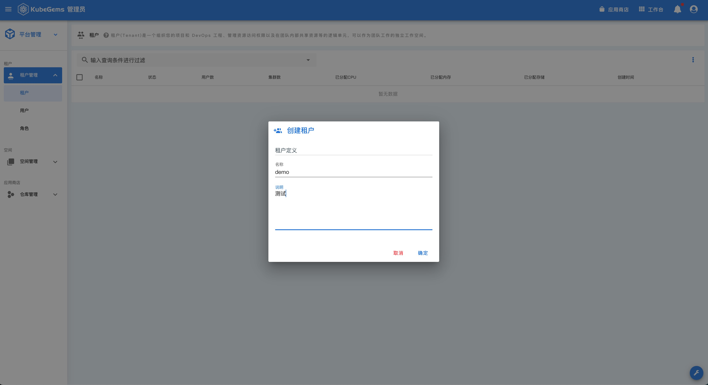
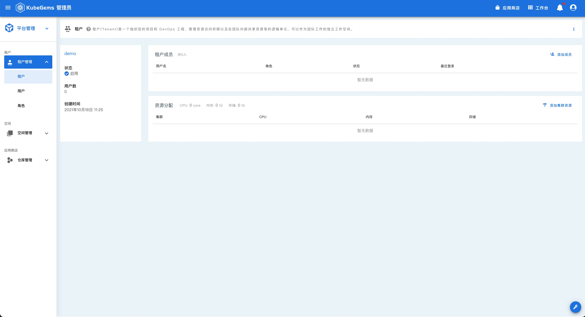
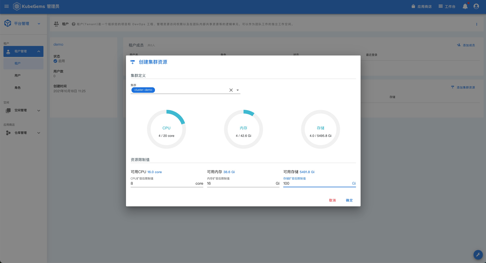

## 租户成员与配额管理

---

### 前置条件

1. KubeGems 安装成功且至少已添加一个集群

2. 集群已设置超分（可选）

### 创建租户

- 使用 admin 账号登录 KubeGems 管理后台，点击左上角【集群资源】卡片，进入【平台管理】

- 点击租户列表右上角的 创建租户 按钮，创建一个名为 **demo** 的租户

### 设置租户成员

- 点击 **demo**，进入租户详情页，里面可以 管理租户成员 以及  集群的资源配额管理

- 点击 **添加成员**，为该租户添加用户列表

  

### 设置租户配额

- 点击 **添加集群资源**，选择cluster-demo集群，为 **demo** 租户分配 8Core 16G 内存和 100G 硬盘

