## 常见操作
---
### 概述

本文主要介绍普通用户在 KubeGems 平台的一些日常高频操作， 旨在用户能够对云平台有一个更加全面的认识。

## 工作负载

### 查看容器日志

- 进入【容器服务】- 【运行时】-【容器组】页面，点击容器最右边的按钮展开容器组抽屉。

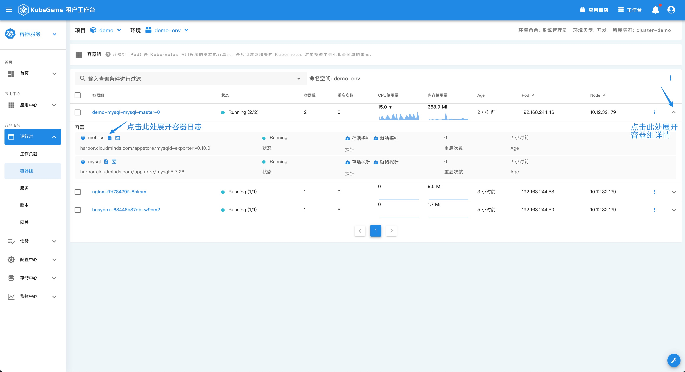

- 点击容器组抽屉中的 `文本` 图标弹出容器日志窗口
  
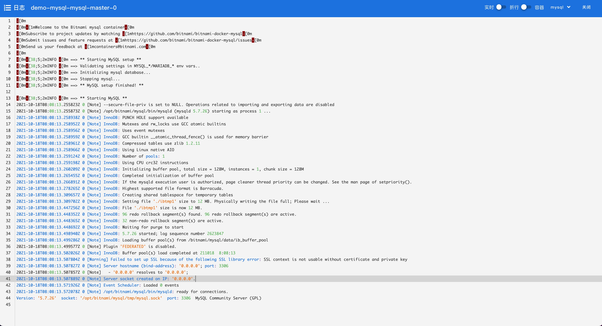

### 访问容器控制台

- 点击容器组抽屉中的 `终端` 图标弹出容器控制台窗口
  
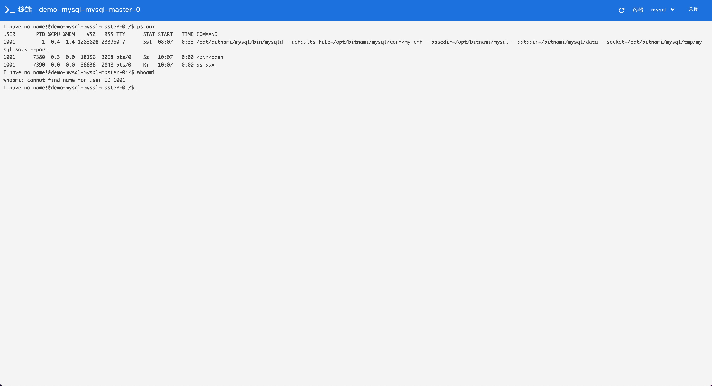

### 调整副本数

- 进入【容器服务】- 【运行时】-【工作负载】页面，点击任意一个工作负载，进入详情页

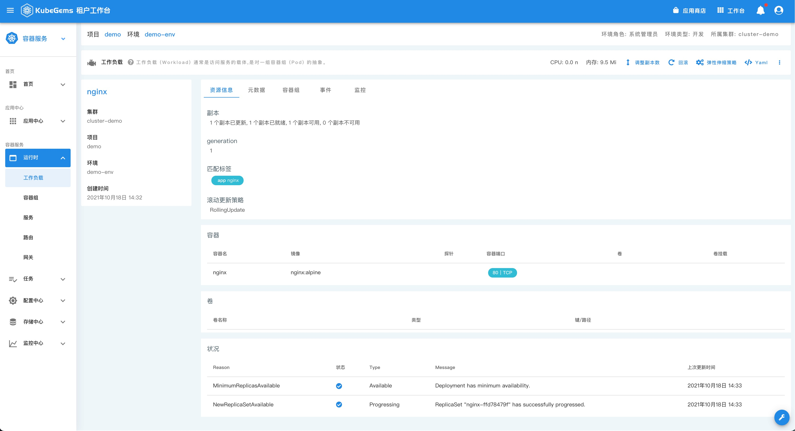

- 点击工作负载详情页的右上角【调整副本数】按钮，输入需要扩（缩）的容器副本数

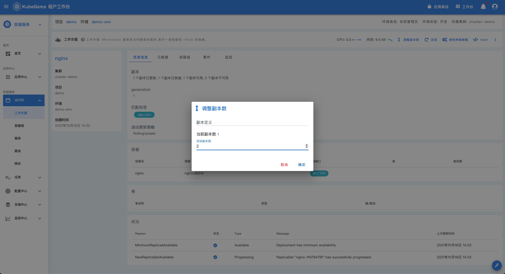

### 应用回滚

- 点击工作负载详情页的右上角【回滚】按钮，选择即将回滚的历史版本
  
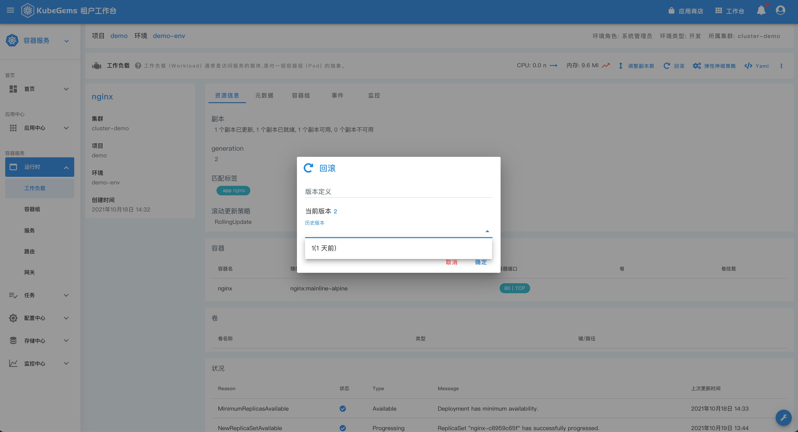

### 调整动态扩缩容

- 点击工作负载详情页的右上角【弹性伸缩设置】按钮，根据表单填写扩缩容策略

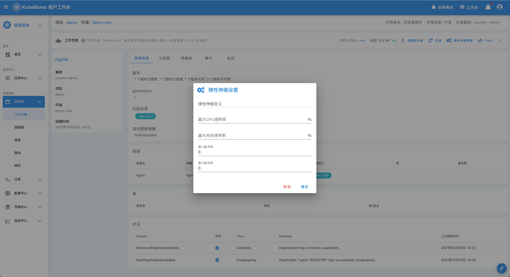

:::info 提示
弹性扩缩容策略中的 `最大CPU使用率` 和 `最大内存使用率` 可以分开设置，也可以设置为同时满足。
:::

### 资源智能建议

- 进入【容器服务】-【工作负载】页面，当工作负载在过去一周的资源使用情况不足或繁忙时，会出现 `橙色` 的资源建议标签

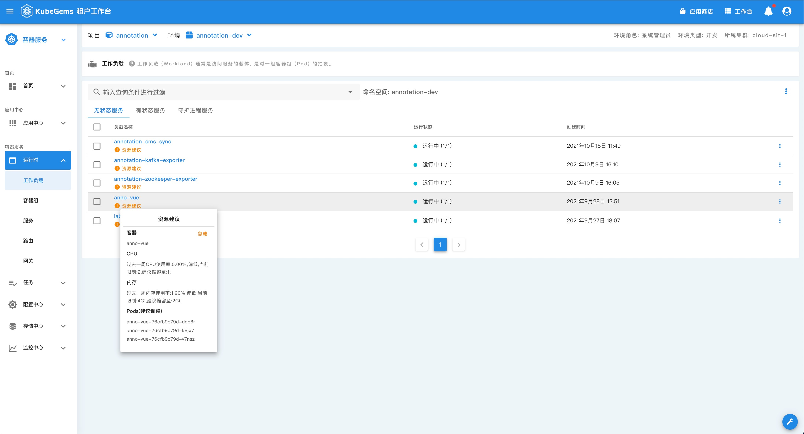

- 点击 **感叹号** 图标，即可弹窗调整 **工作负载** 的资源限制到建议值

:::caution 注意
设置资源限制会触发正在运行的容器滚动更新，生产环境操作时请谨慎！
:::
### 应用资源设置

- 进入【容器服务】-【工作负载】页面，选择要修改资源的 workerload，点击最右边按钮，选择【编辑】进入编排窗口

- 在高级配置中，选择【资源限制】进入资源分配菜单，根据用户实际情况填写

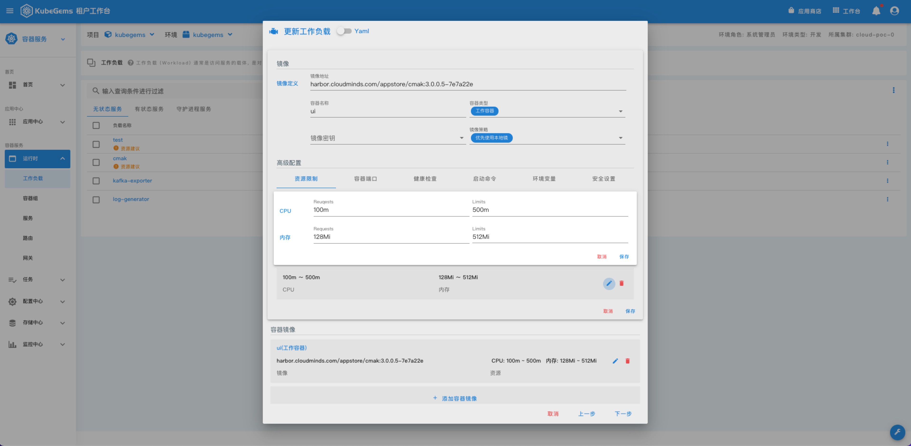

:::tip: 提示
CPU资源单位换算：1 Core = 1000m，内存资源单位换算: 1GB = 1Gi or 1024Mi 
:::

## 存储操作

### 存储卷扩容

- 进入【容器服务】-【存储中心】-【存储卷】页面，在存储卷列表的最右侧点击【扩容】 按钮。

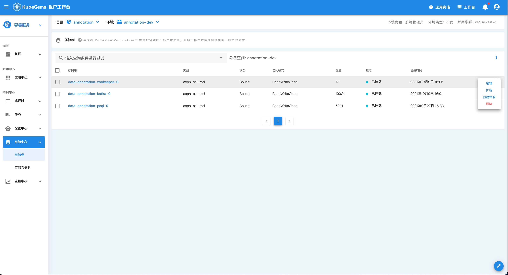

:::tip 提示
存储卷的快照依靠外部存储设备的技术支持
:::

#### 存储卷快照

- 进入【容器服务】-【存储中心】-【存储卷】页面，在存储卷列表的最右侧点击【创建快照】 按钮。

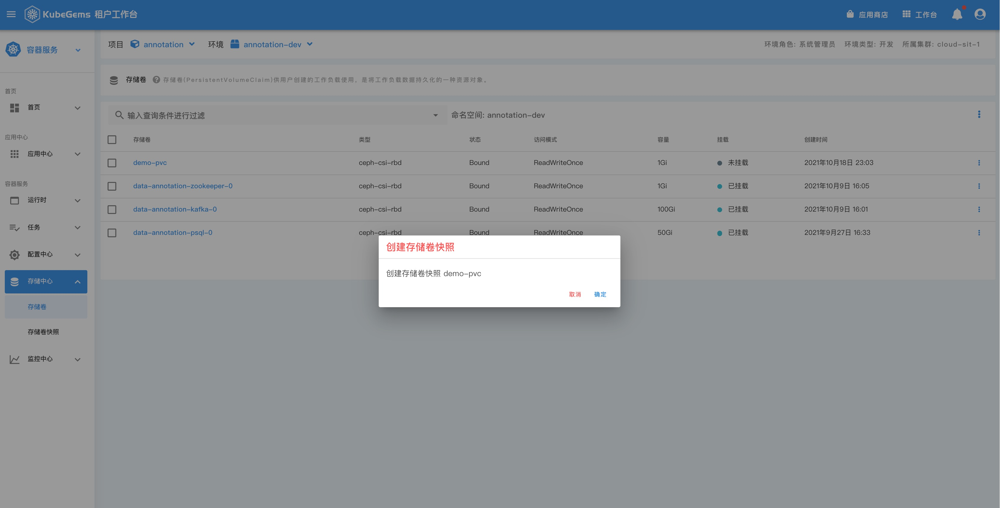

:::caution 注意
存储卷的快照依靠外部存储设备的技术支持 
:::
