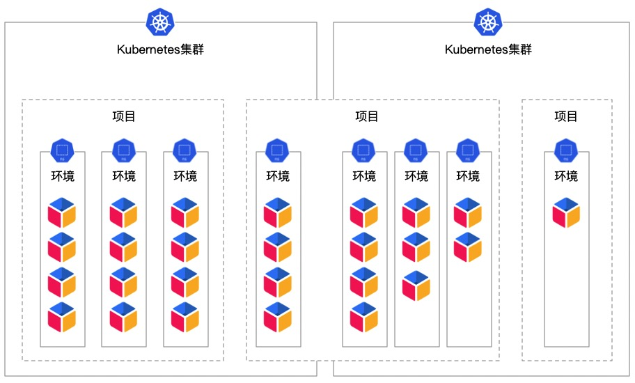

## 平台空间

---

KubeGems 是一个按照多租户架构设计的用户层级的，在空间体系中我们将资源抽象成了 3 个维度，从大大小分别是：

- 租户（Tenant）: KubeGems 上服务的主体单位，用户的计算资源运行在租户空间内，它与平台内的其他租户共享多个 Kubernetes 集群计算资源
- 项目（Project）: 用户交付一组产品或服务的空间集合，它是一个抽象的概念，并不参与 Kubernetes 资源的计算
- 环境（Enviroments）：用户具体运行应用的空间，它对应了 Kubernetes 上的一个命名空间。在环境中，用户可以划分开发、测试、生产等环境

上述的三个空间之间的关系如下：

**通常我们在企业内部可以根据组织关系来创建平台空间**

- 根据企业内组织结构创建租户

部门名就等于租户名称，在部门内部创建各个不同项目和环境。此方式比较通用，企业内组织架构清晰，便于成员管理和结算各部门之间的资源使用情况。缺点是难以协调跨部门应用，运维无法感知企业内服务整体架构。

- 根据企业产品线创建租户

产品线名等于租户名称，在租户内部创建跟整个产品线关联的上下游项目和环境。此方式优势是便于运维或管理着维护，企业内产品整体整体清晰。缺点在于存在不同部门人员的协调，用户组权限难于管理。

- 根据环境创建租户

 根据环境名称创建租户，此方法适合大量无关联产品研发，快速迭代的场景。缺点在于管理比较混乱，不太推荐。

## 租户成员与成员管理

在 KubeGems 中，我们为每个空间都设计了对应的用户组，用户组的成员由上往下组继承。在租户层面，只有当用户进入到租户成员组才有“资格”查看或参与租户下面的资源管理。

:::info
同一个用户可以被添加到多个租户列表当中
:::

在租户空间内，普通用户只有在加入到项目当中，该用户才具备该项目下的参看权限，否则当一个没有加入任何项目的用户加入到新租户时，是浏览不到任何项目信息的。
