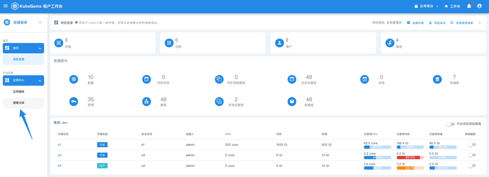
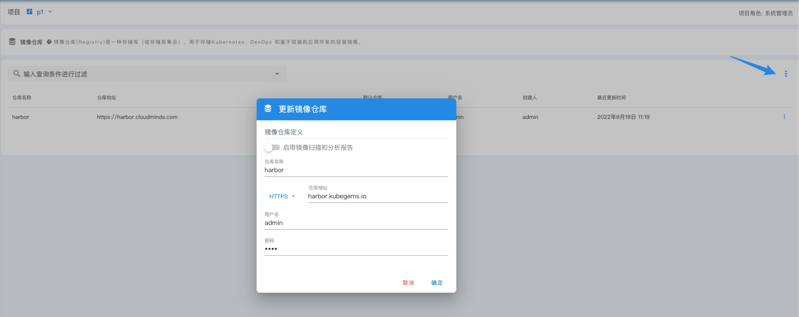
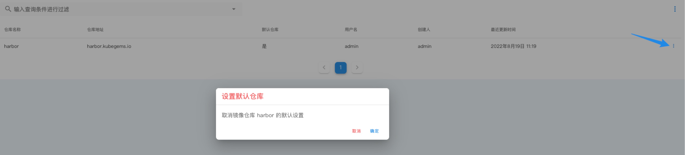
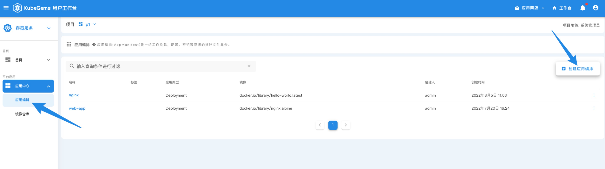
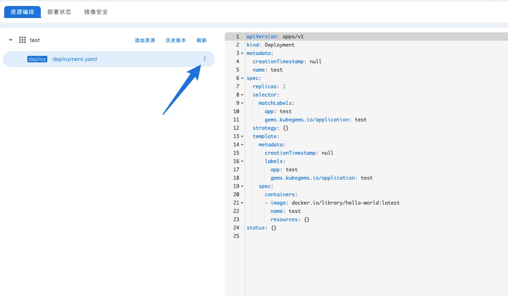
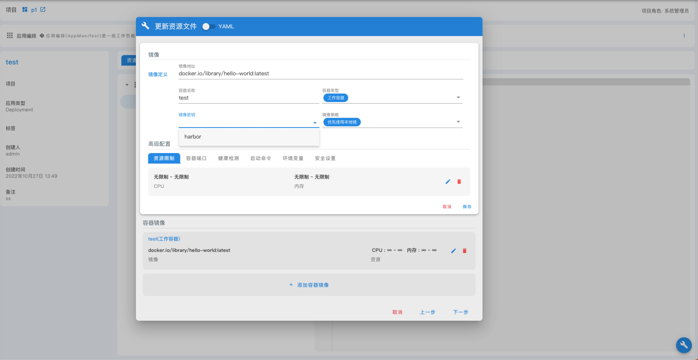
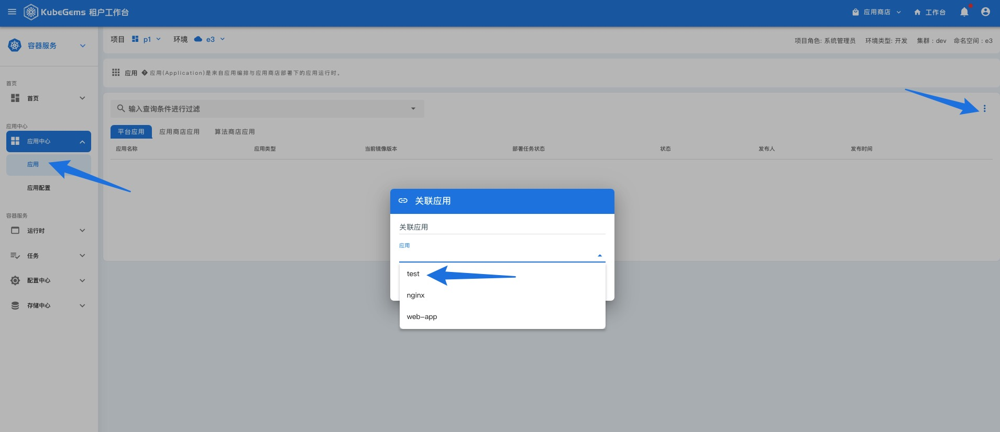
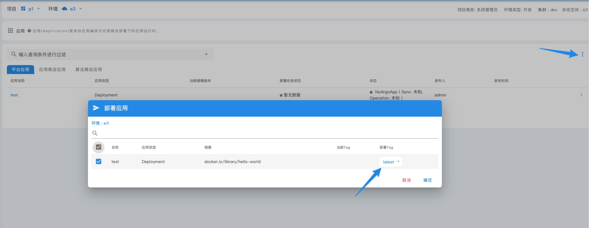
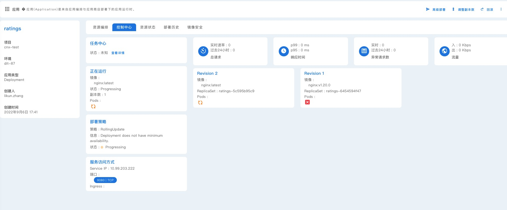
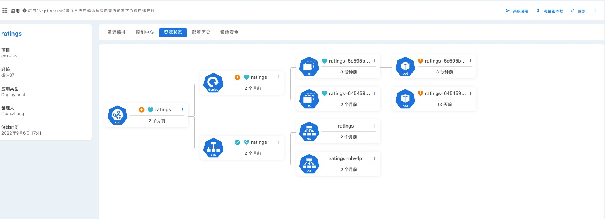

## 通过应用中心编排多集群应用

---

### 目标

本文通过介绍用户在 KubeGems 中创建和编排自定义自有应用的管理，并通过应用模板快速部署到多个 Kubernetes 集群。

### 前置条件

1. KubeGems 成功安装且运行正常

2. 已创建应用部署的目标项目和环境空间

3. 目标环境的可用资源满足部署需求

4. 操作用户具备目标环境的操作权限

### 设置镜像仓库凭证

- 进入目标项目空间的详情页，选择侧边栏右面【应用中心】 下的 “镜像仓库”

- 点击右边按钮，创建一个镜像仓库的凭证

:::info
**启用镜像扫描和分析报告** 功能仅支持 Harbor API v2以上的版本
:::

:::info
在 KubeGems 上创建的镜像仓库凭证会自动同步到项目下的每个环境当中，并在目标 Kubernetes 集群的 NameSpace 下创建一个类型为  `kubernetes.io/dockerconfigjson` 的 secret 对象
:::

- 设置默认凭证

:::info
默认凭证是将 dockerconfigjson 的 secret 对象设置在 Namespace 下的默认 sa 服务账号内。 当 kubelet 从仓库中拉取镜像时会默认从 sa 的服务账号中获取镜像仓库的凭证
:::

### 设置应用模板

- 进入目标项目空间的详情页，选择侧边栏右面【应用中心】 下的 "应用编排”

- 应用创建成功后，进入应用的详情页，选择 mainfest 进行模板编写

- 根据表单引导编排应用，或者点击 “yaml” 直接上传已有的 Manifest 文件

:::info
KubeGems 采用 GitOPS (Gitea + ArgoCD) 引擎来管理和同步应用到目标 Kubernetes 集群.
:::

- 除了 workload 外，您也可以添加额外的资源对象，例如 “ConfigMap”、“Service”、“Secret”、“pvc” 等等

### 应用部署

- 进入到目标环境空间内，并在侧边栏中选择【应用中心】，进入到平台应用。点击右边按钮 “关联应用”，将项目空间下的应用模板关联到本环境

:::caution
应用初次关联到目标环境时的状态为 ` NoArgoApp ( Sync: 未知, Operation: 未知 )` ,这是因为 ArgoCD 并没有真正同步该对象。等第一次部署成功后，应用状态即可恢复正常
:::

- 点击右边按钮 “部署应用”，即可发布应用

- 应用在发布过程中，可进入到应用中心详情页的 “控制中心” 进行查看部署的过程

或者查看应用资源的拓扑结构树

:::info
在多个 Kubernetes 集群中部署，只需在 KubeGems 中创建目标集群对应的环境，即可按照上述方法实现应用的快速部署
:::