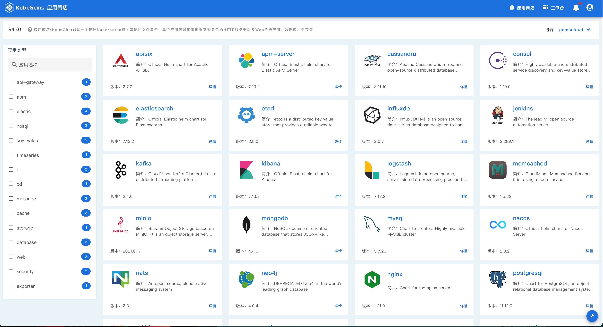
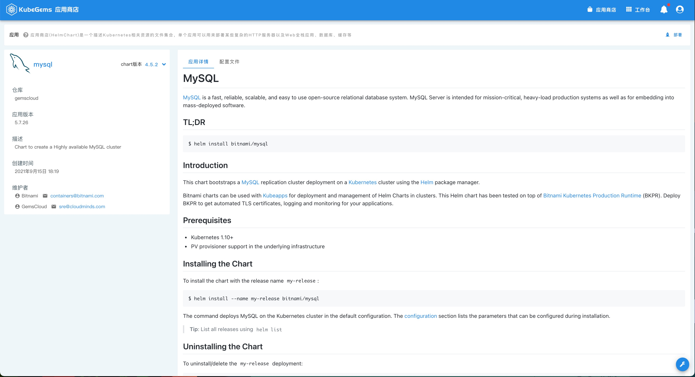
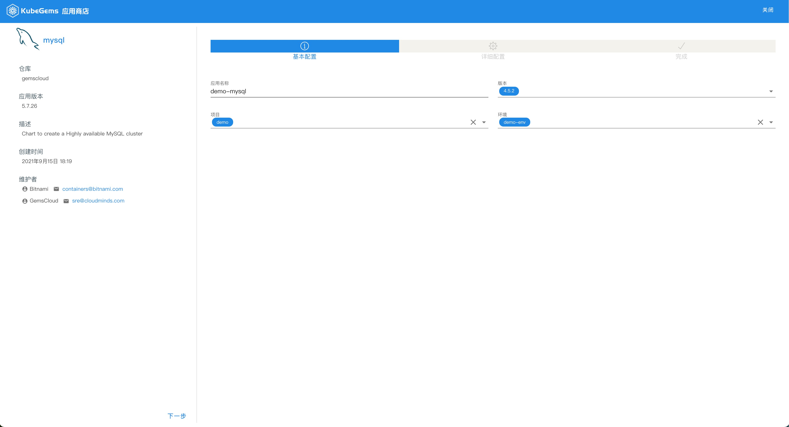
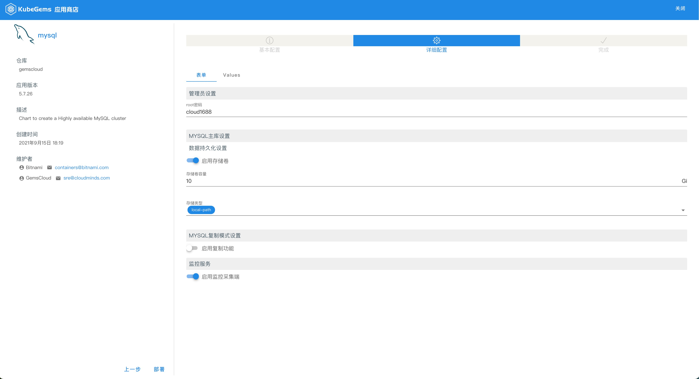
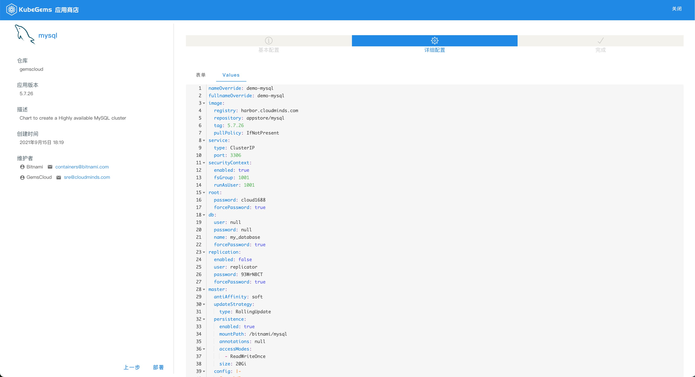
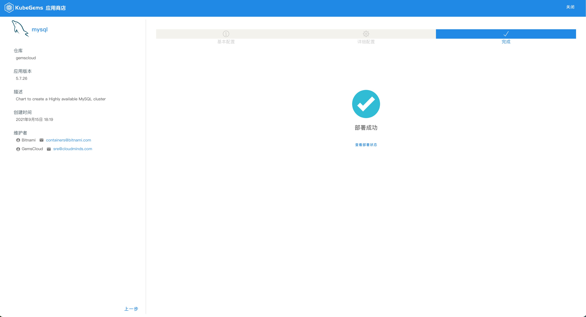
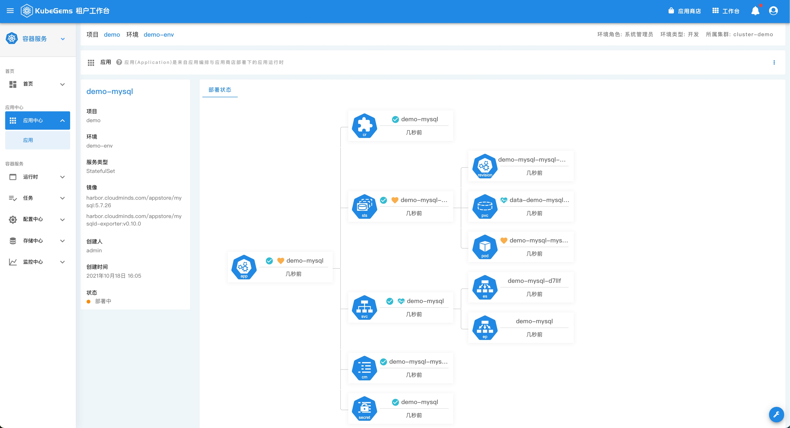

## 从应用商店创建一个 MySQL 应用

---

### 目标

本文主要指导用户在 KubeGems 平台内通过 **应用商店** 的模板快速部署一个应用。通过本节，用户可以更直观的理解和使用应用商店的功能

### 前置条件

1. KubeGems 成功安装且运行正常

2. 已创建应用部署的目标项目和环境空间

3. 目标环境的可用资源满足部署需求

4. 操作用户具备目标环境的操作权限

### 部署MySQL

1. 点击 KubeGems 顶部横栏中的【应用商店】按钮，进入到应用商店列表

1. 任意选择一个应用的卡片进入到应用的详情页，这里以 **mysql** 为例

3. 点击右上角的【部署】按钮进入应用的部署界面，根据页面引导填写部署参数

基本配置的主要参数为：

  - 应用名称：输入应用部署的名称
  - 版本：商店提供可供用户选择的应用版本
  - 项目：应用部署的目标项目
  - 环境：应用部署的目标环境

详细配置主要分为 **表单模式** 和 **Values模式**

  - 表单模式（推荐）：应用商店内置的基于表单的方式填写应用部署信息
  - Values 模式： 基于 Helm V3 版本的 values 配置文件，可以根细粒度的配置应用部署

4. 部署成功后会跳转到如下界面

5. 点击【查看部署状态】可以进入应用的详细拓扑结构

#### 查询应用

1. 进入应用所在的环境空间，选择【应用中心】-【应用】-【应用商店应用】，查看应用基本状态

