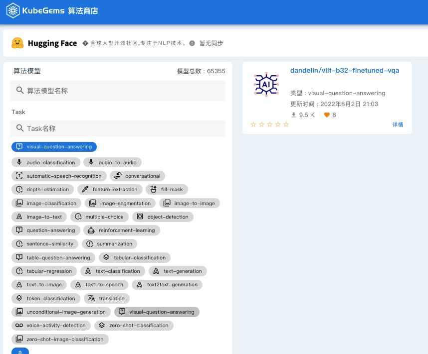
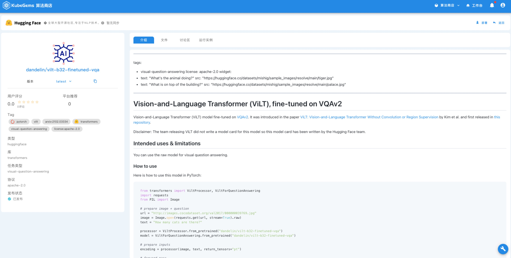
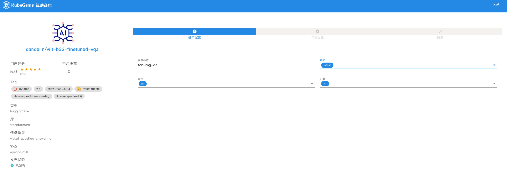
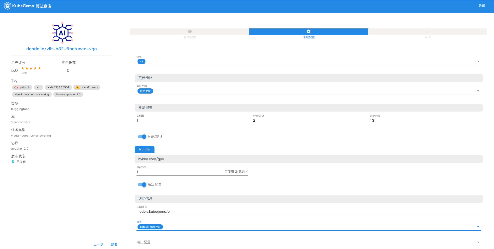
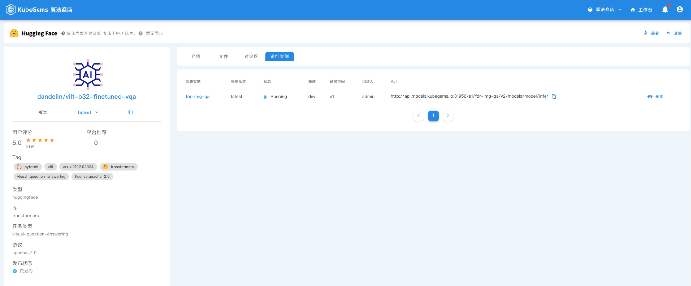
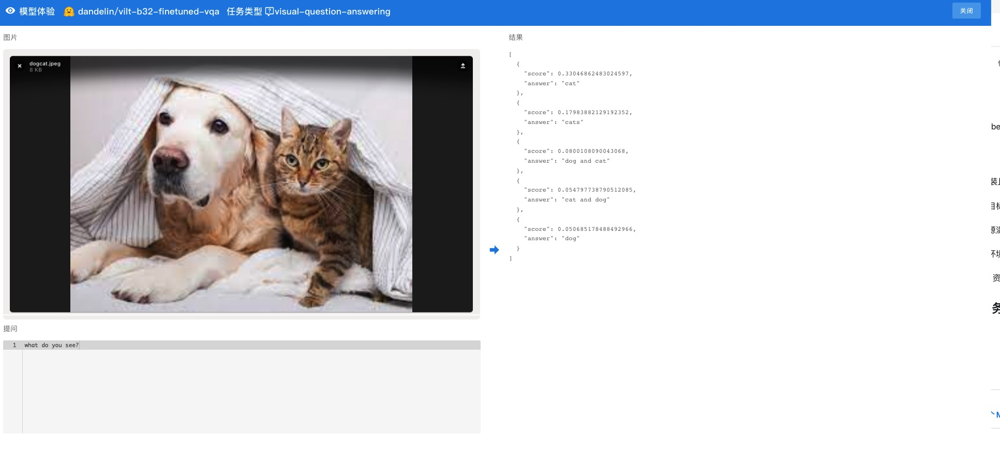
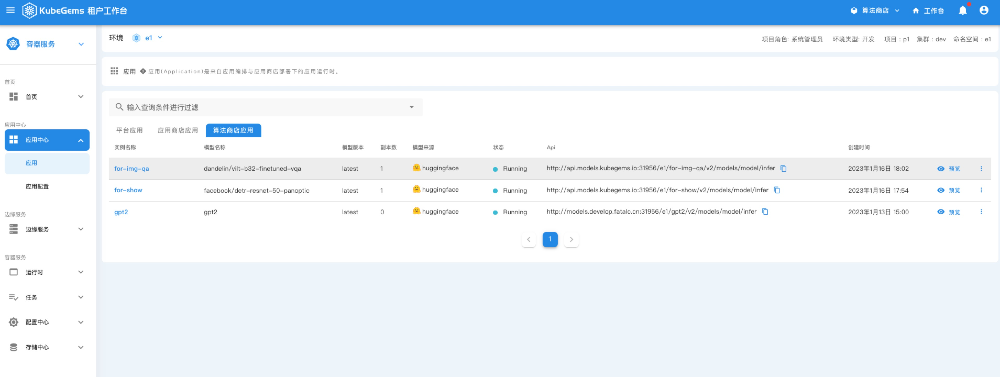
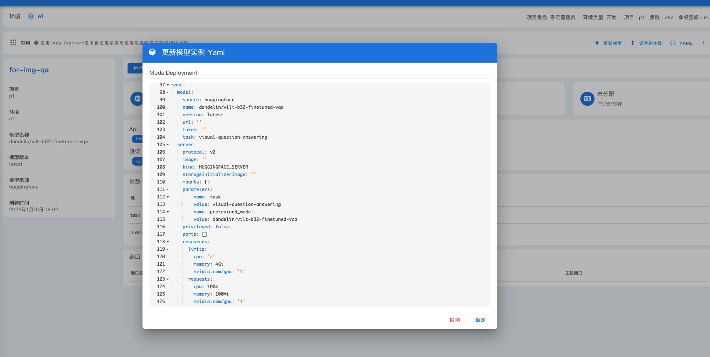
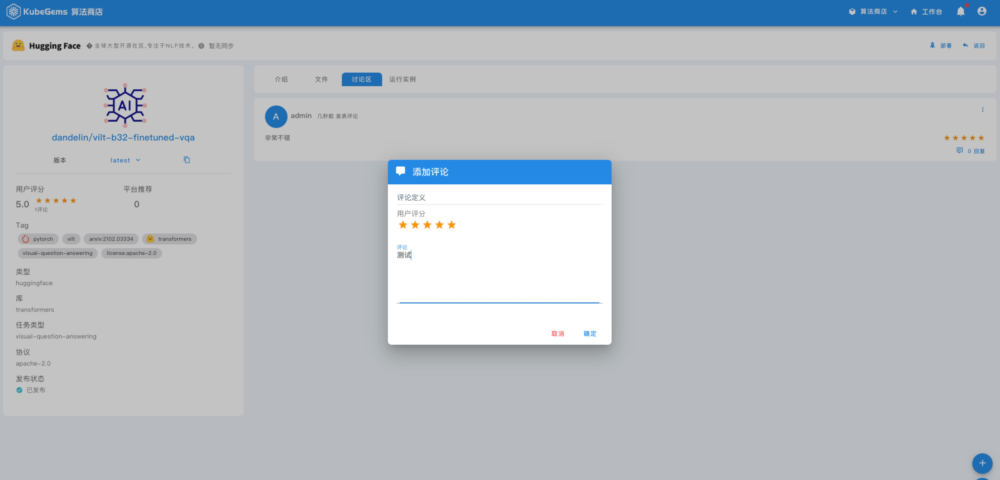

### 目标

本文通过介绍在 KubeGems 中通过在线 HuggingFace 自动下载并部署一个算法应用，并提供简单的预览功能

### 前置条件

1. KubeGems 成功安装且 `kubegems-models` 插件运行正常

2. 已创建应用部署的目标项目和环境空间

3. 目标环境的可用资源满足部署需求

4. 操作用户具备目标环境的操作权限

5. 目标环境具备 GPU 资源 （可选）

### 部署算法应用

:::tip 部署的算法应用以一个`visual-question-answering(图片Q&A)` 举例
:::

1. 点击 KubeGems 顶部横栏中的【算法商店】按钮，进入到算法商店列表，选择左边【task】类型为 "visual-question-answering"

2. 选择模型 `dandelin/vilt-b32-finetuned-vqa`，并进入到详情页

3. 点击模型详情页右上角的【部署】按钮，填入需要将算法和版本部署到目标的位置

4. 配置算法服务运行配置，运行时默认为 `hunggingface server`,协议默认为 `v2`

:::info 配置 GPU
1. 如需 GPU 资源，可打开【分配 GPU】，选择所需的资源
2. 如需自定义容器配置，可打开【高级配置】，填入对应参数即可
:::

5. 当模型运行部署且成功运行后，我们可以在运行实例中看到算法实例

6. 点击算法实例最右边的【预览】按钮，即可进入算法预览页面

:::tip 提示 
KubeGems 的算法预览界面和推理框架根据 HuggingFace 的不同任务类型进行了自适配，无需用户在进行编码，开箱即用！
:::

### 修改算法应用

1. 进入到算法应用对应的 "环境空间"内，选择【应用中心】下的 "算法商店应用" 列表，即可找到算法应用

2. 进入到算法应用详情页，点击右上角的编辑，可对算法应用进行修改

:::info 
算法商店应用由 KubeGems Models Controller 下的 CRD 资源控制，完整的 CRD 定义可参考 [ModelDeployment CRD](../../../ai-applications/modelx/modeldeploy)
:::

### 模型评分系统

KubeGems 为每个模型设计了一个内置的评分系统，以帮助企业内部在模型应用时的各业务团队间的信息共享，主要包含`评分`和`留言板`、`回复`功能。

用户可在 "模型详情页" 下的【讨论区】中进行留言和评分操作

