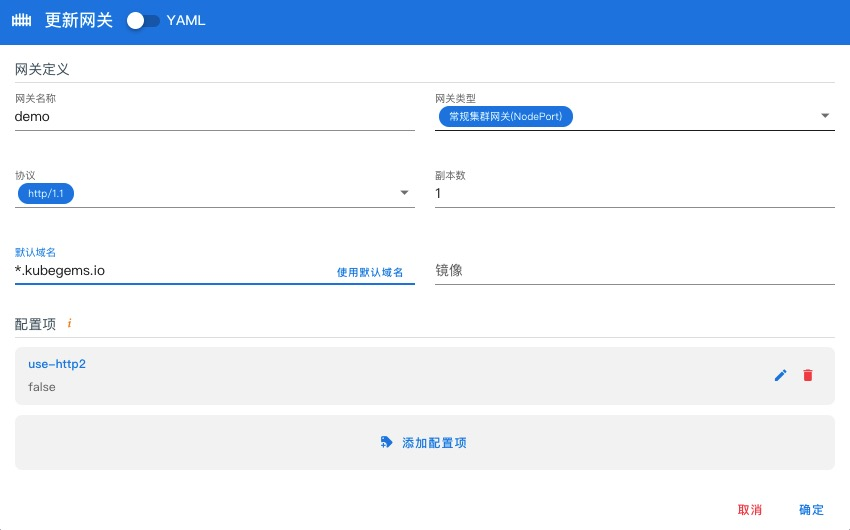
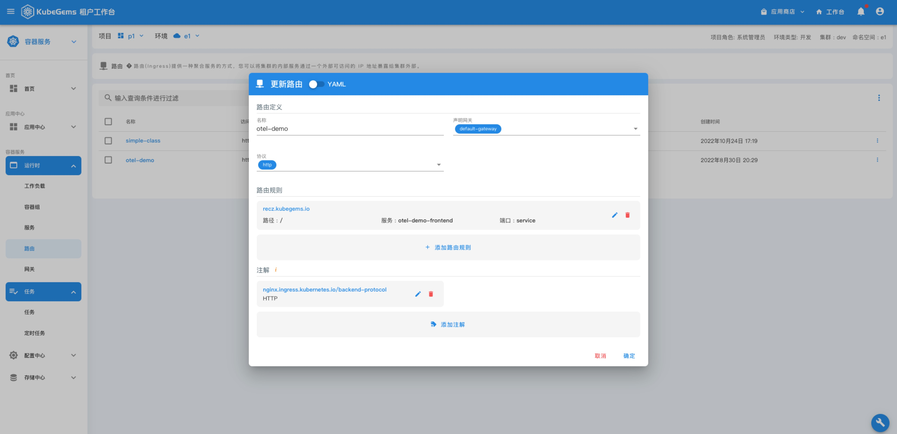

## 创建租户网关代理应用(http/gRPC)

---

### 前置条件

- KubeGems 正常运行

- 启用 KubeGems gateway 插件

- 具备一个具备有操作权限的用户

### 默认租户网关

**默认网关** 是 KubeGems 内置的一个全局性质的 ingress-nginx 网关，它的名称为 `default-gagteway`。
默认网关位于每一个租户下的环境空间内，由于它对所有租户可见，所以在实际使用过程中主要用于测试链路可用性。

### 创建自定义网关

用户在实际场景下，如需创建私有的独立网关，可在根据代理应用情况创建 HTTP 或 gRPC 网关。

- 网关类型: 默认应用网关通过 Nodeport 暴露对外地址，如果您的集群开启了 LoadBalancer，可使用 LoadBalancer IP 暴露网关地址

- 协议： 网关协议，可选择 http/1.1 和 http/2

:::info由于 HTTP/1 和 HTTP/2 不能同时监听在相同的端口，所以针对这两类协议，建议创建独立的网关进行代理
:::

- 副本数： 运行网关实例数

- 默认域名：网关绑定的默认二级域名，例如默认为 `*.kubegems.io`，那么在创建 ingrss 时，如果服务无 Host，KubeGems 将创建一个名叫 `<随机字符>.kubegems.io` 的域名来做服务的 Host

- 镜像（选填）： 网关实例运行的镜像，默认镜像为 `kubegems/ingress-nginx-operator:v.1.3.0`

:::tip网关默认镜像对应了社区版本 ingress-nginx:v1.3.0 /  Nginx1.19.10+
:::

- 配置项： 网关个性化配置

:::info 
KubeGems 默认网关采用了 Kubernetes [Ingress Nginx](https://github.com/kubernetes/ingress-nginx)

更多关于个性化配置的 CofigMap 可以在这里查看 https://kubernetes.github.io/ingress-nginx/user-guide/nginx-configuration/configmap/
:::

### 网关地址

点击网关详情，可以进入详情页查看网关的访问地址

:::info
根据网关的 IP 地址和默认域名，我们可以采用`域名泛解析`的方式将通配域名解析到网关地址上实现应用域名的自动解析
:::

### 网关监控

点击网关详情，可以进入详情页查看网关的监控数据

### 创建一个 HTTP 应用路由

进入一个应用的环境空间，选择【运行时】- 【路由】，点击右上角的按钮选择 “创建路由”

- 勾选“声明网关”，选择将应用路由作用到指定的网关实例。
- 应用协议选择 `http`
- 编辑路由规则，可添加应用**自定义域名**和**访问路径**等配置

  当创建成功，即可在路由列表中查看该配置，并可以通过点击域名，流量自动打开该站点

### 创建一个 GRPC 应用路由

如果您的应用采用的是 gRPC 协议，那么在创建应用路由时，需提前创建一个 `http/2` 协议类型的网关

- 应用协议选择 grpc
- 编辑路由规则，可添加应用自定义域名和访问路径等配置

:::info
如果 grpc 开启了 TLS 认证， 需要将证书和秘钥上传到该环境下才能在路由规则中启用
:::