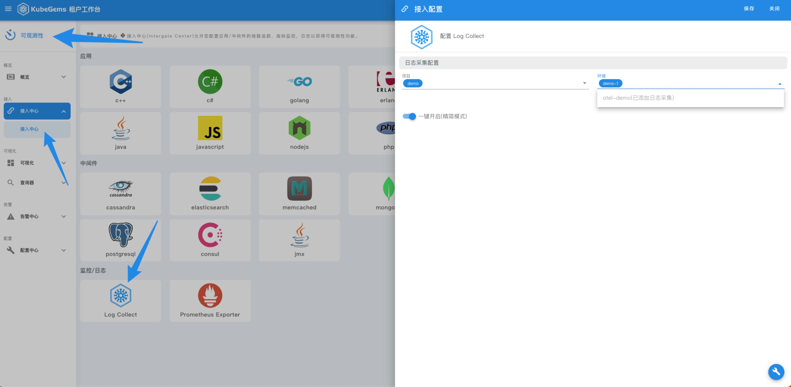
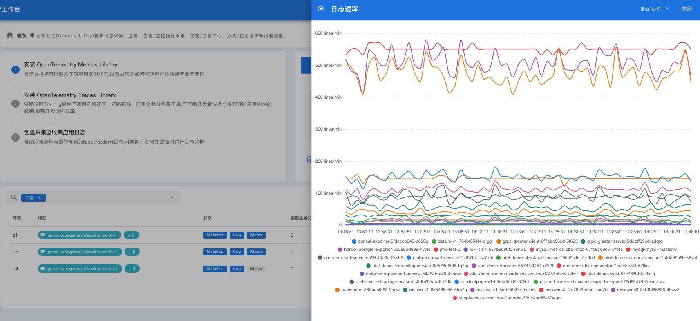
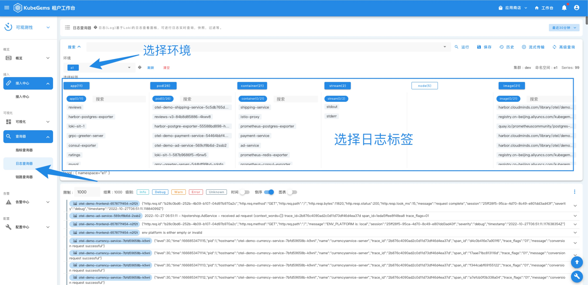
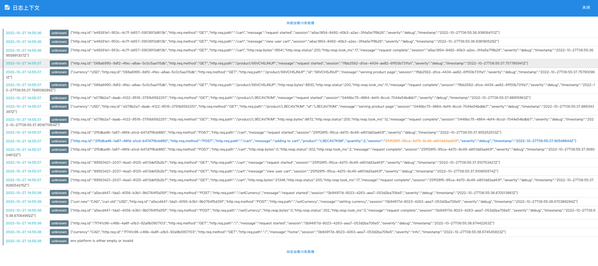

## 采集应用日志与分析

---

### 前置条件

1. KubeGems 正常运行

2. 启用 KubeGems Logging 插件

3. 具备一个有日志输出的环境应用

4. 具备一个具备有操作权限的用户

### 创建日志采集规则

KubeGems 提供了非常灵活的日志接入方式，用户可以自行决定平台内的日志是否需要采集。当需要采集日志时，在接入中心选择 "Log Collect" 便会引导用户创建日志接入规则。默认我们采取精简模式，即采取租户环境下所有容器的日志到内置的 Loki 服务当中，并监控日志摄入过程中的状态。如果用户有额外的需求，可以自定义容器和输出渠道。

- 进入【可观测性】功能模块下的【接入中心】，选择 “Log Collect”。根据侧边栏提示选择需要采集日志的目标环境

- 创建成功后，可在【可观测性】的【概览】面板中，查看日志采集的指标状态

### 日志分析

日志查看器是 KubeGems 可观测性中进行日志分析最重要的模块，用户在此页面可以查询应用日志并进行一些LogQL 的高级查询。在此页面聚合了租户环境下应用所有入库的日志，并提供了时间筛选、流式传输、日志下载和历史等常见功能方便使用者管理日志。

- 进入【可观测性】功能模块下的 【日志查询器】，即可进入日志分析页面。

- 点击 “显示上下文” 可以列出当前行内日志所关联的上文日志

