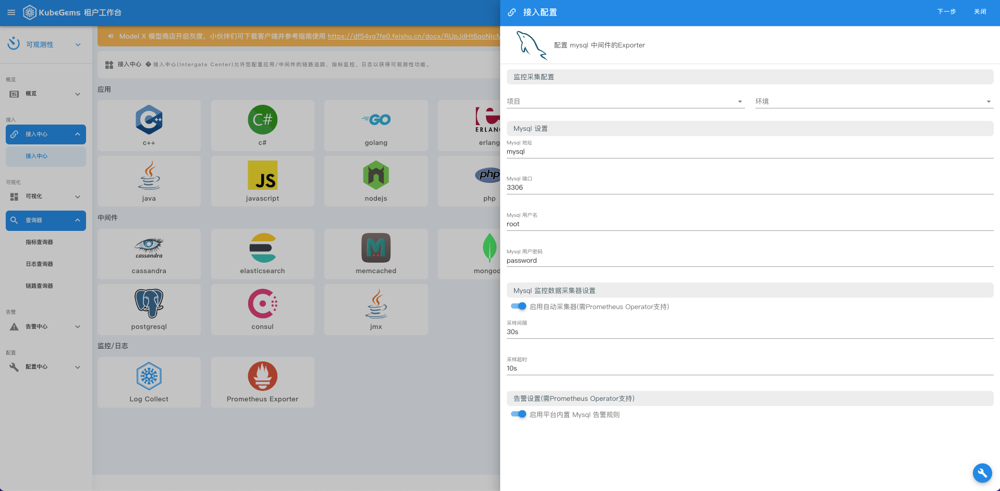
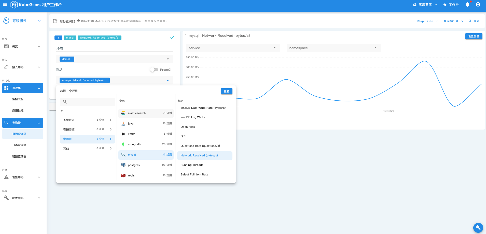
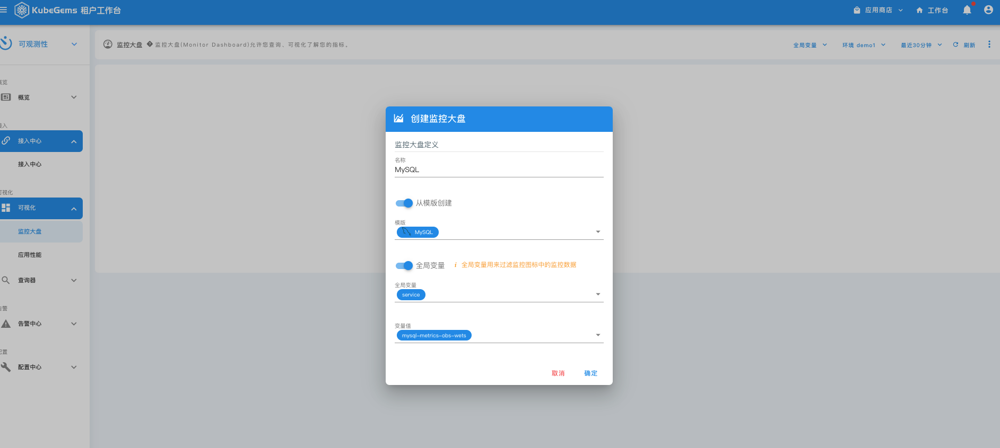
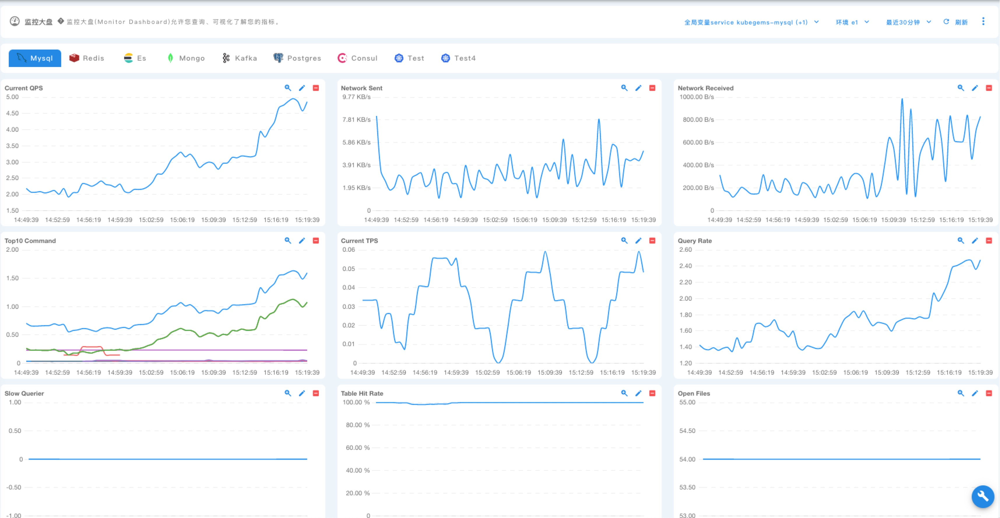

## 中间件指标与监控面板

---

### 前置条件

1. KubeGems 正常运行

2. 启用 KubeGems Logging 插件

3. 具备一个具备有操作权限的用户

### 创建指标采集规则

- 进入【可观测性】功能模块下的【接入中心】，选择目标中间件，以 MySQL 距离

- 填入 mysql 的地址和认证信息后即可提交，在数据状态中可以通过"检查数据"来确认数据是否已经入库

  

### 监控指标分析

指标查询器是 KubeGems 可观测性提供一个用于浏览监控数据的窗口，在里面用户可以通过KuebGems 提供的PromQL 模板或者原生语句来探索应用指标的数据。还是以刚刚接入 MySQL 监控数据为例，用户进入指标查询器可以选择我们内置丰富的模板语句快速预览MySQL 的运行状态

- 进入【可观测性】功能模块下的 【指标查询器】，即可进入指标分析页面。

### 创建空面板

监控大盘是 KubeGems 为指标数据提供的一个精简的，可以聚合查看状态的面板，用户可在里面创建各种类型监控面板，KubeGems 也提供了常用的诸如Container、 Mysql、Redis、MongoDB、ElasticSearch、Kafka等面板的模板，用户可以通过模板实现一键导入。

- 进入【可观测性】功能模块下的 【可视化】，进入 【监控大盘】。选择要创建的目标监控面板的环境后，点击右上角按钮创建 “监控面板”

- 根据内置的面板模板，可以快速创建出中间件的监控大盘

