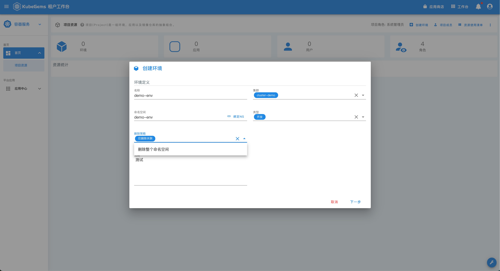
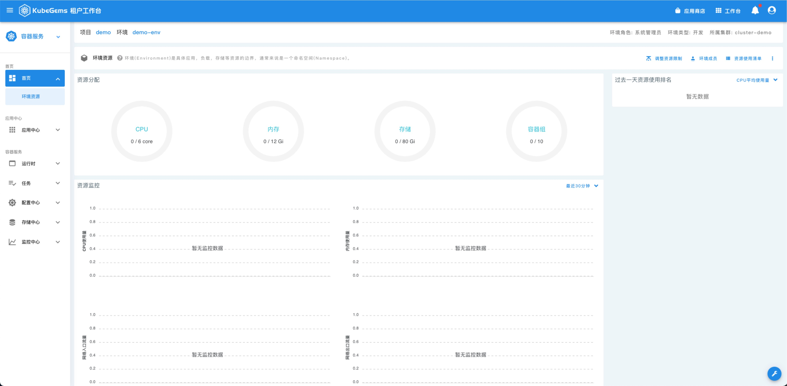

## 设置项目空间和资源配额

---

### 前置条件

1. 租户已创建
2. 租户已分配计算资源

## 设置项目和环境

### 创建项目空间

- 点击 KubeGems 顶部栏中的【工作台】进入租户空间，并点击【用户头像】可以自由切换租户空间

  
   
  

- 点击 【创建项目】 为租户创建一个名为 **demo** 项目空间，并选择可以按照角色添加成员至该项目空间

### 创建环境空间

- 进入 **demo** 项目空间，点击右上角的【创建环境】创建一个名为 **demo-env** 的环境空间

:::info
环境空间的删除策略为 `仅删除关联` 和 `删除整个命名空间`，它们之间的主要区别在于删除环境时是否需要对命名空间资源进行彻底删除
:::

为 **demo-env** 环境创建资源配合，此处与 Kubernetes 原生的 ResourceQuota 资源一致

- 点击 demo-env 进入到环境空间详情页，Kubernetes 相关的资源控制均在环境空间内完成

## 成员权限管理

###  租户空间成员

:::info
只有租户管理员才具备管理租户空间下的成员列表
:::

- 点击顶部功能栏的【工作台】，进入租户空间首页，点击页面右上角的【租户成员】进行成员管理

### 项目空间成员

- 点击顶部功能栏的【工作台】，进入租户空间首页，在【项目】区域选择【进入项目】

- 点击项目首页右上角的【项目成员】按钮进行成员管理

:::info
项目用户成员列表继承至租户用户列表
:::

角色信息说明:  [用户角色与权限](../concept/roles)

**只读权限**: 测试、开发

**读写权限**：运维、管理员

### 环境空间成员

- 点击顶部功能栏的【工作台】，进入租户空间首页，在【项目】区域选择一个环境空间，点击【进入环境】

- 点击环境首页右上角的【环境成员】按钮进行成员管理
- 

:::info
环境用户 **成员** 和 **角色** 继承至项目用户
:::

## 设置计算资源

### 调整环境资源配额

- 点击顶部功能栏的【工作台】，进入租户空间首页，在【项目】下找到一个环境空间，点击【进入环境】

- 点击环境空间首页右上角的【调整资源限制】按钮，进入资源配额管理

:::caution 
环境空间内可配置的最大资源为该租户在当前 kubernetes 集群下的最大可用资源!
:::

### 调整默认资源限制

- 点击【修改限制】修改环境空间内的默认 `LimitRange`

:::info
什么是[LimitRange](https://kubernetes.io/zh/docs/concepts/policy/limit-range/)?
:::

###  集群资源申请

- 点击顶部功能栏的【工作台】，进入租户空间首页，在【集群】下找到需要申请资源的集群，点击最右边的【申请资源】

:::caution
租户空间内可配置的最大资源为该 kubernetes 集群下的最大可用资源!
:::
