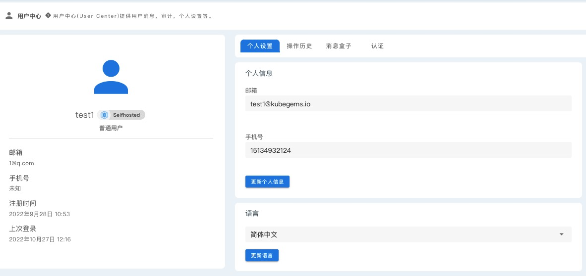
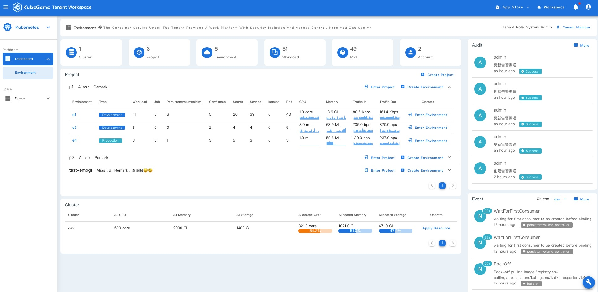
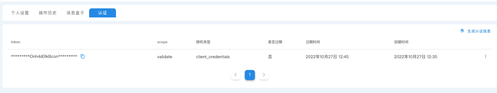

## 设置个人信息

---

### 前置条件

1. 用户登录状态正常

### 设置个人信息

用户成功成功后，点击右上角 个人头像，选择 用户中心 进入到用户个人设置页面

:::info
用户的个人邮箱、个人电话用于平台告警信息推送
:::

### 设置多国语言

KubeGems 支持 🇨🇳 简体中文  🇨🇳 繁体中文  🇺🇸 英文  🇯🇵 日文 四种语言

### 用户身份验证的令牌

KubeGems 提供为普通用户创建身份令牌服务，用户可创建自己的 Token 并通过调用 KubeGems API 服务与平台交互

- 在用户个人信息中选择 “认证” 标签，进入令牌管理页面，点击 “生成认证信息” 可创建 token

  

:::info
过期时间设置未 “0”， 即 Token 永不过期
:::

- 创建成功后，可以在当前页面查看和管理 token

