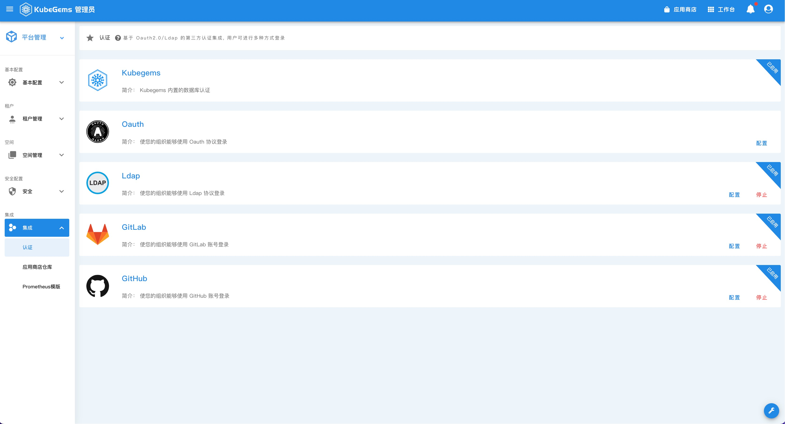
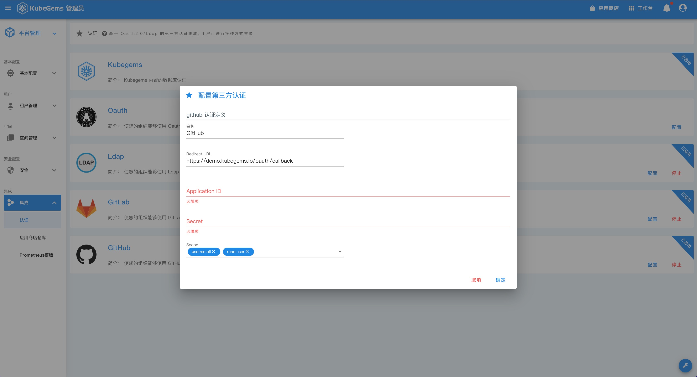
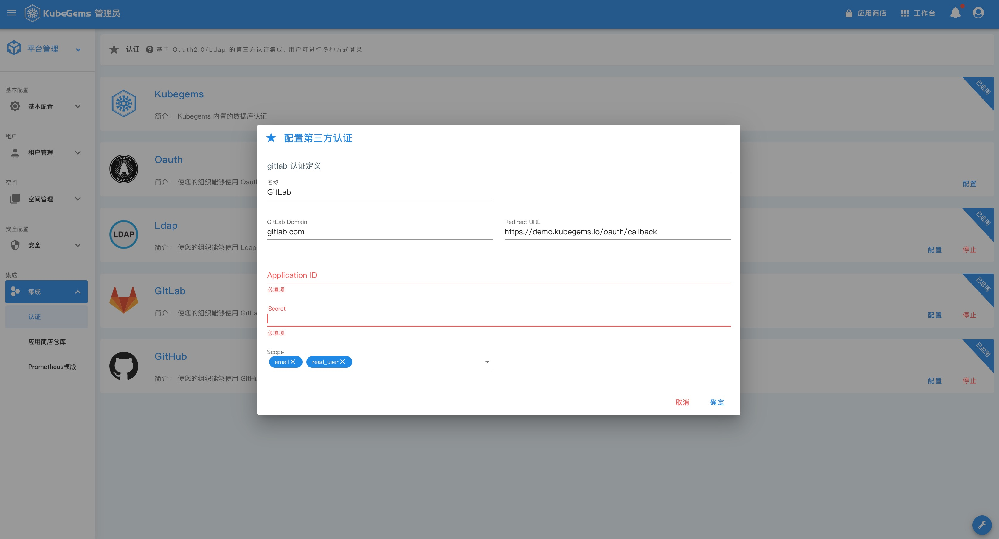

## 设置三方用户系统

## 概述

---

本文将对 KubeGems 与第三方用户认证系统进行对接的文档进行指导和说明。

## 与 OpenLdap 对接

轻型目录访问协议（英文：Lightweight Directory Access Protocol，缩写：LDAP）是一个开放的，中立的，工业标准的应用协议，通过IP协议提供访问控制和维护分布式信息的目录信息。OpenLDAP是轻型目录访问协议（Lightweight Directory Access Protocol，LDAP）的自由和开源的实现，在其OpenLDAP许可证下发行，并已经被包含在众多流行的Linux发行版中。

KubeGems 提供了 OpenLdap 协议的支持，可以方便的与您现有的 Ldap Server 集成。

- 进入【平台设置】，点击左上卡片【平台管理】后选择【集成】，进入 【认证】 页面。

- 选择 【Ldap】后，点击 “配置” 按钮

配置说明

|字段|说明|备注|
| ---| ---| ---|
|ldap地址|ldap 地址| 必填项, 格式满足 ip:port 或者 ldap://host:port ldapi://host:port/xx |
|basedn|ldap basedn| 必填项，用户的basedn |
|username|ldap bind user| 必填项，binduser,需要填写完整dn |
|password|ldap bind password| 必填项，bind password |
|开启tls| 支持tls| 默认关闭，系统会忽略证书验证 |

## 与 Github 对接

### 创建 Oauth 应用程序

您可以在您的个人帐户下或在您有管理权限的任何组织下创建和注册 OAuth 应用程序。 创建 OAuth 应用程序时，请记住仅使用您认为公开的信息来保护您的隐私。

[参考 GitHub 教程](https://docs.github.com/cn/developers/apps/building-oauth-apps/creating-an-oauth-app)

### 授权 Oauth 应用程序

GitHub 的 OAuth 实现支持标准授权代码授予类型以及 OAuth 2.0 设备授权授予（针对无法访问 web 浏览器的应用程序）。

如果您想要跳过以标准方式授权应用程序，例如测试应用程序时， 您可以使用非 web 应用程序流程。

[参考 GitHub 教程](https://docs.github.com/cn/developers/apps/building-oauth-apps/authorizing-oauth-apps)

### 设置 KubeGems

- 进入【平台设置】，点击左上卡片【平台管理】后选择【集成】，进入 【认证】 页面。

- 选择 【GitHub】后，点击 “配置” 按钮

字段说明

|字段|说明|备注|
| ---| ---| ---|
|redirectURL| Github 重定向到本地服务的地址|这个字段通常由系统自动生成，需要在 GitHub 中填写，且必须一致 |
|applicationID| Github Application id| 必填项 |
|secret|GitHub Application secret| 必填项 |
|scope| GtiHub获取数据的范围 | 默认值读取**用户名**和**用户邮件** |

## 与 GitLab 对接

### 创建 Oauth 应用程序

:::tip
本文中的认证渠道同样适用于 `https://gitlab.com` 。更多内容，[参考 GitLab 教程](https://docs.gitlab.com/ee/api/oauth2.html)
:::

- 进入 GitLab 的组织管理页面， 在侧边栏选择【Applications】，进入到应用配置界面

:::caution
GitLab 在私有化部署时，某些情况可能管理员会把组织的 Application 接入功能关闭，预到此类情况，请联系您的 GitLab 管理员为您开通 Application 功能。
:::

- 创建成功后，您将获得 GitLab 的 Application 的 Token 信息

### 设置 KubeGems

- 进入【平台设置】，点击左上卡片【平台管理】后选择【集成】，进入 【认证】 页面。

- 选择 【GitHub】后，点击 “配置” 按钮

## 与私有 Oauth 系统对接

- 进入【平台设置】，点击左上卡片【平台管理】后选择【集成】，进入 【认证】 页面。

- 选择 【Oauth】后，点击 “配置” 按钮

配置说明

|字段|说明|备注|
| ---| ---| ---|
|redirectURL|oauth2 重定向到本地服务的地址|这个字段通常由系统自动生成，需要在oauth provider中填写，且必须一致|
|authURL|oauth2 的用户登陆地址| 必填项 |
|tokenURL|oauth2 获取access_token的地址| 必填项  |
|userInfoURL|获取用户信息的地址| 必填项 |
|applicationID|oauth2 provider application id| 必填项 |
|secret|oauth2 provider application secret| 必填项 |
|scope|oauth2 获取数据的范围 | 如果权限不足，可能读取不到用户的数据 |
