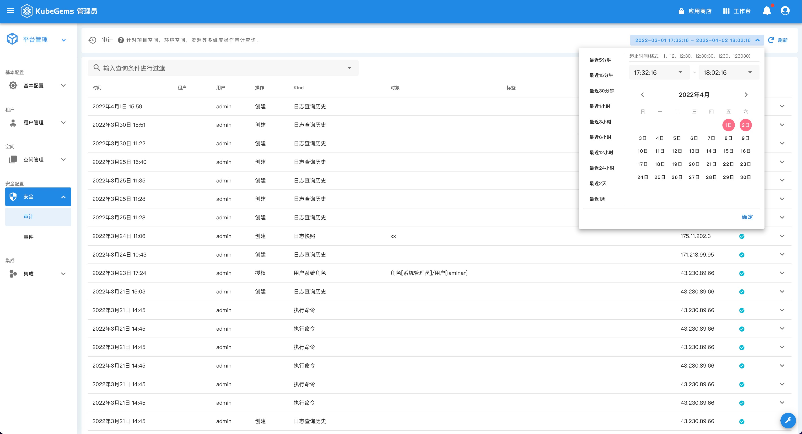

## 安全审计

---

## 概述

KubeGems 核心服务均实现了函数级的操作记录审计功能，任何在平台内的操作均会记录入库。并提供全局查询界面，用于管理员或运维更好的做事后回溯。

## 审计

- 进入【平台设置】，点击左上卡片【平台管理】后选择【安全】，进入【审计】页面

:::tip
您可以在三方的搜索窗口内对需要审计的 `用户` `操作` 和 `对象` 进行有效的筛选
:::

## 事件

KubeGems 通过 `eventer` 插件将 Kubernetes 系统运行期间的事件持久化到本地，管理员可以在一个全局的视角下对集群事件进行筛选。

:::caution
KubeGems 中的事件通过日志采集持久化在 Loki 中，要使用此功能需在插件中心打开 Logging 服务。
:::