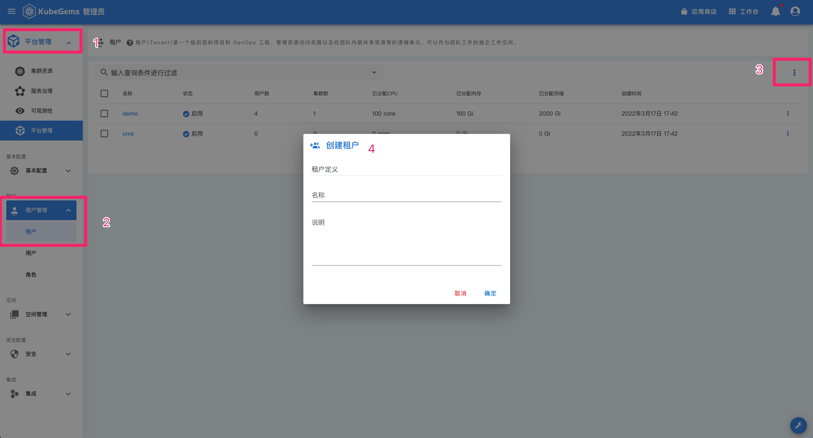
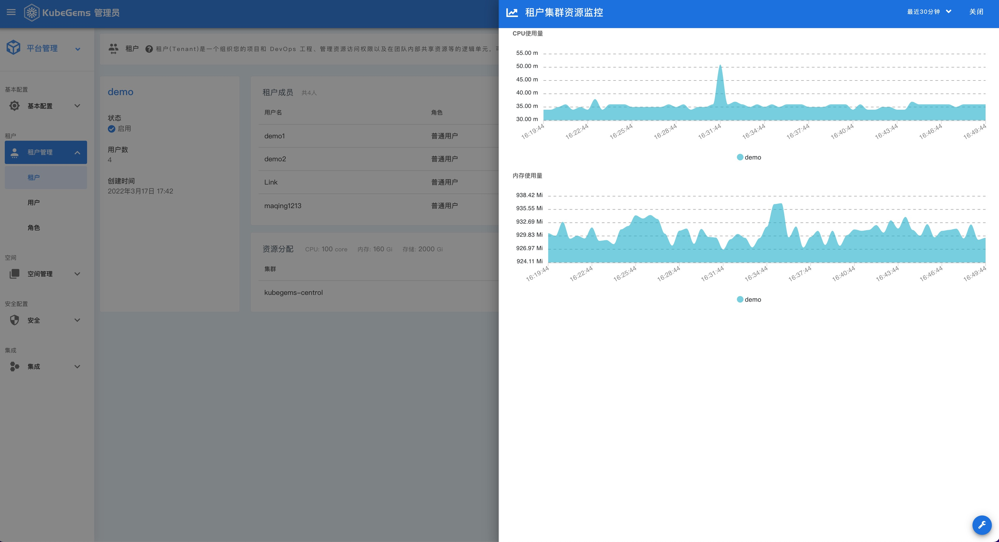

## 管理租户

---

:::important
严格俩说，KubeGems 并没有限定用户对租户的使用限制，用户可以根据自己的实际情况来制定租户的粒度。例如：按照部门维度来设置租户，亦或者按照企业产品线设置租户。不管采用那种方式，它们都遵循一个原则：**KubeGems 租户内的资源是互相独立和隔离的**
:::

**租户**是 KubeGems 内的顶级概念，平台io目、应用、环境等都隶属于租户下。 普通用户在使用平台功能前，需先加入到租户下，才具备使用资源的基本权限。 **平台管理员**可以在 【租户中心】 为每一名租户设置其能够使用的 Kubernetes 资源。租户一旦创建成功并分配好资源后，KubeGems 会将租户信息以 `cr/tenants.kubegems.io` 的方式将数据发送给 Kubernetes API，并由集群控制器负责租户信息管理。

### 创建租户

- 进入【平台设置】，点击坐上卡片【平台管理】后选择【租户管理】，点击右上角按钮选择 “创建租户”，填入租户名称和备注

### 租户详情

- 点击 “租户名称”，进入【租户详情页】

### 租户成员

- 在【租户详情页】中点击右上角点击 “添加成员” ，进入租户成员管理界面

:::caution
租户管理员具备租户下所有资源的管理权限，租户普通成员需加入 “项目空间” 或 “环境空间” 才能完全使用空间下资源。
:::

### 租户资源

- 在【租户详情页】中点击右上角点击 “添加集群资源” ，或在以分配资源的集群右侧点击 “资源调整”按钮，可进入租户的资源分配页面

### 租户资源监控

- 在【租户详情页】中对以分配资源的集群右侧点击 “资源监控”按钮，可查看租户实时的资源使用状态

## 管理用户

---
### 设置系统管理员

 KubeGems 内部系统用户仅分为两类 **系统管理员** 和 **普通用户** 角色。系统管理员除管理集群和租户外，还具备用户的 `密码重置`、`删除`和`修改系统角色`等权限。

- 进入【平台设置】，点击坐上卡片【平台管理】后选择【租户管理】，点击 "用户"进入用户列表。在用户最右边的按钮中选中 “角色”，进入用户角色分配

### 重置用户密码

- 在用户列表中，点击需重置用户最右边的按钮，选中 “重置密码”，进入用户密码重置页面

:::tip
你可以使用 “随机密码” 让平台为您生成更符合安全规范的字符串。
:::

### 删除用户

- 在用户列表中，点击需重置用户最右边的按钮，选中 “删除”即可完成操作。

