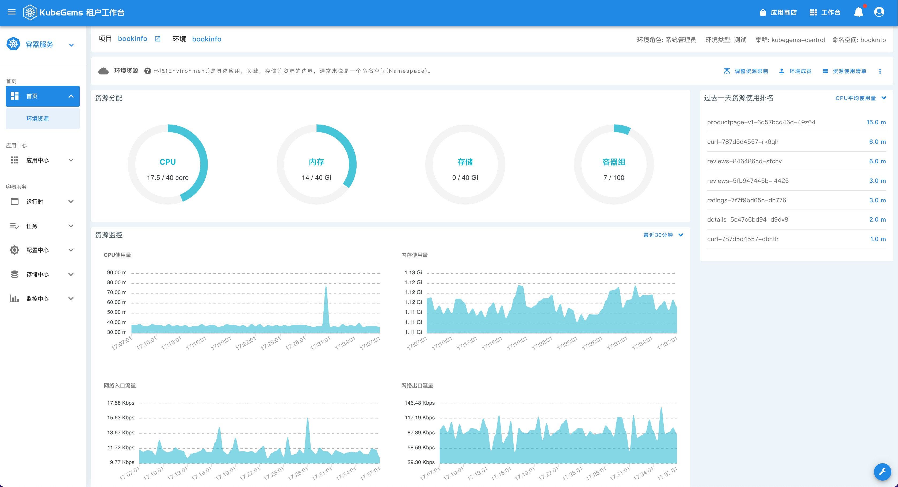

## 环境资源

KubeGems 默认对每个用户环境开启了资源限制，如果您使用的环境资源超过了限制，那么新的容器将不能被部署。

:::caution
如果您的应用是采用`RollingUpdate`更新策略，那么它也会因资源不足造成更新一直处于 `pending` 状态。
:::

用户可以在**【环境详情页】** 中看到当前环境下的资源实时使用情况，除此之外，您还可以在 **详情页** 中查看过去一天各个pod对于资源的使用量统计信息。

### 设置环境成员

- 在【环境详情页】 中点击 “环境成员” 按钮，进入成员管理页面。[参考文档：租户空间成员](/docs/quick-starts/common-operation#环境空间成员) 

### 设置环境资源

- 在【环境详情页】 中点击 “调整资源限制” 按钮，进入资源管理页面。[参考文档：调整环境资源配额](/docs/quick-starts/common-operation#调整环境资源配额)

## 附录
### Kubernetes 中的 ResourceQuota

当多个用户或团队共享具有固定节点数目的集群时，人们会担心有人使用超过其基于公平原则所分配到的资源量。资源配额是帮助管理员解决这一问题的工具。

资源配额通过 `ResourceQuota` 对象来定义，对每个命名空间的资源消耗总量提供限制。 它可以限制命名空间中某种类型的对象的总数目上限，也可以限制命令空间中的 Pod 可以使用的计算资源的总上限。

[更多关于 ResourceQuota，请参考](https://kubernetes.io/zh/docs/concepts/policy/resource-quotas/)

Kubernetes ResourceQuota 支持的资源类型如下：

| 资源名称 | 描述 |
| --- | --- |
| limits.cpu |所有非终止状态的 Pod，其 CPU 限额总量不能超过该值。|
| limits.memory |所有非终止状态的 Pod，其内存限额总量不能超过该值。|
| requests.cpu |所有非终止状态的 Pod，其 CPU 需求总量不能超过该值。|
| requests.memory |所有非终止状态的 Pod，其内存需求总量不能超过该值。|
| hugepages-<size\> |对于所有非终止状态的 Pod，针对指定尺寸的巨页请求总数不能超过此值。|
| cpu |与 requests.cpu 相同。|
| memory |与 requests.memory 相同。|

### Kubernetes 中的 LimitRange

默认情况下， Kubernetes 集群上的容器运行使用的计算资源没有限制。 使用资源配额，集群管理员可以**以命名空间为单位**，限制其资源的使用与创建。 在命名空间中，一个 Pod 或 Container 最多能够使用命名空间的资源配额所定义的 CPU 和内存用量。

#### 限制范围流程

1. 管理员在一个命名空间内创建一个 LimitRange 对象。
2. 用户在命名空间内创建 Pod ，Container 和 PersistentVolumeClaim 等资源。
3. LimitRanger 准入控制器对所有没有设置计算资源需求的 Pod 和 Container 设置默认值与限制值， 并跟踪其使用量以保证没有超出命名空间中存在的任意 LimitRange 对象中的最小、最大资源使用量以及使用量比值。
4. 若创建或更新资源（Pod、 Container、PersistentVolumeClaim）违反了 LimitRange 的约束， 向 API 服务器的请求会失败，并返回 HTTP 状态码 403 FORBIDDEN 与描述哪一项约束被违反的消息。
5. 若命名空间中的 LimitRange 启用了对 cpu 和 memory 的限制， 用户必须指定这些值的需求使用量与限制使用量。否则，系统将会拒绝创建 Pod。

:::tip
LimitRange 的验证仅在 Pod 准入阶段进行，不对正在运行的 Pod 进行验证。
:::

### KubeGems 中的资源配置

|字段|说明|备注|
|---|---|---|
|cpu限制值|所有pod的limits.cpu之和不能超过这个值||
|内存限制值|所有pod的limits.memory之和不能超过这个值||
|存储限制值|所有pvc的size之和 不能超过这个值||
|容器组限制值|容器数量之和不能超过这个值||

资源限制

|字段|说明|默认值|
|---|:---|:---|
|容器 cpu 默认值|单容器的limits.cpu的默认值，如果workload没有提供，将用这个值填充| 500m |
|容器 cpu 默认请求值|单容器的requests.cpu的默认值，如果workload没有提供，将用这个值填充| 10m |
|容器 cpu 限制最大值|单容器的limits.cpu的最大值，如果workload中的这个值超过了它，将无法下发| 25000m |
|容器 memory 默认值|单容器的limits.memory的默认值，如果workload没有提供，将用这个值填充| 1Gi |
|容器 memory 默认请求值|单容器的requests.memory的默认值，如果workload没有提供，将用这个值填充| 10Mi |
|容器 memory 限制最大值|单容器的limits.memory的最大值，如果workload中的这个值超过了它，将无法下发| 48Gi |
|容器组CPU|单个pod的cpu限制，即pod内的cpu之和不能大于这个值| 48000m |
|容器组内存|单个pod的memory限制，即pod内的memory之和不能大于这个值| 64Gi |
|存储卷容量|单个存储卷的最大容量,超过这个值将不可以被创建出来| 1Ti |
|容器组数量 | 当前命名空间能够创建的最大容器组数量，超过这个值将不可以被创建出来 | 100 |
|配置数量  | 当前命名空间能够创建的最大configmap数量，超过这个值将不可以被创建出来 | 512 |
|daemonset数量  | 当前命名空间能够创建的最大daemonset数量，超过这个值将不可以被创建出来 | 512 |
|deployment数量  | 当前命名空间能够创建的最大deployment数量，超过这个值将不可以被创建出来 | 512 |
|statefulset数量  | 当前命名空间能够创建的最大statefulset数量，超过这个值将不可以被创建出来 | 512 |
|ingress数量  | 当前命名空间能够创建的最大ingress数量，超过这个值将不可以被创建出来 | 512 |
|job数量  | 当前命名空间能够创建的最大job数量，超过这个值将不可以被创建出来 | 512 |
|pvc数量  | 当前命名空间能够创建的最大persistentvolumeclaims数量，超过这个值将不可以被创建出来 | 512 |
|secret数量  | 当前命名空间能够创建的最大secret数量，超过这个值将不可以被创建出来 | 512 |
|service数量  | 当前命名空间能够创建的最大service数量，超过这个值将不可以被创建出来 | 512 |