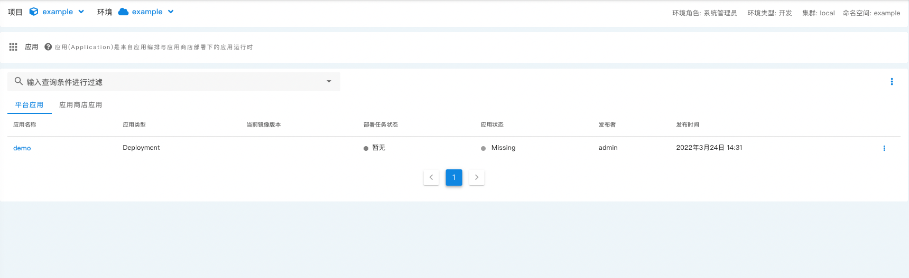
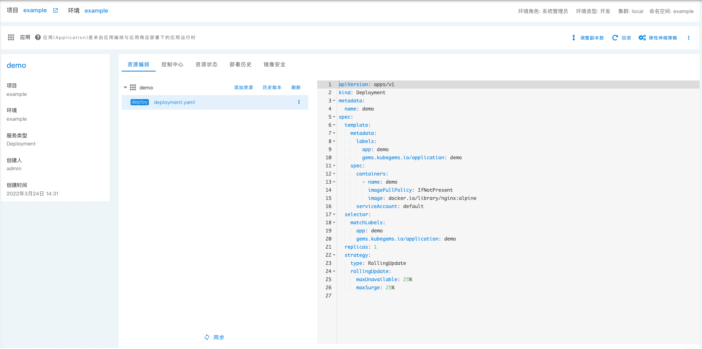
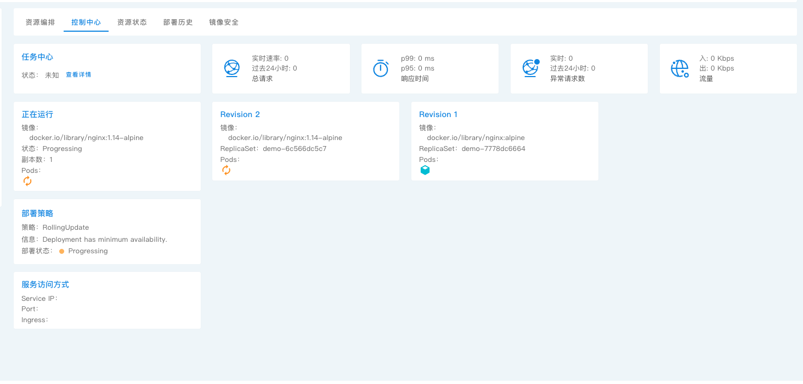
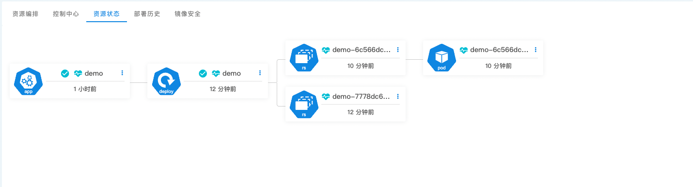
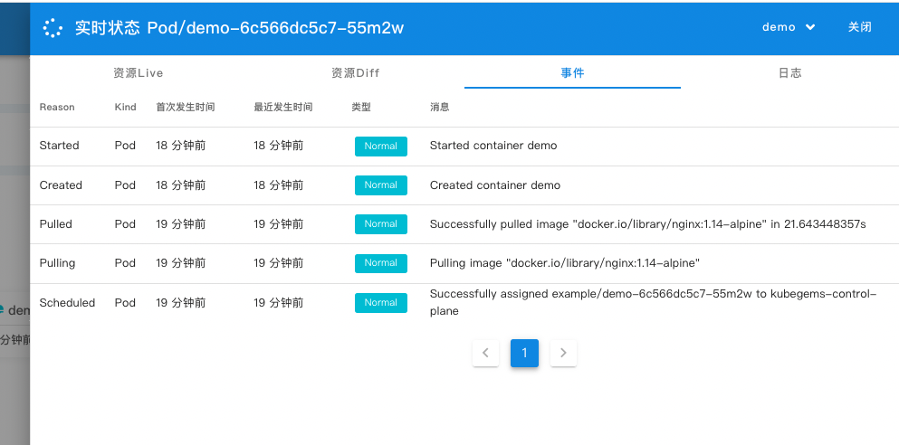

## 用户应用

除了应用商店的应用，剩下的都应该是用户自己的应用，kubegems提供了用户应用管理的功能；

:::caution
通常情况下，应用有多个环境，同一个应用在不同的环境下，由于环境的基础设施不同，编排文件或许存在一些差异，但大部分的内容都相似；针对这样的情况， kubegems 的策略是`在项目下维护应用的模版，在环境下维护应用的实际编排`，即 在`项目`的应用中心维护的是应用的基础模版，它不会真实部署，只有将它和`环境`关联的时候，它才会部署到对应的环境中; 关联到具体环境之后，用户可以针对差异的部分进行再次编辑，编辑之后的编排文件仅对当前环境生效；
:::

## 编辑用户应用

编辑环境下的应用和编辑项目下的应用模版操作一样，只是环境下的应用关联的是真实环境对应的基础设施内容，例如StorageClass;

_用户应用_ 是从 _应用编排_ 关联到环境中的，后续简称 _应用_ 。

_同步_ 操作表示将环境下的应用编排下发至运行时，即保持运行时与编排同步，其后端对应 argo-cd Sync 操作。

入口：

要创建一个 _用户应用_ 您需要进入到需要部署应用的环境中，可以通过：

- 在 **租户工作台** 中选择项目右侧 **⌵** 下拉栏选择对应环境 **进入环境**，选择左侧菜单栏 **应用中心** - **应用** 进入应用列表页。
- 在 **项目** 主页中点击 环境名称 进入环境,选择左侧菜单栏 **应用中心** - **应用** 进入应用列表页。

应用使用 argocd 进行部署，每一个应用都对应一个 argocd Application，应用编排存储与后端 git 服务上，对应用的 **所有** 变动都需要进行以下步骤:

1. 更改编排文件，`git commit`，`git push`.
1. _同步_.

## 列表页

列表页面分两栏展示：

- **平台应用** 展示由应用编排下发的应用。
- **应用商店应用** 展示从应用商店部署的应用。

包含两个操作： **关联应用** 以及 **部署应用**

需要特别说明的是在列表页面中：

- **当前镜像版本** 展示了 _运行时_  的镜像而非编排中的镜像，如果您的应用无法正常部署或发生其他错误，则该字段可能显示为空。
- **部署任务状态** 展示了该应用对应的最新一条异步任务执行状态。对于异步任务您只需要了解，当执行了部署等耗时较长的操作时，该操作会异步执行，其状态会被展示在这里。

## 关联应用

:::important
环境下不能添加应用，只能从项目里关联应用
:::

**关联应用** 将一个应用编排当前状态复制到所在当前环境，后续在环境中进行的资源修改均对 **应用编排** 中无影响。
关联应用操作后默认不实际部署到集群中，您需要使用 **部署应用** 操作进行部署后才会实际部署到集群中。

关联应用操作后会在环境对应的集群namespace 中生成一个 argo-cd Application，但不执行 Sync ，您可以进入到**应用详情**中**资源状态页面**看见。

## 部署应用

**部署应用** 用于将应用实际部署到集群。

部署应用时，您可以选择多个应用同时部署，为多个应用更新镜像tag并下发至集群。

在部署应用页面中，**当前tag** 展示了运行时正在使用的tag，**部署tag**展示了存储于现在编排中的tag。

您可以通过下拉按钮选择tag，如果没有可供选择的tag（通常为未配置[**镜像仓库**](image-registry)）你可以手动输入需要部署的tag。

在为应用选择了新镜像并部署后，其编排中的镜像会被更新并 _同步_ 至运行时。

## 应用详情

应用详情页面可以点击应用名称进入。

页面右上侧功能：

- **高级部署** 用于执行 灰度发布/蓝绿发布等操作。
- **调整副本数** 用于调整编排中的副本数并同步。
- **回滚** 用于将应用回滚至之前的版本。
- **弹性伸缩策略** 用于设置副本数量动态增减的策略，见[Pod 水平自动扩缩](https://kubernetes.io/zh/docs/tasks/run-application/horizontal-pod-autoscale/)

其包含了与 **[应用编排](orchestration)** 相同的功能 **资源编排** **部署历史** **镜像安全**

以及 - **控制中心** 与 - **资源状态** 展示了与该应用相关的所有资源实时状态。

### 资源编排

**资源编排** 与 应用编排中的基本功能相同，但在文件列表的最下方增加了 **⟳同步** 按钮，同于将编排中的变动 _同步_ 至运行时。

### 控制中心

**控制中心** 包含了该应用可能的大部分操作，包含实时状态，历史版本，版本回滚以及**高级发布**等。

你可以选择某个 Revision 并 **回滚**

### 资源状态

**资源状态** 展示了与该应用相关的所有资源实时状态。

页面中的根节点为 argo application，其他节点为 _运行时_ 中存在的资源以及其子资源。

您可以单击树形图的节点来查看该节点**资源Live**,**资源Diff**以及**事件**。对于 Pod 类型的节点，还支持查看实时**日志**。

- **资源live** 展示当前资源在集群中的实时定义。
- **资源diff** 展示了当前资源在编排中和运行时的差异。在没有差异时该页面为空白内容。
- **事件** 展示当前资源的 Kubernetes Event.
- **日志** 会实时输出所选 Pod container 的标准输出流内容。

您还可以单击节点右上方的 **⋮** 来进行更多操作：

- **删除** 从运行时删除该节点资源。
- **同步** 仅 _同步_ 所选节点资源。

