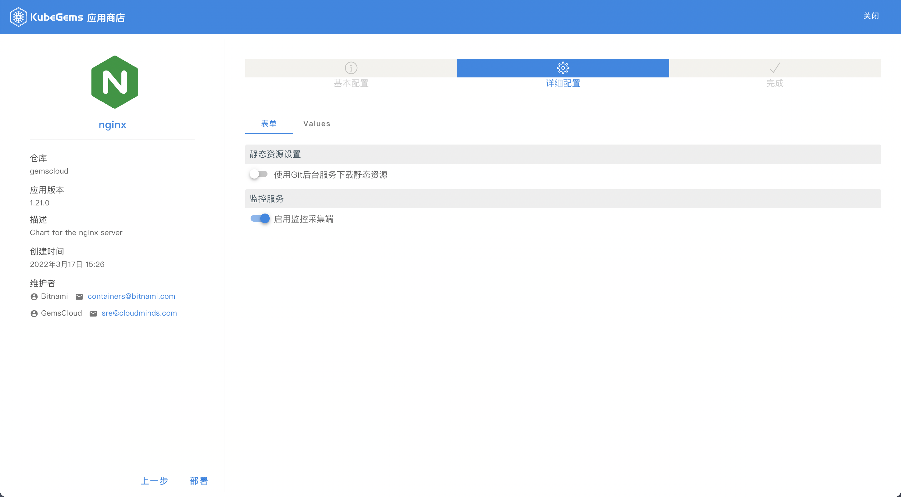

## 应用商城

kubegems 内置了一个应用商城,包含了许多开箱可用的资源编排，其内容为 helm charts。里面内置了一部分常用的应用，例如mysql, redis等；

#如何设置应用商店，请移步[这里，设置应用商店](/docs/tasks/admin/integrations/appstore-manage)

### 部署应用

用户可以在应用详情页点击**部署**按钮，进入部署流程;

1. 填写基础信息

|字段|说明|
|---|---|
|应用名字| 应用的唯一名字，例如 购物车业务依赖的nignx, 可以命名为 cart-nginx |
|项目| 部署到当前租户下的哪个项目中 |
|环境| 部署到当前租户下的哪个环境中 |

1. 填写/修改 values信息

部分charts内置了 schema.json, kubegems 会根据这个 schema.json 生成表单，提供更简单的填写values方式；用户也可以选择直接编辑values文件，自定义需要的内容;

1. 进行部署

填写完基础信息和values内容后，就可以点击`部署`进行部署； 部署完成后，可以在对应的`环境`的`应用中心` -> `应用商店应用`看到这个应用的相关信息
