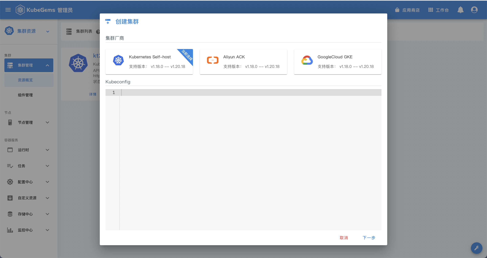

## 集群导入

kubegems 本身不会维护k8s集群，而是通过kubeconfig导入到kubegems中;

kubegems会通过kubeconfig在目标集群上创建 上创建名字为`kubegems-installer`的namespace，和一个crd `installers.plugins.kubegems.io`以及installer的 **cr** `kubegems-plugins`; 这个 **cr** 中定义了作为添加集群所需要的核心组件，crd的 controller会通过`kubegems-plugins`中描述的插件，在集群内添加平台功能相关的插件运行的namespace;

|namesapce|作用|
|---|---|
|gemcloud-gateway-system| 租户网关插件运行的namespace|
|gemcloud-logging-system|日志采集和查询相关服务运行的namespace|
|gemcloud-monitoring-system|监控告警相关服务运行的namespace|
|gemcloud-workflow-system|部署流程相关组件运行的namespace|
|gemcloud-system|kubegems核心组件agent+controller运行的namespace|

#### 流程

1. 填写kubeconfig

2. 填写其他安装必要数据

|字段|作用|
|---|---|
|集群名字|集群名字在kubegems必须唯一，且满足命名规范|
|存储卷类型|由于kubegems的核心服务也需要存储(pvc)，所以在添加集群的时候需要为他们指定使用什么存储卷类型|
|镜像仓库|kubegems核心服务的镜像库地址(由于某一些原因，国内访问dockerhub或者其他镜像仓库有网络故障,所以有时候需要修改这个地址)|

3. 等待集群状态正常

当集群添加完毕，installer跑完安装流程后，集群的状态会显示为正常(一个蓝色的❤️)