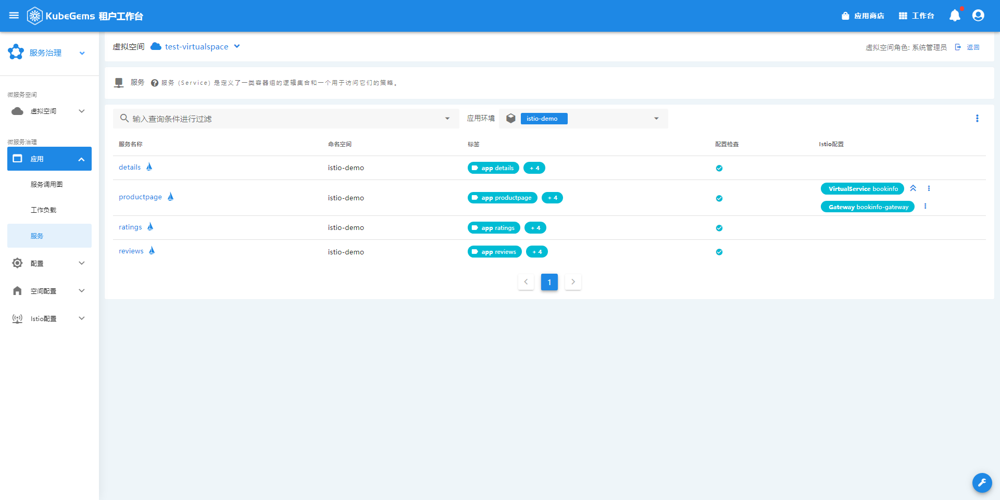
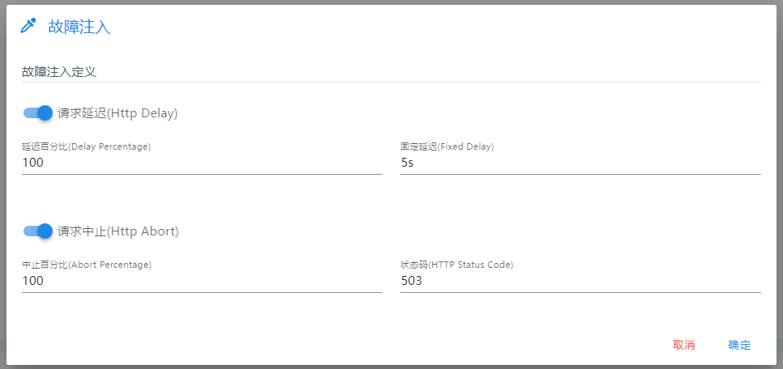
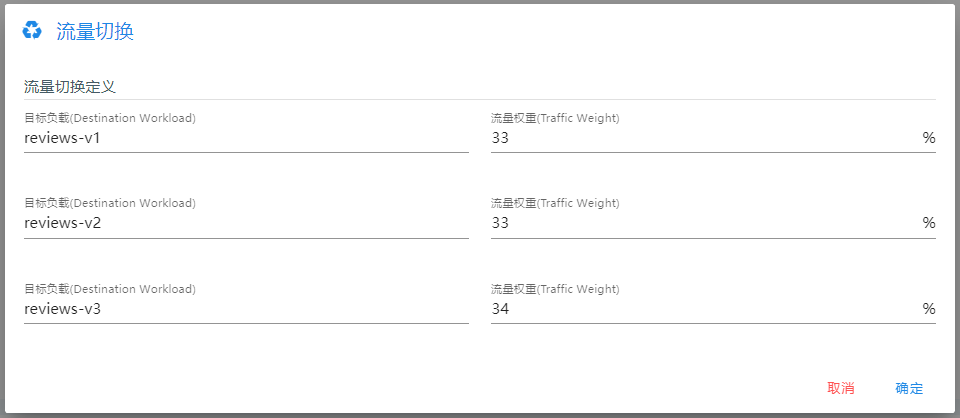
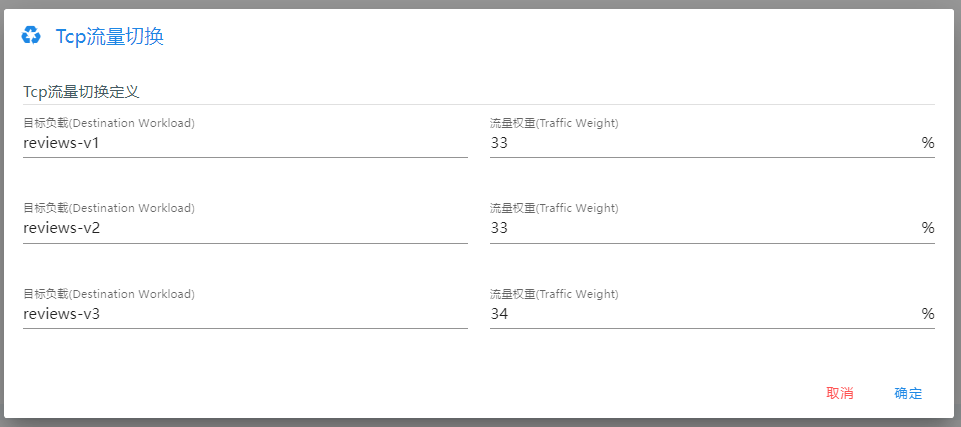
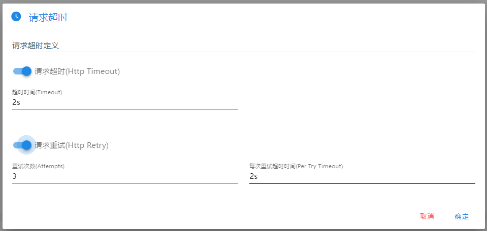

## 服务管理

基于`istio`，管理虚拟空间中的服务。

### 进入服务管理视图

1. 进入虚拟空间
2. 在**应用**栏点击**服务**
3. 选择你要管理的环境

:::tip 小技巧
1. _标签_ 和 _配置检查_ 状态栏可以协助你检查服务配置是否正确
2. _istio配置_ 栏会展示每个服务所关联的istio资源，包括`gateway`、`virtualservice`、`destinationrule`
:::

### 服务详情

类似[工作负载详情页面](workload.md)，服务详情页也提供了流量、链路的可观测性信息。

除此之外，我们为服务提供了5个便捷的流量管理入口：

1. 请求路由: 配置请求`从服务到工作负载`的`HTTP`流量路由策略，支持基于`header`和`uri`的两种路由策略

2. 故障注入：针对TCP流量，进行故障注入

:::info 提示
_请求延时_ 设置服务多久之后再响应，_请求中止_ 则是直接响应指定的 `HTTP状态码`
:::
3. 流量切换：便捷地切换`从服务到工作负载`的`HTTP`流量比率

4. TCP流量切换：便捷地切换`从服务到工作负载`的`TCP`流量比率

5. 请求超时：设置该服务的`HTTP`请求 _超时时长_ 及请求 _重试策略_

:::caution 请注意
1. 若你配置了上述5种流量管理方式中的一种，然后想要切换为另一种策略，你 **必须** 先 **清理虚拟服务**，再重新配置
2. 若你不满足于仅配置其中一种策略，想要综合多种，请手动编辑`virtualservice`和`destionationrule`资源，更多文档参考: <https://istio.io/latest/docs/tasks/traffic-management/>
:::