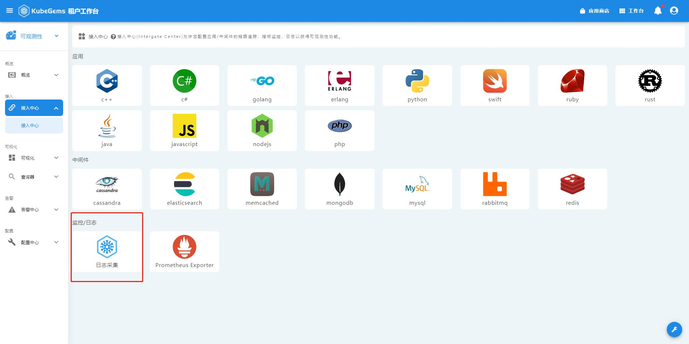
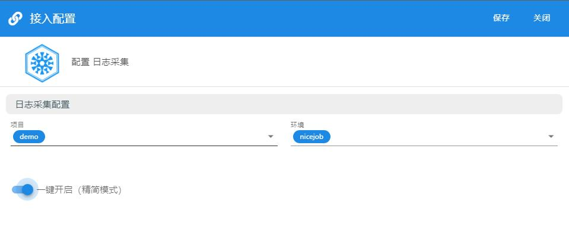

## 日志接入

1. 点击左上角，选择**可观测性**
2. 在可观测性栏目，选择**接入中心-接入中心**
3. 选择并点**日志采集**


### 一键接入
选择要接入的项目环境后，拖动滑块打开**一键开启(精简模式)**即可一键接入采集该环境下 **所有的容器日志**


接入后日志采集器大概如下：
```yaml
apiVersion: logging.banzaicloud.io/v1beta1
kind: Flow
metadata:
  name: default
  namespace: test
spec:
  filters:
  - prometheus:
      labels:
        container: $.kubernetes.container_name
        flow: default
        namespace: $.kubernetes.namespace_name
        node: $.kubernetes.host
        pod: $.kubernetes.pod_name
      metrics:
      - desc: Total number of log entries collected by this each flow
        name: gems_logging_flow_records_total
        type: counter
  globalOutputRefs:
  - kubegems-container-console-output
```

:::tip 小知识
这个采集器会将该namespace下所有容器日志，输入到名为`kubegems-container-console-output`(内置)的`ClusterOutput`中。

你可以在`可观测性 -> 配置中心 -> 日志 -> 日志采集器`处查看，我们不建议对其进行修改。
:::

### 自定义接入
选择要接入的项目环境后，拖动滑块关闭**一键开启(精简模式)**即可自定义接入应用日志。


1. 关联应用

即要采集的app，实际是筛选有**app标签**的pod，受支持的app标签如下:
- app
- apps.kubernetes.io/name
- gems.kubegems.io/application

以上三种ap标签只要有任意一种就能被采集。

2. 关联日志路由

即采集到日志后将其发送到哪个日志路由器

3. 启用限速
启用、配置限速器，当日志速率超过配置的限速，日志就会被丢弃。

4. 启用日志状态监控
启用后，会在采集时在prometheus生成名为`gems_logging_flow_records_total`的指标，若你配置了ingress访问kubegems, 可以通过 http://prometheus.{cluster_name}.kubegems.io:{port} 查看这条指标