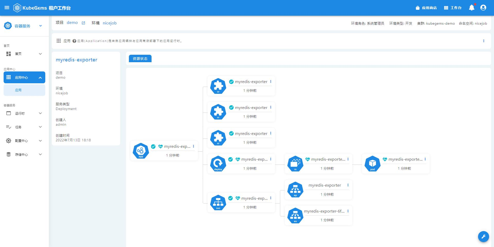
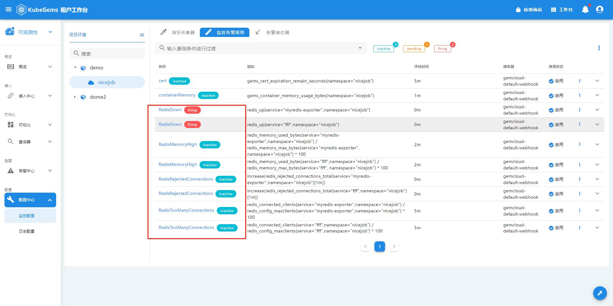

## 中间件接入

### 为中间件应用一键接入监控

我们为以下中间件提供了一键接入功能：
- cassandra
- elasticsearch
- memcached
- mongodb
- mysql
- rabbitmq
- redis

kubegems集成了这些中间件的`prometheus exporter`，并在接入他们的同时会创建一系列预置的监控告警规则。

1. 点击左上角，选择**可观测性**
2. 在可观测性栏目，选择**接入中心-接入中心**
3. 选择并点击对应的中间件

4. 配置接入参数

| 参数名               | 释义                                                             |
| :------------------- | :--------------------------------------------------------------- |
| 项目、环境           | 该exporter应用要部署在哪个项目、环境                             |
| 名称                 | exporter应用名                                                   |
| 差异配置             | 中间件的个性化配置，如地址、用户名、密码等，不同中间件有所不同   |
| 启用自动采集器       | 是否自动为该exporter创建监控采集器（有了采集器才能看到监控指标） |
| 监控数据采样频率     | 多久执行一次采样，默认30s                                        |
| 监控数据采样超时     | 超时时长，默认10s                                                |
| 启用平台内置告警规则 | 若启用，会同时在指定项目环境中创建内置的监控告警规则             |

5. 查看接入状态

在 `工作台 -> 进入环境 -> 应用中心 -> 应用商店应用` 查看刚接入的应用状态

6. 查看告警规则
   
在`可观测性 -> 配置中心 -> 监控配置 -> 监控告警规则`查看内置的告警规则

