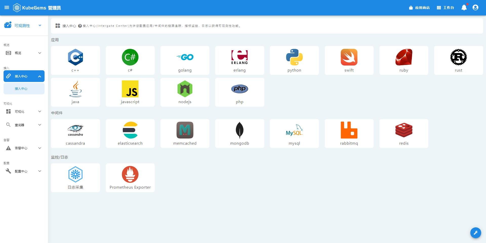
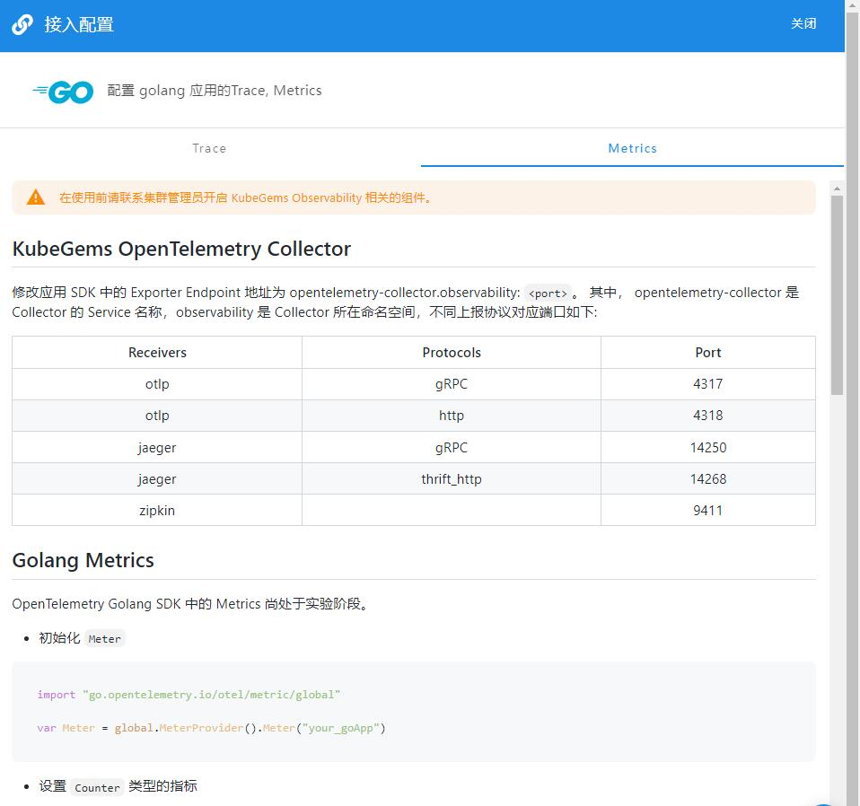

## Opentelemetry接入

### 按照接入文档提示接入

我们针对不同类型的应用(包括但不限于C++, Go, java, nodejs, php, python, erlang, javascript等)提供了详细的通过Opentelemetry接入的文档。

1. 点击左上角，选择**可观测性**
2. 在可观测性栏目，选择**接入中心-接入中心**
3. 选择并点击对应的应用

4. 接入trace

5. 接入metrics
